# Apollo 配置中心底层实现原理深度分析

> 本文基于 Apollo 源码（`apollo-biz` / `apollo-configservice` / `apollo-adminservice` / `apollo-portal` / `apollo-common` / `apollo-assembly`）逐层拆解其整体架构、服务端启动流程、核心组件、客户端拉取配置、配置动态变更实现及其它底层原理。文中所有类名、方法名、字段名均来源于源码；客户端 Java SDK（`apollo-client`/`apollo-core`）位于独立仓库 `apollo-java`，其行为通过本仓库文档与服务端契约（`/configs`、`/notifications/v2` 端点）交叉验证。

---

## 目录

- [一、整体架构](#一整体架构)
- [二、核心组件](#二核心组件)
- [三、服务端启动流程](#三服务端启动流程)
- [四、客户端如何拉取配置](#四客户端如何拉取配置)
- [五、配置动态变更如何实现](#五配置动态变更如何实现)
- [六、灰度发布](#六灰度发布)
- [七、整合 Spring Boot](#七整合-spring-boot)
- [八、其它底层实现原理](#八其它底层实现原理)
- [九、端到端总结流程](#九端到端总结流程)
- [附录：关键类速查表](#附录关键类速查表)

---

## 一、整体架构

### 1.1 设计目标

Apollo 是一个**分布式配置中心**，核心诉求：

1. **统一配置管理**：多环境（DEV/FAT/UAT/PRO）、多集群、多命名空间的集中式配置。
2. **实时生效**：配置发布后，客户端在秒级感知并更新，无需重启。
3. **高可用**：任一服务节点宕机不影响整体；客户端与服务失联时可降级到本地缓存。
4. **统一治理**：权限、灰度、审计、回滚、OpenAPI。

### 1.2 角色划分

Apollo 把"读"与"写"拆成两条链路，分别由不同服务承载：

| 角色 | 模块 | 职责 | 是否多实例无状态 |
| --- | --- | --- | --- |
| **Config Service** | `apollo-configservice` | 配置读取（`/configs`、`/configfiles`）+ 变更推送（`/notifications/v2` 长轮询）+ 承载 Meta Server 与 Eureka | 是 |
| **Admin Service** | `apollo-adminservice` | 配置写入与发布（CRUD + publish/rollback/灰度），被 Portal 调用 | 是 |
| **Portal** | `apollo-portal` | Web 控制台，聚合多环境的 Admin Service；用户/权限/审计 | 单实例即可，可多实例 |
| **Client SDK** | `apollo-java`（独立仓库） | 应用内嵌，拉取配置、监听变更、本地缓存 | — |
| **Meta Server** | configservice 内的逻辑角色 | 把 Eureka 的服务发现包装成 HTTP 接口（`/services/config`、`/services/admin`） | 与 configservice 同 JVM |
| **Eureka** | configservice 内嵌 | 服务注册与发现 | 与 configservice 同 JVM |
| **数据库** | 共享存储 | `ApolloConfigDB`（配置数据）+ `ApolloPortalDB`（Portal 元数据） | — |

> 关键设计：**Config Service、Eureka、Meta Server 三者部署在同一个 JVM**。这样 Meta Server 的地址就等于 Config Service 的地址，客户端只需知道一个域名即可完成服务发现 + 配置拉取，部署与运维都更简单。

### 1.3 模块组成

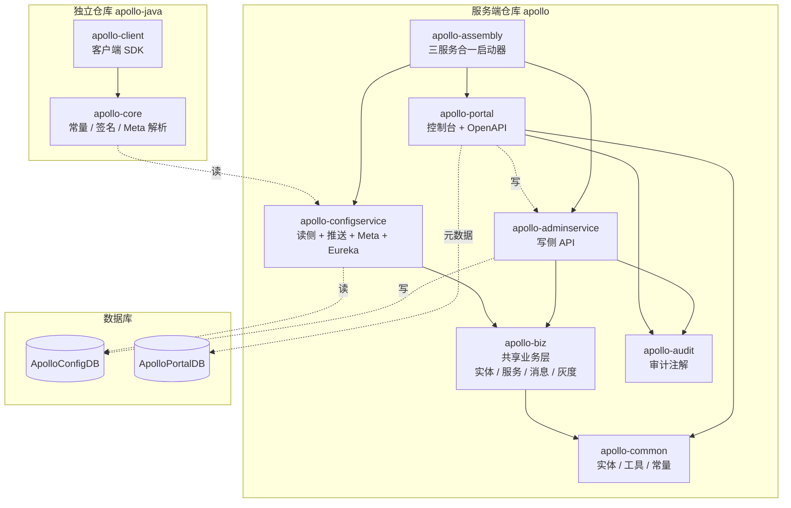

各模块职责：

- **apollo-biz**：实体（`App`/`Cluster`/`Namespace`/`Item`/`Release`/`ReleaseMessage`/`GrayReleaseRule` 等）、业务 Service、Repository、消息总线（`DatabaseMessageSender`/`ReleaseMessageScanner`）、灰度缓存（`GrayReleaseRulesHolder`）、运行时配置（`BizConfig`）。被 configservice 与 adminservice 共用。
- **apollo-configservice**：读侧 Controller（`ConfigController`/`ConfigFileController`/`NotificationControllerV2`）、多级缓存（`ConfigServiceWithCache`/`ReleaseMessageServiceWithCache`/`AccessKeyServiceWithCache`/`AppNamespaceServiceWithCache`）、Meta Server（`ServiceController`/`DiscoveryService`）、鉴权过滤器（`ClientAuthenticationFilter`）。
- **apollo-adminservice**：写侧 Controller（`AppController`/`NamespaceController`/`ItemController`/`ReleaseController`/`NamespaceBranchController` 等），发布时写 `ReleaseMessage`。
- **apollo-portal**：Web 控制台、多环境分发（`AdminServiceAPI`/`AdminServiceAddressLocator`）、权限（`RolePermissionService`）、OpenAPI（`ConsumerToken`）。
- **apollo-common**：跨模块共享实体（`App`/`AppNamespace`）、枚举、常量、异常。
- **apollo-assembly**：把三个服务跑进一个 JVM（开发/小规模部署）。

### 1.4 整体架构图

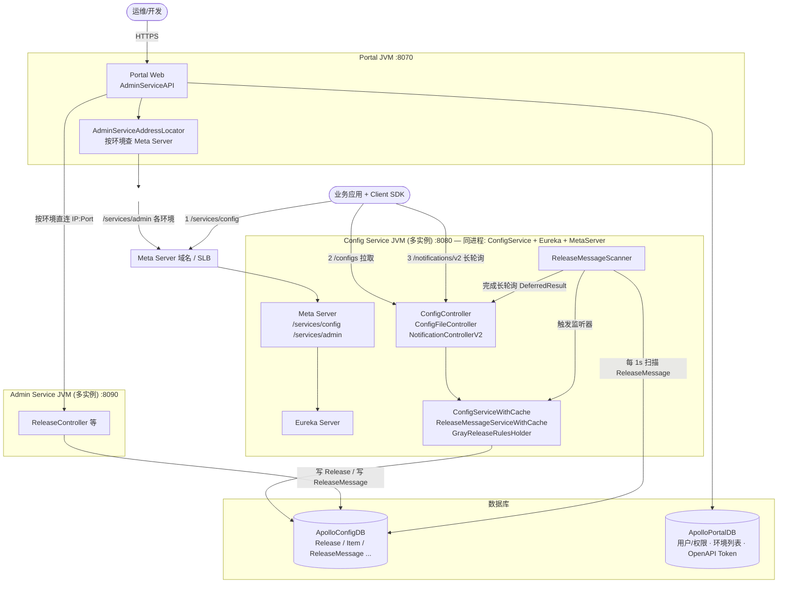

### 1.5 部署模式

- **独立部署（生产推荐）**：configservice、adminservice、portal 各自独立 JVM。configservice 多实例 + SLB；adminservice 多实例；portal 可单/多实例。
- **装配模式（apollo-assembly）**：`ApolloApplication` 在**一个进程内启动 4 个 Spring 上下文**——common（公共）、config（profile=`assembly`）、admin（profile=`assembly`）、portal，三者共享 common 父上下文。见 `apollo-assembly/src/main/java/.../ApolloApplication.java`。常用于本地/测试/小规模。

### 1.6 领域模型

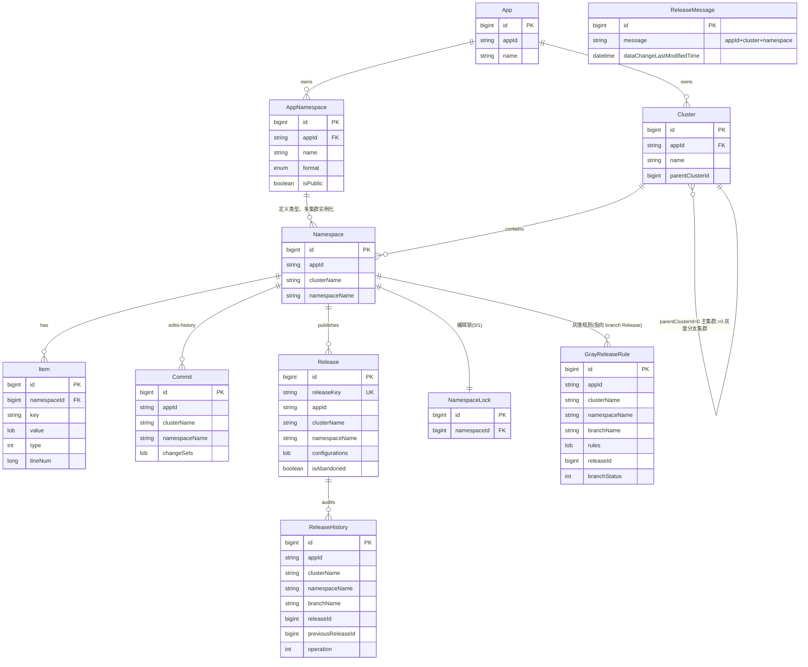

**版本化模型**：

- `Item` = 可编辑的单条键值（`key`/`value`/`type`/`lineNum`）。
- `Commit` = 一次编辑批次的变更集（`changeSets` JSON，由 `ConfigChangeContentBuilder` 构造 create/update/delete）。
- `Release` = 一次发布的**全量快照**（`configurations` = 整个 namespace 所有 Item 序列化的 JSON map，不是增量 diff），带全局唯一 `releaseKey`；`isAbandoned=true` 表示已回滚。
- `ReleaseHistory` = 发布审计（`operation` 取自 `ReleaseOperation`：NORMAL_RELEASE/ROLLBACK/GRAY_RELEASE/...）。
- `ReleaseMessage` = 发布/回滚时写入的"消息"，`message` = `appId+cluster+namespace`，自增 `id` 即客户端比对的 `notificationId`。

---

## 二、核心组件

### 2.1 `apollo-configservice` 核心组件

| 组件 | 类 | 作用 |
| --- | --- | --- |
| 配置读取 | `ConfigController` | `GET /configs/{appId}/{cluster}/{namespace}`，返回结构化 `ApolloConfig`，支持 304 与增量同步 |
| 配置文件读取 | `ConfigFileController` | `GET /configfiles/{...}`、`/configfiles/json`、`/configfiles/raw`，渲染为 properties/json/yaml/xml 文本；自带 30min 文件内容缓存 |
| 变更推送 | `NotificationControllerV2` | `GET /notifications/v2`，基于 Spring `DeferredResult` 的 HTTP 长轮询；实现 `ReleaseMessageListener` |
| 变更推送(旧) | `NotificationController` | `GET /notifications`（单 namespace、30s 超时，已废弃） |
| 配置缓存 | `ConfigServiceWithCache` | 三层 Guava `LoadingCache`（configCache/configIdCache/releaseKeyCache），expireAfterAccess 60min；实现 `ReleaseMessageListener` |
| 消息缓存 | `ReleaseMessageServiceWithCache` | 内存缓存每个 watch key 的最新 `ReleaseMessage`（即最新 notificationId）；启动全量加载 + 1s 兜底扫描 |
| 灰度缓存 | `GrayReleaseRulesHolder` | 内存缓存 `GrayReleaseRule`，按 clientAppId/ip/label 匹配灰度 releaseId |
| AppNamespace 缓存 | `AppNamespaceServiceWithCache` | 缓存 app->namespace 类型，用于判断公共/私有 namespace |
| AccessKey 缓存 | `AccessKeyServiceWithCache` | 缓存各 app 的可用/观察密钥，供鉴权过滤器使用 |
| 消息扫描器 | `ReleaseMessageScanner`（apollo-biz） | 每 1s 扫描 `ReleaseMessage` 表 `id > maxIdScanned`，分发给有序监听器链 |
| 鉴权过滤器 | `ClientAuthenticationFilter` | 拦截 `/configs/*`、`/configfiles/*`、`/notifications*`，校验 AccessKey HMAC 签名 |
| 增量同步 | `DefaultIncrementalSyncService` | 计算新旧配置 diff（ADDED/DELETED/MODIFIED），缓存 10min |
| Meta Server | `ServiceController` | `/services/config`、`/services/admin` 返回实例列表 |
| 服务发现 SPI | `DiscoveryService` 链 | `DefaultDiscoveryService`(Eureka) / `DatabaseDiscoveryService` / `KubernetesDiscoveryService` / `Consul` / `Nacos` / `Zookeeper` |
| Eureka | `ConfigServerEurekaServerConfigure` | `@EnableEurekaServer`（默认开启），configservice 自带注册中心 |

### 2.2 `apollo-adminservice` 核心组件

写侧 Controller（均位于 `.../adminservice/controller/`）：

- `AppController` / `ClusterController` / `NamespaceController` / `AppNamespaceController`
- `ItemSetController`（批量编辑 + 生成 Commit）/ `ItemController`
- `ReleaseController`（`publish` / `updateAndPublish` / `rollback` / `gray-del-releases`）
- `NamespaceBranchController`（灰度分支创建/规则/合并/删除）
- `AccessKeyController` / `InstanceController`（实例配置上报）/ `ConsumerController`（OpenAPI token）

发布后由 `ReleaseController` 调用 `messageSender.sendMessage(ReleaseMessageKeyGenerator.generate(appId, cluster, namespace), Topics.APOLLO_RELEASE_TOPIC)` 写入消息。

### 2.3 `apollo-portal` 核心组件

- **多环境分发**：`AdminServiceAPI`（内部一组 `@Service` 静态内部类 `AppAPI`/`NamespaceAPI`/`ReleaseAPI` 等，每个方法接收 `Env` 并通过 `restTemplate` 调用对应环境 adminservice）；`AdminServiceAddressLocator`（`@PostConstruct` 后按 `portalSettings.getAllEnvs()` 周期性向各环境 Meta Server `GET /services/admin` 拉取并缓存实例列表，随机打乱返回；失败用更长间隔重试）。
- **环境配置**：`apollo.portal.envs`（ServerConfig，支持的环境列表）、`apollo.portal.meta.servers`（各环境 Meta Server 列表 JSON）、`apollo-env.properties`（`dev.meta=...` 等映射）。
- **权限**：`RolePermissionService` + `Permission`/`Role`/`UserRole`，按 app-namespace 粒度授权。
- **OpenAPI**：`ConsumerToken`（bearer token + 限流 `rateLimit`）、`ConsumerAudit`（调用审计）、`ConsumerRole`（授权）。

### 2.4 `apollo-biz` 共享业务层

关键 Service（`.../biz/service/`）：`ReleaseService`（发布引擎）、`NamespaceService`、`ItemService`/`ItemSetService`（编辑 + Commit）、`CommitService`、`ReleaseHistoryService`、`NamespaceBranchService`（灰度分支/规则）、`NamespaceLockService`、`AccessKeyService`、`InstanceService`（实例 + 实例配置）、`AdminService`（应用生命周期 facade：`createNewApp`/`deleteApp`）、`ReleaseMessageService`。

消息/灰度：`DatabaseMessageSender`（`MessageSender` 实现，写 `ReleaseMessage` + 异步清理同 key 旧行）、`ReleaseMessageScanner`、`ReleaseMessageListener`、`Topics`（`APOLLO_RELEASE_TOPIC="apollo-release"`）、`GrayReleaseRulesHolder`。

### 2.5 "数据库即消息总线"组件链

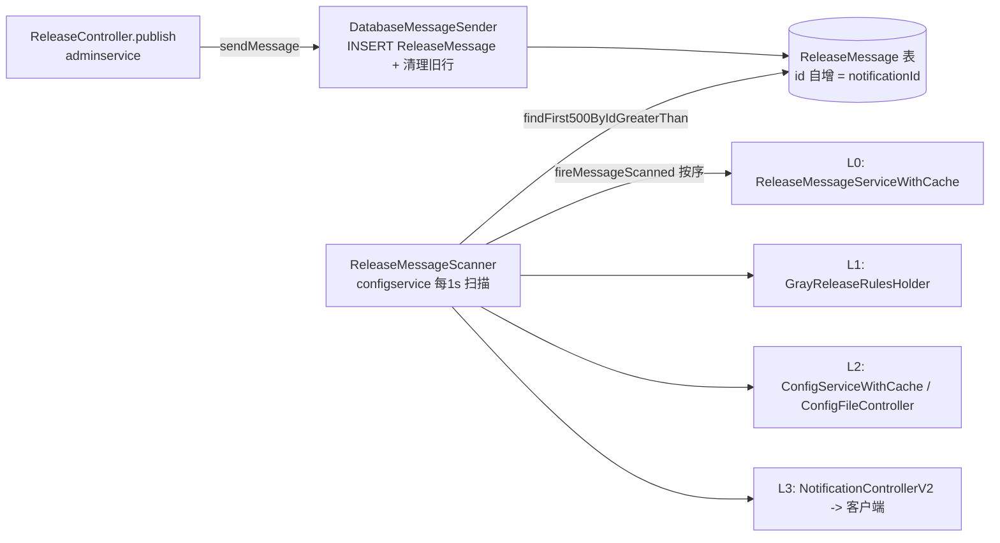

### 2.6 多级缓存体系

| 层级 | 缓存 | 命中对象 | TTL | 失效方式 |
| --- | --- | --- | --- | --- |
| 服务端-配置对象 | `ConfigServiceWithCache.configCache` | `appId+cluster+namespace` -> `Release` | expireAfterAccess 60min | `handleMessage` 失效+预热；请求级 staleness 检查 |
| 服务端-文件内容 | `ConfigFileController.localCache` | `format+appId+cluster+ns` -> 文本 | expireAfterWrite 30min，≤50MB | `handleMessage` 失效 |
| 服务端-消息id | `ReleaseMessageServiceWithCache` | watch key -> 最新 `ReleaseMessage` | 常驻内存 | `handleMessage` 更新；1s 兜底扫描 |
| 服务端-灰度规则 | `GrayReleaseRulesHolder` | config key -> 规则；反向 ip/label -> ruleId | 常驻内存 | `handleMessage` 更新；周期扫描 |
| 客户端-内存 | `DefaultConfig.m_configProperties` | namespace -> `Properties` | 进程内 | 长轮询触发 sync |
| 客户端-本地快照 | `LocalFileConfigRepository` 文件 | `appId+cluster+ns` -> 文件 | 持久 | 每次拉取覆写；失联时读 |

---

## 三、服务端启动流程

### 3.1 启动入口

- **Config Service**：`ConfigServiceApplication`（`@EnableAutoConfiguration` + `@ComponentScan({ApolloCommonConfig, ApolloBizConfig, ConfigServiceApplication, ApolloMetaServiceConfig})` + `@PropertySource("configservice.properties")`）。
- **Admin Service**：`AdminServiceApplication`。
- **Portal**：`PortalApplication`。
- **Assembly**：`ApolloApplication` 用 `SpringApplicationBuilder` 顺序拉起 4 个上下文，common 为父上下文，config/admin/portal 均以 `profile=assembly` 为子上下文：

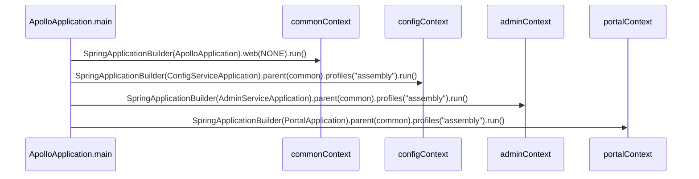

### 3.2 Config Service 启动时序

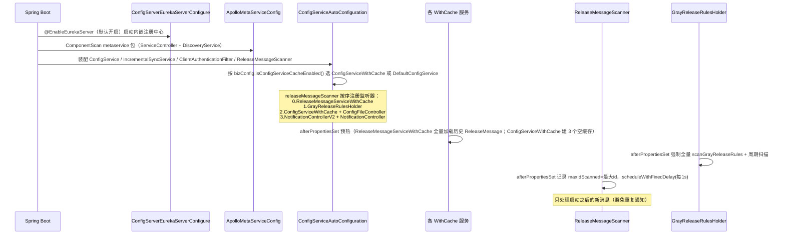

### 3.3 Eureka 嵌入与 Meta Server

- `ConfigServerEurekaServerConfigure`：`@Configuration @EnableEurekaServer @ConditionalOnProperty("apollo.eureka.server.enabled", matchIfMissing=true)`。即默认在 configservice 内启动 Eureka Server；可通过 profile（kubernetes/nacos/consul/zookeeper）或关闭开关改用外部注册中心。
- `ServiceController`：`@RestController @RequestMapping("/services")`，`/services/config` 与 `/services/admin` 通过 `DiscoveryService.getServiceInstances(serviceId)` 返回实例列表（`ServiceDTO`：appName/instanceId/homepageUrl）。
- `DiscoveryService` SPI 链（`@ConditionalOnMissingProfile` 选择实现）：
  - `DefaultDiscoveryService`：基于 Eureka（默认）。
  - `DatabaseDiscoveryService`、`KubernetesDiscoveryService`、`SpringCloudInnerDiscoveryService`（Nacos/Consul/Zookeeper）：适配其它注册中心。

> 因此 Meta Server 不是一个独立进程，而是 configservice 内一组 Controller + DiscoveryService，客户端/Portal 只需请求"Meta Server 域名"的 `/services/config`、`/services/admin` 即可拿到 IP:Port 列表。

### 3.4 启动时缓存预热与初始化顺序

启动期需要保证顺序正确，避免漏掉已有消息：

1. `ReleaseMessageServiceWithCache.afterPropertiesSet()`：阻塞式 `loadReleaseMessages(0)` 全量加载历史到内存（注释明确：必须在 `ReleaseMessageScanner` 之前完成），随后启动 1s 兜底扫描线程。
2. `GrayReleaseRulesHolder.afterPropertiesSet()`：先 `periodicScanRules()` 同步全量加载灰度规则，再 `scheduleWithFixedDelay` 周期扫描。
3. `ConfigServiceWithCache.@PostConstruct initialize()`：建立三个 Guava 缓存（懒加载，首次请求时填充）。
4. `AppNamespaceServiceWithCache` / `AccessKeyServiceWithCache`：预热 namespace 类型与密钥。
5. `ReleaseMessageScanner.afterPropertiesSet()`：`maxIdScanned = loadLargestMessageId()`，只处理 id 大于该值的**新**消息，避免启动时把历史消息重放给客户端。

### 3.5 启动流程图

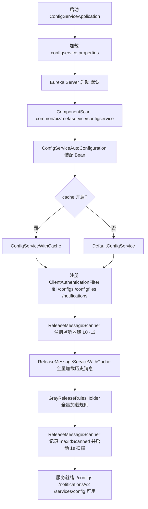

---

## 四、客户端如何拉取配置

> 客户端 Java 实现位于独立仓库 `apollo-java`（`apollo-client` + `apollo-core`）。下列类名/方法为该仓库内部实现，行为经服务端契约与文档验证。

### 4.1 客户端架构

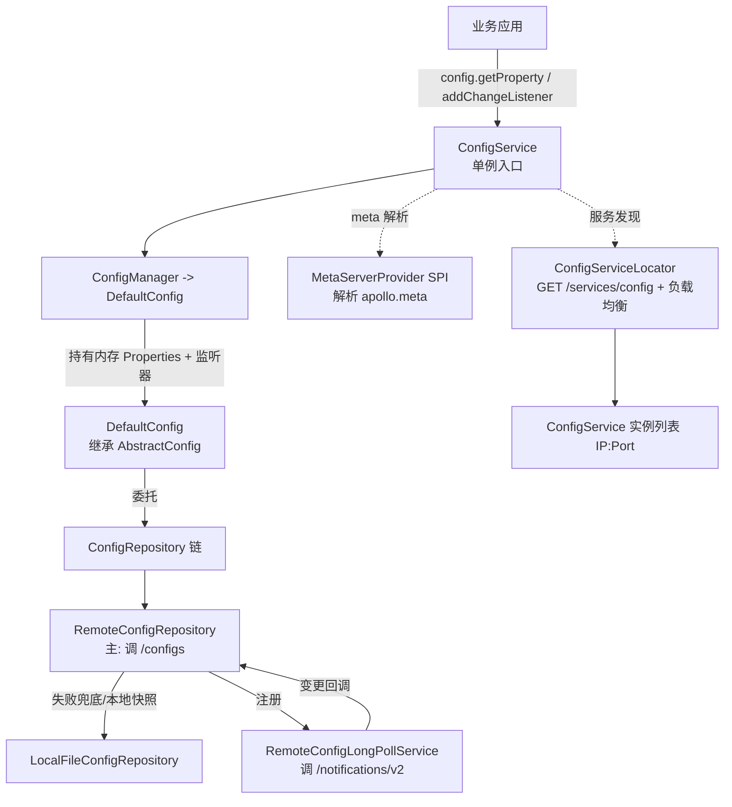

- `ConfigService`：客户端入口，`getAppConfig()`/`getConfig(namespace)` 返回单例 `Config`。
- `DefaultConfig`（继承 `AbstractConfig`）：持有 `AtomicReference<Properties>` 内存配置与 `List<ConfigChangeListener>`；`updateAndCalcConfigChanges` 计算逐键 diff 后回调 `onChange(ConfigChangeEvent)`。
- `ConfigRepository` 链：`RemoteConfigRepository`（主）→ `LocalFileConfigRepository`（兜底）。`RemoteConfigRepository` 在远程失败时回退本地快照，保证可用性。
- `RemoteConfigLongPollService`：管理长轮询循环，把多个 namespace 复用进一次 `/notifications/v2` 请求；收到变更后回调对应 `RemoteConfigRepository.sync()`。

### 4.2 `apollo.meta` 解析与服务发现

`apollo.meta` 解析优先级（`MetaServerProvider` SPI，Order 最小者胜出）：Java 系统属性 → Spring Boot 配置文件 → 环境变量 `APOLLO_META` → `server.properties` → `classpath:/META-INF/app.properties` → `${env}_meta`/`${ENV}_META` → `apollo-env.properties`。得到 Meta Server 域名后，`ConfigServiceLocator` 调 `GET /services/config` 获取实例列表，`RandomConfigServiceLoadBalancerClient`（v2.1.0+ SPI，默认随机）选一个实例，失败重试其它。

### 4.3 首次拉取配置时序

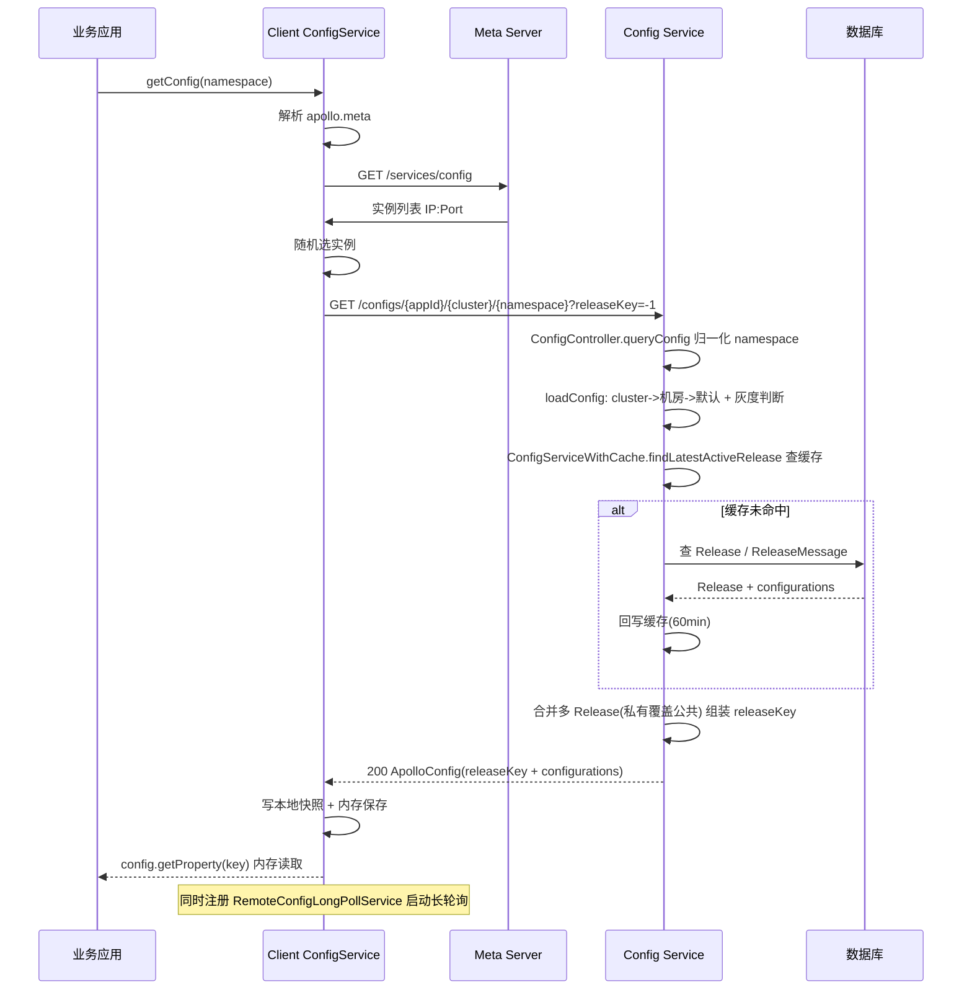

### 4.4 服务端 `/configs` 处理详解

`ConfigController.queryConfig` 流程：

1. `namespaceUtil.filterNamespaceName`（去 `.properties` 后缀）+ `normalizeNamespace`（大小写归一）。
2. 解析 clientIp，`transformMessages(messages)` 把客户端上报的 `ApolloNotificationMessages`（各 watch key 的 notificationId）解析出来。
3. `configService.loadConfig(...)`（`AbstractConfigService`）：按 **指定 cluster → 机房 cluster → 默认 cluster** 顺序解析；`findRelease` 先查灰度规则 `grayReleaseRulesHolder.findReleaseIdFromGrayReleaseRule(...)`，命中则按 id 取灰度 Release，否则取最新生效 Release。
4. 若 namespace 不属于该 app（公共 namespace），再 `findPublicConfig` 取拥有方 app 的 Release，**合并顺序：私有覆盖公共**（`Lists.reverse(releases)` 后 `putAll`）。
5. 组装 `latestMergedReleaseKey`（多 Release 的 releaseKey 用 `+` 拼接）。
6. **304 短路**：若 `latestMergedReleaseKey.equals(clientSideReleaseKey)` → 返回 `304 Not Modified`，告知客户端已是最新。
7. **增量同步**（`bizConfig.isConfigServiceIncrementalChangeEnabled()`）：拆分客户端 releaseKey 取其历史 Release，`incrementalSyncService.getConfigurationChanges(...)` 计算 diff，返回 `ConfigSyncType.INCREMENTAL_SYNC` + `ConfigurationChange` 列表；异常则回退全量。
8. 全量路径：`ApolloConfig.setConfigurations(mergedMap)` 返回。

`ConfigServiceWithCache`（请求级 staleness 检查）：`findLatestActiveRelease` 命中 `configCache` 后，若客户端 `ApolloNotificationMessages` 中该 key 的 notificationId **大于**缓存里的 `ConfigCacheEntry.notificationId`，则 `invalidate` 并重载——保证即便服务端缓存未被消息失效，也能按客户端已知版本及时刷新。

### 4.5 本地快照（LocalFileConfigRepository）

- 路径：`/opt/data/{appId}/config-cache/{appId}+{cluster}+{namespace}.json|.properties`（可由 `apollo.cacheDir` 覆盖）。
- 每次成功拉取后覆写本地文件；服务不可达/网络中断时，从本地文件恢复配置，应用继续运行（容灾降级）。
- `env=Local` 本地开发模式下仅读本地缓存、不连服务、不监听变更（重启生效）。

### 4.6 cluster/机房/默认解析与公共 namespace 合并

- 解析顺序：指定 cluster → dataCenter 机房 cluster → `default` 默认 cluster（`AbstractConfigService.loadConfig`）。
- 长轮询 watch key 同时注册这三个 cluster 的 key（`WatchKeysUtil.assembleAllWatchKeys`），任一发布都能感知。
- 公共 namespace：`NamespaceService.findPublicNamespaceForAssociatedNamespace` 通过 `AppNamespaceService.findPublicNamespaceByName` 找到拥有方 app，再取其 Release；客户端引用公共 namespace 时会自动 watch 拥有方 app 的 key。

### 4.7 HTTP 304 与增量同步

- `releaseKey` 是版本指纹：客户端上报上次的 releaseKey，服务端比对决定 304（无变更）还是下发新配置。
- 增量同步（`DefaultIncrementalSyncService`）：以 `(clientSideReleaseKey, latestMergedReleaseKey)` 为 key 缓存 diff（10min）；`calcConfigurationChanges` 用集合差集得出 ADDED/DELETED/MODIFIED 三类 `ConfigurationChange`，减少大配置全量传输。

---

## 五、配置动态变更如何实现

### 5.1 设计思路：DB 作消息总线 + HTTP 长轮询

Apollo **不依赖外部 MQ**。Admin Service 发布时往 `ReleaseMessage` 表写一行；每个 Config Service 实例独立每秒扫描该表，把新消息**进程内**分发给监听器，最终通过 `DeferredResult` 唤醒挂起的长轮询连接。客户端收到"有变更"通知后，再单独发一次 `/configs` 拉取"变更内容"。这是**两段式**：长轮询负责"推送通知"，`/configs` 负责"拉取内容"。

### 5.2 发布端

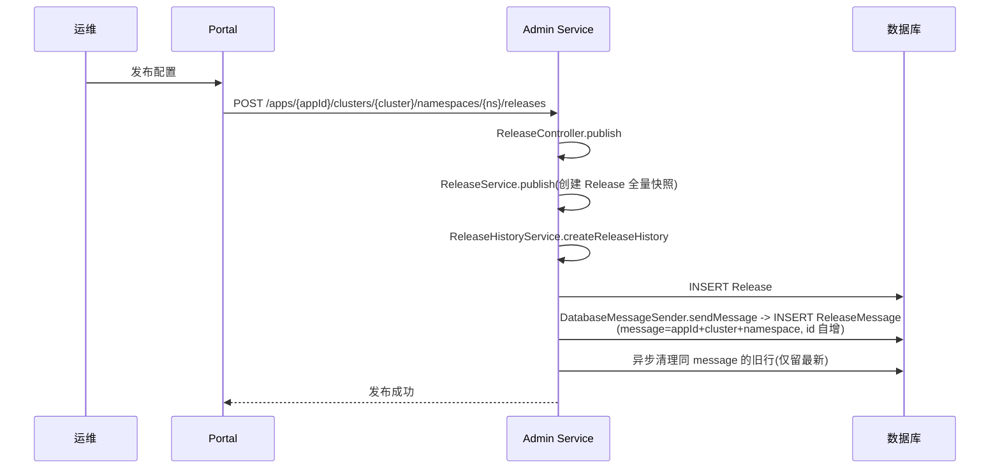

- `releaseKey` 由 `ReleaseKeyGenerator.generateReleaseKey` 生成（时间戳+appId+cluster+namespace+hash）。
- `messageCluster` 在存在父 namespace（灰度分支）时取**父**集群名，使父集群的订阅者也能收到通知。

### 5.3 扫描端（ReleaseMessageScanner 监听器链）

`ReleaseMessageScanner.afterPropertiesSet`：`maxIdScanned = loadLargestMessageId()`，`scheduleWithFixedDelay(scanMissingMessages + scanMessages, 1s, 1s)`。`scanAndSendMessages` 批量 `findFirst500ByIdGreaterThanOrderByIdAsc(maxIdScanned)`，对每条消息按 `ConfigServiceAutoConfiguration` 注册的顺序调用监听器 `handleMessage`：

| 顺序 | 监听器 | 动作 |
| --- | --- | --- |
| L0 | `ReleaseMessageServiceWithCache` | 更新消息缓存（缺失 id 则回填） |
| L1 | `GrayReleaseRulesHolder` | 重新加载该 namespace 灰度规则 |
| L2 | `ConfigServiceWithCache` | 失效配置缓存 + 预热新 Release |
| L2 | `ConfigFileController` | 失效文件内容缓存（按 watchedKeys 反查） |
| L3 | `NotificationControllerV2` | 唤醒等待该 watch key 的长轮询连接（最后） |
| L3 | `NotificationController` | 旧版同上 |

> 顺序很关键：**先刷新缓存与灰度，最后才通知客户端拉取**——否则客户端拉到的可能还是旧缓存。

### 5.4 长轮询端（NotificationControllerV2 + DeferredResult）

`pollNotification`：

1. 解析客户端 `notifications=[{namespaceName, notificationId}]`，归一化。
2. `watchKeysUtil.assembleAllWatchKeys` 生成多 watch key（指定 cluster / 机房 / 默认 / 公共 namespace 拥有方）。
3. 创建 `DeferredResultWrapper`（超时 `bizConfig.longPollingTimeoutInMilli()`，默认 60s，钳制 1–90s）。
4. **先注册** `DeferredResultWrapper` 到各 watch key 的 `deferredResults` multimap，**再查缓存**（注释明示：避免"检查与注册之间"消息到达导致丢通知）。
5. `releaseMessageService.findLatestReleaseMessagesGroupByMessages(watchedKeys)` 比对 `latestId > clientSideId`：有变更则立即 `setResult`；否则挂起。
6. 手动 `entityManagerUtil.closeEntityManager()`——异步长轮询会长期挂起请求，必须主动释放 DB 连接，避免连接池耗尽。
7. `onCompletion`/`onTimeout` 注销 watch key。

`handleMessage`（被 Scanner 触发）：查 `deferredResults.get(content)`，对每个等待的 `DeferredResultWrapper` 调 `setResult(ApolloConfigNotification(namespace, message.getId()))`；若等待客户端数 > `releaseMessageNotificationBatch`（默认 100），用 `largeNotificationBatchExecutorService` 分批异步通知，批间 `releaseMessageNotificationBatchIntervalInMilli`（默认 100ms）睡眠——防止热点 namespace 的惊群。

### 5.5 端到端时序

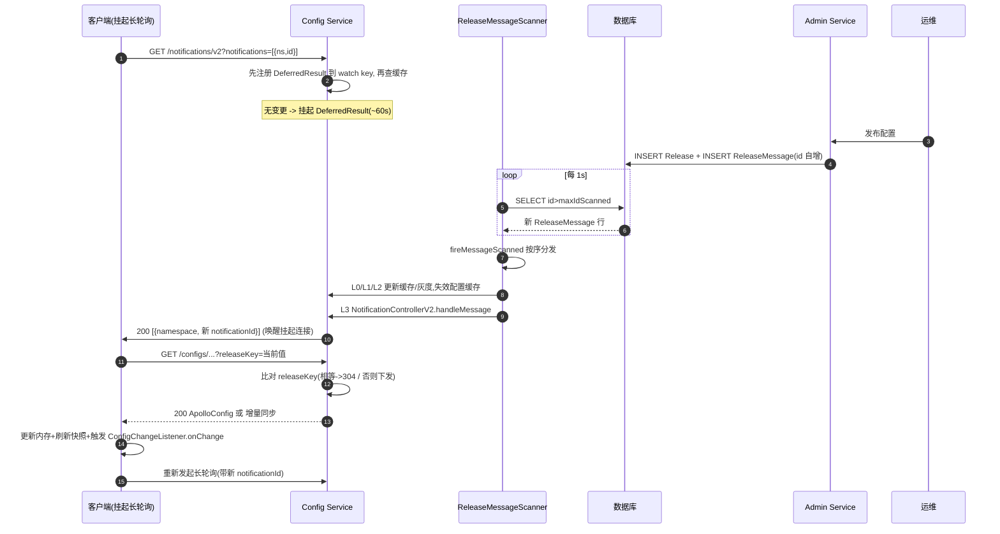

### 5.6 关键并发与正确性

- **watch key 对称**：`ReleaseMessageKeyGenerator.generate(appId, cluster, namespace) = appId+cluster+namespace`，发布端与订阅端用同一函数生成，保证两侧 join。
- **先注册再查缓存**：消除长轮询注册与缓存检查之间的竞态（V1 有此 bug，V2 修复）。
- **notificationId 单调**：`ReleaseMessage.id` 自增，客户端用 `latestId > clientSideId` 判断变更，天然幂等。
- **DB 兜底扫描**：`ReleaseMessageServiceWithCache` 除监听消息外还独立每秒扫表，Scanner 不可达时仍能自愈。
- **批量推送保护**：大量客户端同 watch 一个热点 namespace 时分批唤醒，避免瞬时洪峰。
- **连接释放**：长轮询挂起期间手动关闭 EntityManager，不占 DB 连接。

### 5.7 客户端侧变更监听

`RemoteConfigLongPollService` 维护每个 namespace 的 `notificationId`（`ApolloNotificationMessages`），单线程循环发起 `/notifications/v2`。收到变更 namespace 后，回调对应 `RemoteConfigRepository.sync()` → `trySync()` → `loadConfigProperties()` 重新拉取 `/configs`。`DefaultConfig` 拿到新 Properties 后 `updateAndCalcConfigChanges` 计算逐键 diff，对每个 `ConfigChange`（`oldValue`/`newValue`/`changeType`）回调已注册的 `ConfigChangeListener.onChange`。失败时按指数退避重试并轮换 configservice 实例。另有**定时兜底拉取**（默认每 5min，`apollo.refreshInterval`），上报本地版本，服务端通常返回 304。

---

## 六、灰度发布

### 6.1 master / branch 模型

灰度不靠额外表字段，而是**借 Cluster 表建模**：`Cluster.parentClusterId=0` 为主集群，`>0` 为灰度分支集群（`name` 形如 `yyyyMMddHHmmss-hash`）。`NamespaceBranchService.createBranch` 创建子 Cluster + 同名子 Namespace。`GrayReleaseRule` 绑定父 `(appId,cluster,namespace)` 与分支 `branchName`，`releaseId` 指向分支 Release，`rules` 为 JSON 条件（clientAppId / ip 列表 / label），`branchStatus`（`NamespaceBranchStatus`：DELETED/ACTIVE/MERGED）。

### 6.2 GrayReleaseRulesHolder

`GrayReleaseRulesHolder`（`InitializingBean` + `ReleaseMessageListener`）维护：

- `grayReleaseRuleCache`：`configAppId+cluster+namespace` -> `GrayReleaseRuleCache`。
- `reversedGrayReleaseRuleCache`：`clientAppId+namespace+ip` -> ruleId。
- `reversedGrayReleaseRuleLabelCache`：`clientAppId+namespace+label` -> ruleId。

`findReleaseIdFromGrayReleaseRule(clientAppId, ip, label, ...)` 遍历该 namespace 的规则，匹配 `branchStatus=ACTIVE` 且条件命中者，返回灰度 `releaseId`（`AbstractConfigService.findRelease` 据此按 id 取灰度 Release）。`hasGrayReleaseRule` 用于 `ConfigFileController` 判断是否绕过缓存直接加载（灰度客户端不能命中公共缓存）。

### 6.3 灰度发布流程

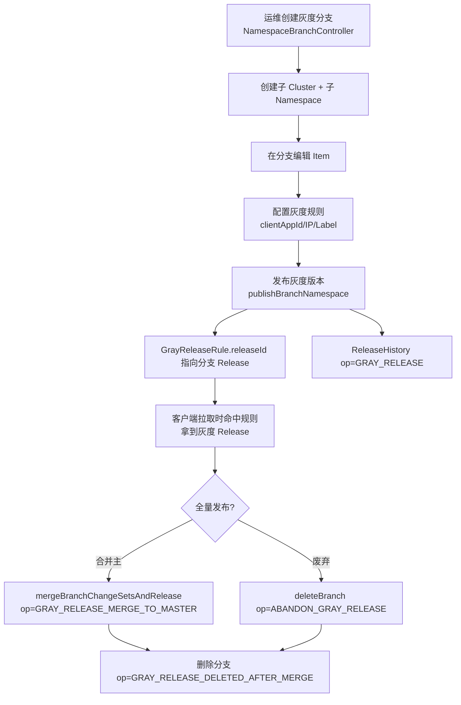

---

## 七、整合 Spring Boot

> Apollo 的 Spring/Spring Boot 集成位于独立仓库 `apollo-java` 的 `apollo-client` 模块（包 `com.ctrip.framework.apollo.spring`）。本节说明 Spring Boot 应用如何"无感"地把 Apollo 配置加载进 Spring 容器，以及配置变更如何在运行时自动刷新。

### 7.1 集成原理：把 Apollo 配置变成 Spring PropertySource

Spring 3.1+ 的 `ConfigurableEnvironment` 内部维护一组有序的 `PropertySource`，`getProperty(key)` 按顺序查找、**排在前面的优先级最高**。Apollo 集成的核心手段就是：**在应用启动阶段，从远端拉取配置，组装成一个 `PropertySource`，并用 `addFirst` 插到 `MutablePropertySources` 最前面**，使 Apollo 配置优先于本地 `application.properties`、系统属性等。此后 `@Value("${key}")`、`@ConditionalOnProperty`、`@ConfigurationProperties` 都会从 Environment 中读到 Apollo 的值。

### 7.2 三种接入方式

| 方式 | 触发 | 注入时机 | 适用场景 |
| --- | --- | --- | --- |
| `@EnableApolloConfig`（Java/XML `<apollo:config/>`） | `@Configuration` 类 | `BeanFactoryPostProcessor` 阶段 | Spring / Spring Boot 通用 |
| `apollo.bootstrap.enabled=true` | bootstrap.properties | Environment 准备阶段（极早） | 需要 `@ConditionalOnProperty` 或早期 starter 读到 Apollo |
| `spring.config.import=apollo://ns`（1.9.0+） | application.properties | Config Data 阶段 | Spring Boot 2.4+ 推荐 |

### 7.3 核心 Spring 扩展点与组件

```mermaid
graph TD
  ENV[ConfigurableEnvironment<br/>MutablePropertySources]
  BF[BeanFactory refresh]
  BI[Bean 实例化]

  EP["ApolloApplicationContextInitializer<br/>ApplicationContextInitializer + EnvironmentPostProcessor"]
  REG[ApolloConfigRegistrar<br/>ImportBeanDefinitionRegistrar]
  PSP["PropertySourcesProcessor<br/>BeanFactoryPostProcessor"]
  AAP["ApolloAnnotationProcessor<br/>BeanPostProcessor"]
  SVP["SpringValueProcessor<br/>BeanPostProcessor"]
  SVR[SpringValueRegistry]
  AUTO["AutoUpdateConfigChangeListener<br/>ConfigChangeListener"]
  CDL["ApolloConfigDataLoader + LocationResolver<br/>(1.9.0+)"]

  REG -->|注册| PSP
  REG -->|注册| AAP
  REG -->|注册| SVP
  EP -->|addFirst PropertySource| ENV
  CDL -->|addFirst PropertySource| ENV
  PSP -->|addFirst PropertySource| ENV
  PSP -->|注册监听| AUTO
  BF -->|postProcessBeanFactory| PSP
  BI -->|处理 @Value| SVP
  SVP -->|记录 SpringValue| SVR
  AUTO -->|查 key -> SpringValue| SVR
  AUTO -->|反射更新 @Value 字段| BI
  AAP -->|@ApolloConfig / @ApolloConfigChangeListener| BI
  ENV -->|@Value 占位符解析| BI
```

- **`ApolloApplicationContextInitializer`**：同时实现 `ApplicationContextInitializer` 与 `EnvironmentPostProcessor`，经 `META-INF/spring.factories` 注册。`apollo.bootstrap.enabled=true` 时在 Environment 准备阶段初始化 Apollo（拉取配置）并把 `PropertySource` `addFirst`，使配置在上下文刷新前就可用。
- **`@EnableApolloConfig`** -> `ApolloConfigRegistrar`（`ImportBeanDefinitionRegistrar`）：注册 `PropertySourcesProcessor`、`ApolloAnnotationProcessor`、`SpringValueProcessor` 三个 Bean 定义。
- **`PropertySourcesProcessor`**（`BeanFactoryPostProcessor`）：收集所有 namespace（默认 `application`，可 `@EnableApolloConfig({"ns1","ns2"})` 多个并指定 `order`），初始化各 `Config`（触发远程拉取），创建 `ConfigPropertySource` 并 `addFirst`，同时注册 `AutoUpdateConfigChangeListener`。
- **`ApolloAnnotationProcessor`**（`BeanPostProcessor`）：处理 `@ApolloConfig`（注入 Config 对象）、`@ApolloConfigChangeListener`（把方法注册为 `ConfigChangeListener`）、`@ApolloJsonValue`。
- **`SpringValueProcessor`**（`BeanPostProcessor`）：扫描 bean 的 `@Value`，记录 `SpringValue`（bean 名 / 字段或方法 / 占位符 key / 类型）入 `SpringValueRegistry`，供自动刷新使用。
- **`AutoUpdateConfigChangeListener`**（`ConfigChangeListener`）：监听 `ConfigChangeEvent`，对每个变更 key 反查 `SpringValueRegistry`，用反射更新对应 `@Value` 字段（带类型转换），实现运行时免重启刷新。
- **`ApolloConfigDataLoader` + `ApolloConfigDataLocationResolver`**（1.9.0+）：对接 Spring Boot 2.4 的 Config Data 机制，`spring.config.import=apollo://ns` 触发，在 Environment 准备期加载 Apollo 配置。

### 7.4 Spring Boot 加载配置的整体流程

**bootstrap 模式（`apollo.bootstrap.enabled=true`）**

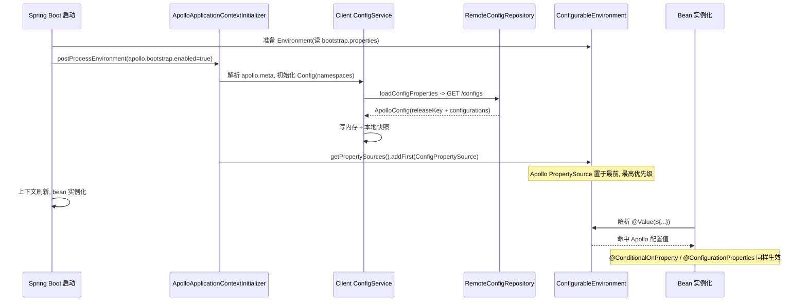

**`@EnableApolloConfig` 模式**

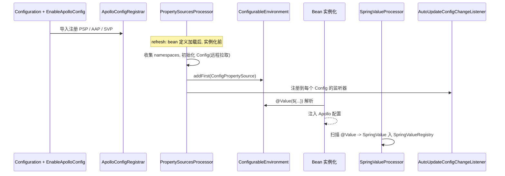

> 两种模式最终都把 Apollo `PropertySource` 置于 Environment 最前；区别仅在注入时机：bootstrap 模式更早（适合 `@ConditionalOnProperty`、dubbo 等早期读取场景），`@EnableApolloConfig` 模式在 `BeanFactoryPostProcessor` 阶段。`apollo.bootstrap.eagerLoad.enabled=true` 可进一步把 Apollo 加载提前到日志系统初始化之前，便于用 Apollo 管理 `logging.level.*` 等。

### 7.5 配置占位符与运行时自动刷新

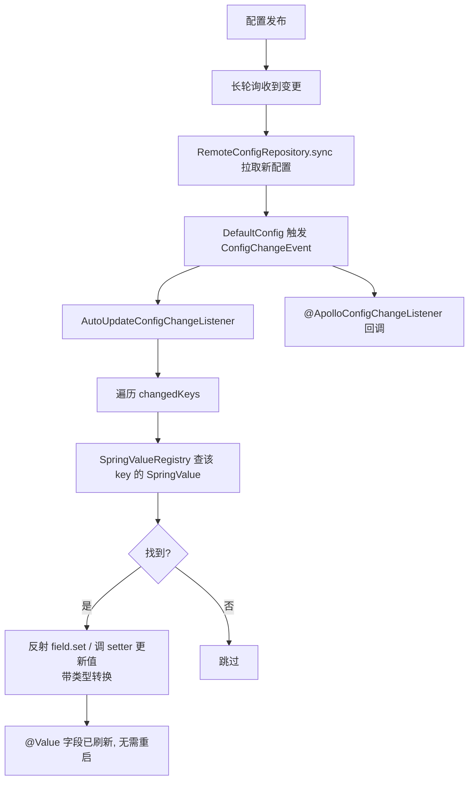

- **`@Value("${key:default}")`**：Spring 占位符，启动时从 Environment（含 Apollo）解析注入；v0.10.0+ 支持运行时自动更新。
- **`@ConfigurationProperties`**：支持注入，但其自动刷新需配合 `EnvironmentChangeEvent` / `@RefreshScope`（Apollo 不会直接重建此类 bean）。
- **自动刷新开关**：`apollo.autoUpdateInjectedSpringProperties=false`（系统属性或 `META-INF/app.properties`）可关闭 `@Value` 的运行时自动更新。
- **Apollo 注解**：`@ApolloConfig`（注入 Config）、`@ApolloConfigChangeListener`（注册监听方法）、`@ApolloJsonValue`（JSON 字符串 -> 对象）。

### 7.6 Config Data Loader 模式（Spring Boot 2.4+，Apollo 1.9.0+ 推荐）

`spring.config.import=apollo://namespace`；多 namespace 用 `apollo://ns3, apollo://ns2, apollo://ns1`（Config Data 从后往前加载、与 `apollo.bootstrap.namespaces` 顺序相反，需倒序）。Spring Boot 的 Config Data 机制调用 `ApolloConfigDataLocationResolver` 解析 `apollo://` 前缀，再由 `ApolloConfigDataLoader` 加载对应 namespace 配置为 `PropertySource`，是当前推荐的 Spring Boot 集成方式。`apollo.client.extension.enabled=true` 还可用 webClient（reactor-netty / jetty / httpclient5）替换默认 HTTP 客户端，便于扩展。

### 7.7 与客户端拉取/变更链路的关系

Spring Boot 集成本质上是 §四「客户端拉取配置」与 §五「配置动态变更」之上的一层适配：底层仍走 `RemoteConfigRepository` 调 `/configs`、`RemoteConfigLongPollService` 调 `/notifications/v2`、`LocalFileConfigRepository` 写本地快照；Spring 层只负责把 `Config` 的 `Properties` 包装成 `PropertySource` 注入 Environment，并把 `ConfigChangeEvent` 桥接为对 `@Value` 的反射更新与 `@ApolloConfigChangeListener` 回调。

---

## 八、其它底层实现原理

### 8.1 AccessKey 鉴权

- `ConfigServiceAutoConfiguration.clientAuthenticationFilter` 把 `ClientAuthenticationFilter` 注册到 `/configs/*`、`/configfiles/*`、`/notifications*`。
- `AccessKeyUtil.extractAppIdFromRequest` 从 URL 路径或 `appId` 参数提取 appId；`findAvailableSecret`/`findObservableSecrets` 从 `AccessKeyServiceWithCache` 取密钥。
- 校验：`Authorization` 头格式 `Apollo <secret>:<signature>`，取冒号后签名；`Signature.signature(timestamp, pathWithQuery, secret)` 计算 HMAC 签名（`path?query` + timestamp + secret）；`checkTimestamp` 校验时间戳偏差在 `accessKeyAuthTimeDiffTolerance`（默认 60s）内，防重放。
- "观察密钥"（observable）模式：未强制启用时仅做预检查（pre-check）记录告警，不拦截——用于灰度开启鉴权。

### 8.2 NamespaceLock 编辑锁

`NamespaceLock` 仅有 `namespaceId` 字段。编辑时 `tryLock` 写锁；`ReleaseService.checkLock` 规定**非紧急发布时，持锁人不能是发布人自己**（`lock.getDataChangeCreatedBy().equals(operator)` 抛 `BadRequestException`），强制"编辑-发布"分离，防误发布。发布成功 `unlock` 删除锁。

### 8.3 版本与回滚

- `Release.isAbandoned` 标记回滚版本（软删）。`rollback(releaseId)` 要求至少 2 个活跃版本，把最新版本置 `isAbandoned=true`，回退到上一版本，写 `ReleaseHistory(op=ROLLBACK)` 并 `rollbackChildNamespace`。`rollbackTo` 可回退到任意历史版本。
- 回滚同样会 `sendMessage` 写 `ReleaseMessage`，触发与发布相同的推送链路。
- `ReleaseHistoryService` 后台单线程按保留策略清理过期 `ReleaseHistory` 并物理删除真正无引用的 `Release`（`deletePhysicallyIfUnreferencedByIdIn`：无 ReleaseHistory/GrayReleaseRule 引用）。

### 8.4 公共/私有 namespace

- `AppNamespace.isPublic=false` 私有，仅拥有方 app 使用；`=true` 公共，其它 app 可关联引用。
- `NamespaceService.findPublicNamespaceForAssociatedNamespace` 解析拥有方，优先请求集群已发布版本，未发布则回退默认集群。
- 长轮询会同时 watch 拥有方 app 的 key，公共 namespace 变更也能通知到引用方客户端。

### 8.5 客户端实例上报

`ConfigController.queryConfig` 在 clientIp 存在时 `auditReleases` → `InstanceConfigAuditUtil` 异步记录 `Instance`/`InstanceConfig`（哪个实例消费了哪个 releaseKey），供 Portal 的"实例配置"视图展示，并可按 releaseKey 反查消费实例。

### 8.6 BizConfig 运行时参数

Apollo 把自身运行参数存于 `ApolloConfigDB.ServerConfig` 表，`BizConfig`（`@PropertySource` + `BizDBPropertySource`）读取并支持热更新（`@RefreshScope`）。关键参数：

| 参数 | 默认 | 含义 |
| --- | --- | --- |
| `long.polling.timeout` | 60s（钳制 1–90s） | 长轮询挂起时长 |
| `apollo.message-scan.interval` | 1000ms | ReleaseMessage 扫描间隔 |
| `apollo.release-message.cache.scan.interval` | 1s | 消息缓存兜底扫描 |
| `apollo.release-message.notification.batch` | 100 | 批量推送阈值 |
| `apollo.release-message.notification.batch.interval` | 100ms | 批间睡眠 |
| `apollo.access-key.auth.time-diff-tolerance` | 60s | 签名时间偏差容忍 |

### 8.7 服务发现 SPI

`DiscoveryService` 通过 `@ConditionalOnMissingProfile` 选择实现：Eureka（默认）/ Database / Kubernetes / Consul / Nacos / Zookeeper / 自定义。`ServiceController` 只依赖 `DiscoveryService` 接口，对上层屏蔽注册中心差异。

### 8.8 Portal 多环境分发

`AdminServiceAddressLocator`：`@PostConstruct` 取 `portalSettings.getAllEnvs()`，对每个 env 周期性 `GET {meta域名}/services/admin` 拉取实例列表并缓存；`getServiceList` 返回随机打乱列表。Portal 调 adminservice 时按 `Env` 选用对应实例，实现"一个 Portal 管理多环境"。客户端则只连其 `apollo.meta` 指定的单一环境。

---

## 九、端到端总结流程

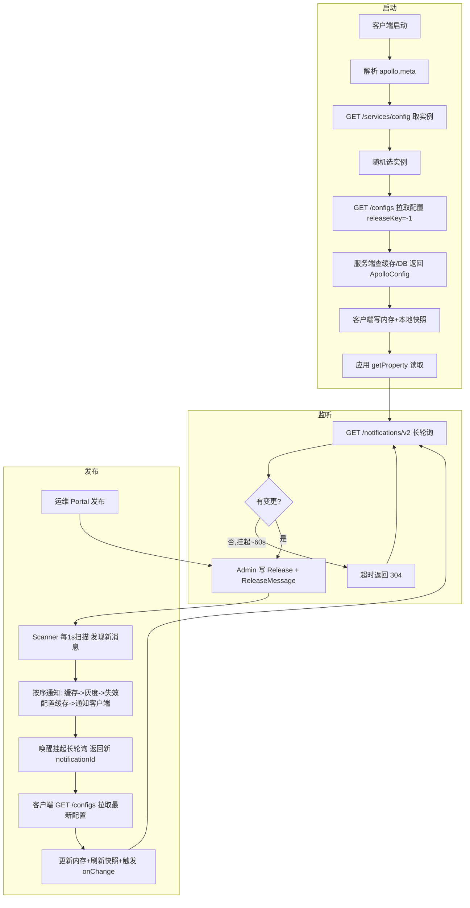

---

## 附录：关键类速查表

| 关注点 | 类 | 关键方法 |
| --- | --- | --- |
| 配置读取 | `ConfigController` | `queryConfig` |
| 配置文件读取 | `ConfigFileController` | `queryConfig` / `handleMessage` |
| 配置缓存 | `ConfigServiceWithCache` | `findLatestActiveRelease` / `handleMessage` |
| 集群解析 | `AbstractConfigService` | `loadConfig` / `findRelease` |
| 长轮询 | `NotificationControllerV2` | `pollNotification` / `handleMessage` |
| watch key 生成 | `WatchKeysUtil` | `assembleAllWatchKeys` |
| 消息缓存 | `ReleaseMessageServiceWithCache` | `findLatestReleaseMessagesGroupByMessages` / `handleMessage` |
| 消息扫描 | `ReleaseMessageScanner` | `scanMessages` / `fireMessageScanned` |
| 消息写入 | `DatabaseMessageSender` | `sendMessage` / `cleanMessage` |
| 发布 | `ReleaseService` | `publish` / `masterRelease` / `publishBranchNamespace` / `rollback` |
| 灰度 | `GrayReleaseRulesHolder` | `findReleaseIdFromGrayReleaseRule` / `hasGrayReleaseRule` |
| 灰度分支 | `NamespaceBranchService` | `createBranch` / `updateBranchGrayRules` / `deleteBranch` |
| 编辑锁 | `NamespaceLockService` | `tryLock` / `unlock` |
| 鉴权 | `ClientAuthenticationFilter` / `AccessKeyUtil` | `doCheck` / `buildSignature` |
| 增量同步 | `DefaultIncrementalSyncService` | `getConfigurationChanges` |
| 实例上报 | `InstanceConfigAuditUtil` / `InstanceService` | `auditReleases` |
| 服务发现 | `ServiceController` / `DiscoveryService` | `getConfigService` / `getAdminService` |
| Eureka | `ConfigServerEurekaServerConfigure` | `@EnableEurekaServer` |
| 装配启动 | `ApolloApplication` | `main`（4 上下文） |
| Portal 环境分发 | `AdminServiceAddressLocator` / `AdminServiceAPI` | `getServiceList` / 按 Env 调用 |
| 运行时参数 | `BizConfig` | `longPollingTimeoutInMilli` 等 |
| 客户端入口 | `ConfigService`(apollo-java) | `getAppConfig` / `getConfig` |
| 客户端内存配置 | `DefaultConfig` / `AbstractConfig` | `updateAndCalcConfigChanges` |
| 客户端远程仓库 | `RemoteConfigRepository` | `sync` / `trySync` / `loadConfigProperties` |
| 客户端本地快照 | `LocalFileConfigRepository` | 本地文件读写 |
| 客户端长轮询 | `RemoteConfigLongPollService` | 长轮询循环 + `ApolloNotificationMessages` |
| 客户端服务发现 | `ConfigServiceLocator` + `RandomConfigServiceLoadBalancerClient` | 选实例 |
| 客户端 Meta 解析 | `DefaultMetaServerProvider` 等 SPI | 解析 `apollo.meta` |

---

> 说明：客户端 SDK 内部实现（`RemoteConfigRepository`、`LocalFileConfigRepository`、`RemoteConfigLongPollService`、`DefaultConfig`、`ConfigServiceLocator` 等）位于 `apollo-java` 独立仓库，本文对其行为描述基于该仓库实现与 Apollo 服务端契约（`/configs`、`/notifications/v2`）、官方文档交叉验证。服务端部分（`apollo-configservice`/`apollo-adminservice`/`apollo-biz`/`apollo-portal`/`apollo-assembly`）均直接源自本仓库源码。
