# Apollo 配置中心源码深度解析

> 基于本仓库 `apolloconfig/apollo`（服务端 v3.0.0-SNAPSHOT）与 [apolloconfig/apollo-java](https://github.com/apolloconfig/apollo-java) **v2.5.0**（与本仓库 `pom.xml` 中 `apollo-java.version` 一致）源码梳理。

---

## 目录

> 正文章节编号 **1–33 保持不变**，便于锚点跳转与文内交叉引用；下列按主题归类，便于按需阅读。

### 一、入门与架构总览

| 节 | 标题 |
|----|------|
| [1](#1-项目概览与模块架构) | 项目概览与模块架构 |
| [2](#2-核心概念与数据模型) | 核心概念与数据模型 |
| [7](#7-设计亮点) | 设计亮点 |
| [8](#8-技术亮点) | 技术亮点 |
| [9](#9-可用性与运维考量) | 可用性与运维考量 |

### 二、核心链路与 Config Service 原理

| 节 | 标题 |
|----|------|
| [3](#3-端到端工作流程) | 端到端工作流程 |
| [4](#4-配置中心底层原理源码级) | 配置中心底层原理（源码级） |
| [5](#5-服务发现与-meta-server) | 服务发现与 Meta Server |
| [10](#10-服务端专题补充) | 服务端专题补充（Item/Commit、灰度分支、Portal 权限等综述） |

### 三、apollo-java 客户端

| 节 | 标题 |
|----|------|
| [6](#6-apollo-java-客户端深度解析v250) | apollo-java 客户端深度解析（v2.5.0） |
| [11](#11-apollo-java-扩展模块与生态) | apollo-java 扩展模块与生态 |
| [16](#16-深度专题客户端-di监听与类型化读取) | 客户端 DI、监听与类型化读取 |

### 四、深度专题 — 配置模型、发布与灰度

| 节 | 标题 |
|----|------|
| [18](#18-深度专题公共关联-namespace-与配置合并) | 公共/关联 Namespace 与配置合并 |
| [15](#15-深度专题灰度规则引擎) | 灰度规则引擎 |
| [27](#27-深度专题namespace-编辑锁) | Namespace 编辑锁 |
| [33](#33-深度专题release-生命周期与回滚) | Release 生命周期与回滚 |

### 五、深度专题 — 配置拉取、推送与运行时

| 节 | 标题 |
|----|------|
| [25](#25-深度专题watchkeys-与长轮询通知对齐) | WatchKeys 与长轮询通知对齐 |
| [14](#14-深度专题实例上报与-configfile-api) | 实例上报与 ConfigFile API |
| [13](#13-深度专题运行时配置与-accesskey) | 运行时配置与 AccessKey |

### 六、深度专题 — 服务发现与部署形态

| 节 | 标题 |
|----|------|
| [19](#19-深度专题数据库注册发现database-discovery) | 数据库注册发现（database-discovery） |
| [24](#24-深度专题meta-服务发现实现对比) | Meta 服务发现实现对比（Eureka / DB / K8s / Nacos 等） |
| [26](#26-深度专题一体化启动apollo-assembly) | 一体化启动（apollo-assembly） |

### 七、深度专题 — Portal 管理平台

| 节 | 标题 |
|----|------|
| [12](#12-深度专题portal-认证与安全体系) | Portal 认证与安全体系 |
| [20](#20-深度专题portal-前端与-api-映射) | Portal 前端与 API 映射 |
| [21](#21-深度专题应用namespace-生命周期与权限初始化) | 应用/Namespace 生命周期与权限初始化 |
| [22](#22-深度专题portal-多环境-admin-调用与容错) | Portal 多环境 Admin 调用与容错 |
| [23](#23-深度专题配置导入导出) | 配置导入/导出 |
| [28](#28-深度专题发布后通知webhook--邮件--mq) | 发布后通知（Webhook / 邮件 / MQ） |
| [29](#29-深度专题apollo-audit-审计体系) | apollo-audit 审计体系 |
| [30](#30-深度专题openapi-契约与-portal-实现映射) | OpenAPI 契约与 Portal 实现映射 |
| [31](#31-深度专题全局配置检索) | 全局配置检索 |
| [32](#32-深度专题开放平台-consumer-与-token-鉴权) | 开放平台 Consumer 与 Token 鉴权 |

### 八、阅读指南

| 节 | 标题 |
|----|------|
| [17](#17-源码阅读路线图) | 源码阅读路线图（推荐阅读顺序 + 深度专题索引） |

### 附录

| 附录 | 标题 |
|------|------|
| [A](#附录-a关键类索引) | 关键类索引 |
| [B](#附录-b与官方文档的关系) | 与官方文档的关系 |
| [C](#附录-c服务端与客户端版本对应) | 服务端与客户端版本对应 |
| [D](#附录-d关键配置项速查) | 关键配置项速查 |
| [E](#附录-e常见问题与源码定位) | 常见问题与源码定位 |

<details>
<summary>按章节号顺序（1–33）展开</summary>

1. [项目概览与模块架构](#1-项目概览与模块架构) · 2. [核心概念与数据模型](#2-核心概念与数据模型) · 3. [端到端工作流程](#3-端到端工作流程) · 4. [配置中心底层原理](#4-配置中心底层原理源码级) · 5. [服务发现与 Meta Server](#5-服务发现与-meta-server) · 6. [apollo-java 客户端](#6-apollo-java-客户端深度解析v250) · 7. [设计亮点](#7-设计亮点) · 8. [技术亮点](#8-技术亮点) · 9. [可用性与运维](#9-可用性与运维考量) · 10. [服务端专题补充](#10-服务端专题补充) · 11. [apollo-java 扩展](#11-apollo-java-扩展模块与生态) · 12. [Portal 认证](#12-深度专题portal-认证与安全体系) · 13. [AccessKey](#13-深度专题运行时配置与-accesskey) · 14. [实例与 ConfigFile](#14-深度专题实例上报与-configfile-api) · 15. [灰度规则](#15-深度专题灰度规则引擎) · 16. [客户端 DI/监听](#16-深度专题客户端-di监听与类型化读取) · 17. [阅读路线图](#17-源码阅读路线图) · 18. [公共/关联 Namespace](#18-深度专题公共关联-namespace-与配置合并) · 19. [database-discovery](#19-深度专题数据库注册发现database-discovery) · 20. [Portal 前端](#20-深度专题portal-前端与-api-映射) · 21. [应用/Namespace 生命周期](#21-深度专题应用namespace-生命周期与权限初始化) · 22. [Admin 调用容错](#22-深度专题portal-多环境-admin-调用与容错) · 23. [导入/导出](#23-深度专题配置导入导出) · 24. [发现实现对比](#24-深度专题meta-服务发现实现对比) · 25. [WatchKeys](#25-深度专题watchkeys-与长轮询通知对齐) · 26. [apollo-assembly](#26-深度专题一体化启动apollo-assembly) · 27. [编辑锁](#27-深度专题namespace-编辑锁) · 28. [发布通知](#28-深度专题发布后通知webhook--邮件--mq) · 29. [审计](#29-深度专题apollo-audit-审计体系) · 30. [OpenAPI](#30-深度专题openapi-契约与-portal-实现映射) · 31. [全局检索](#31-深度专题全局配置检索) · 32. [Consumer](#32-深度专题开放平台-consumer-与-token-鉴权) · 33. [Release 回滚](#33-深度专题release-生命周期与回滚)

</details>

---

## 1. 项目概览与模块架构

### 1.1 技术栈

| 项 | 版本/说明 |
|---|---|
| Java | 17 |
| Spring Boot | 4.x |
| 构建 | Maven 多模块 |
| 持久化 | JPA + H2（开发）/ MySQL / PostgreSQL（生产） |
| 服务发现 | Eureka（默认同 JVM）、或 DB/K8s/Nacos/Consul/ZK 等可插拔实现 |

### 1.2 Maven 模块职责

```
apollo (root)
├── apollo-common          # 服务端公共 DTO、异常、MVC、数据源初始化
├── apollo-biz             # 核心业务：实体、Repository、Release、消息、灰度、注册表
├── apollo-configservice   # 配置读取 + 长轮询推送 + Meta Server + Eureka
├── apollo-adminservice    # 配置 CRUD、发布、回滚（面向 Portal）
├── apollo-portal          # 管理 UI + 多环境路由 + OpenAPI 管理接口
├── apollo-assembly        # 单机一体启动（Config + Admin + Portal）
├── apollo-audit           # 审计日志框架（注解 + JPA 实现 + Starter）
├── apollo-buildtools      # Spotless / 代码风格
└── apollo-build-sql-converter  # 构建期 SQL 增量转换
```

**外部依赖（不在本仓库）：**

- `apollo-core`：枚举、签名、MetaServer SPI 等
- `apollo-openapi`：OpenAPI 契约，Portal 用 codegen 生成 `*ManagementApi`
- `apollo-client`：应用侧 SDK（长轮询、本地缓存、Spring 集成）

### 1.3 逻辑架构（运行时角色）

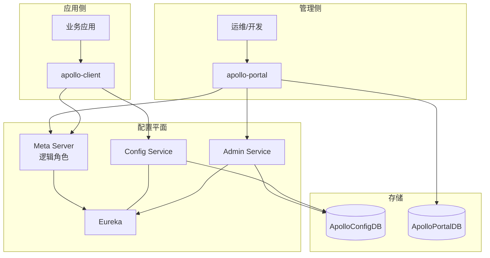

**关键设计：** Config Service、Eureka、Meta Server 默认同 JVM 部署，减少外部中间件依赖，提高配置中心自身可用性（见官方设计文档 `docs/en/design/apollo-design.md`）。

### 1.4 一体启动：`ApolloApplication`

`apollo-assembly` 通过父子 Spring Context 顺序启动四个上下文：

```46:88:apollo-assembly/src/main/java/com/ctrip/framework/apollo/assembly/ApolloApplication.java
  public static void main(String[] args) throws Exception {
    // 1. commonContext（无 Web）
    ConfigurableApplicationContext commonContext =
        new SpringApplicationBuilder(ApolloApplication.class).web(WebApplicationType.NONE)
            .run(args);
    // 2. ConfigService（profile: assembly）
    ConfigurableApplicationContext configContext =
        new SpringApplicationBuilder(ConfigServiceApplication.class).parent(commonContext)
            .profiles("assembly").sources(RefreshScope.class).run(args);
    // 3. AdminService
    ConfigurableApplicationContext adminContext =
        new SpringApplicationBuilder(AdminServiceApplication.class).parent(commonContext)
            .profiles("assembly").sources(RefreshScope.class).run(args);
    // 4. Portal
    ConfigurableApplicationContext portalContext =
        new SpringApplicationBuilder(PortalApplication.class).parent(commonContext)
            .profiles("assembly").sources(RefreshScope.class).run(args);
  }
```

本地开发也可分别启动 `ConfigServiceApplication`、`AdminServiceApplication`、`PortalApplication`。

---

## 2. 核心概念与数据模型

### 2.1 四维配置定位

Apollo 用四个维度定位一份配置：

| 维度 | 含义 | 示例 |
|------|------|------|
| **AppId** | 应用标识 | `SampleApp` |
| **Env** | 环境（Portal 侧概念，映射到不同 Meta/Admin 集群） | `DEV` / `PRO` |
| **Cluster** | 集群（同环境内灰度/机房维度） | `default`、`SHAJQ` |
| **Namespace** | 配置集合（类似一个配置文件） | `application`、`application.yml` |

客户端请求 Config Service 时使用 **AppId + Cluster + Namespace**；Portal 管理时额外带 **Env**，由 Portal 的 `RestTemplate` 路由到对应环境的 Admin Service。

### 2.2 配置存储分层（未发布 vs 已发布）

| 层级 | 表/实体 | 作用 |
|------|---------|------|
| **草稿** | `Item` | Namespace 下可编辑的 key-value，Portal 修改的是这一层 |
| **发布快照** | `Release` | 发布时将 Item 快照序列化为 JSON 存入 `configurations` 字段 |
| **变更记录** | `Commit` | 每次 Item 批量变更的审计日志 |
| **发布历史** | `ReleaseHistory` | 发布/回滚/灰度合并等操作类型与上下文 |
| **推送游标** | `ReleaseMessage` | `appId+cluster+namespace` 消息，驱动 Config Service 通知客户端 |

**发布不会直接改 Item 以外的运行时视图**——运行时只认 `Release` 中 `isAbandoned=false` 的最新记录。

### 2.3 Namespace 类型（权限与继承）

详见 `docs/en/design/apollo-core-concept-namespace.md`：

- **私有 Namespace**：仅所属 AppId 可读
- **公共 Namespace**：任意 AppId 可关联读取（如 `datasource` 公共库）
- **关联 Namespace**：继承公共配置并覆盖部分 key

Config Service 在 `ConfigController` 中合并「本应用 Release + 公共 Namespace Release」：

```117:136:apollo-configservice/src/main/java/com/ctrip/framework/apollo/configservice/controller/ConfigController.java
    if (!ConfigConsts.NO_APPID_PLACEHOLDER.equalsIgnoreCase(appId)) {
      Release currentAppRelease = configService.loadConfig(...);
      if (currentAppRelease != null) {
        releases.add(currentAppRelease);
      }
    }
    if (!namespaceBelongsToAppId(appId, namespace)) {
      Release publicRelease = this.findPublicConfig(...);
      if (Objects.nonNull(publicRelease)) {
        releases.add(publicRelease);
      }
    }
```

合并规则：**列表中越靠前的 Release 优先级越高**（`Lists.reverse` 后 `putAll`）。

### 2.4 主要 ER 关系（ConfigDB）

核心实体在 `apollo-biz/.../biz/entity/`：

- `App` → `Cluster` → `Namespace` → `Item`
- `Release` 挂靠在 Namespace 维度（appId + cluster + namespaceName）
- `GrayReleaseRule` + 子 Namespace（branch cluster）实现灰度
- `Instance` / `InstanceConfig`：客户端实例与所用 `releaseKey` 的审计
- `AccessKey`：客户端访问鉴权
- `ServiceRegistry`：无 Eureka 时的 DB 注册

PortalDB 单独存储用户、权限、环境 Meta 地址、发布审批等 Portal 元数据。

---

## 3. 端到端工作流程

### 3.1 配置修改（未发布）

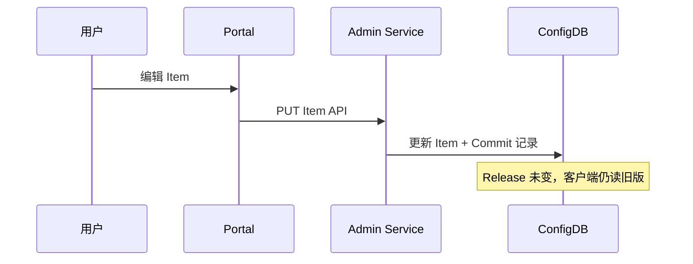

Portal 通过 `AdminServiceAPI` 按 Env 解析 Admin Service 地址并调用 REST 接口。Item 变更由 `ItemService` / `ItemSetService` 处理，并调用 `CommitService.createCommit` 留痕。

### 3.2 配置发布（核心链路）

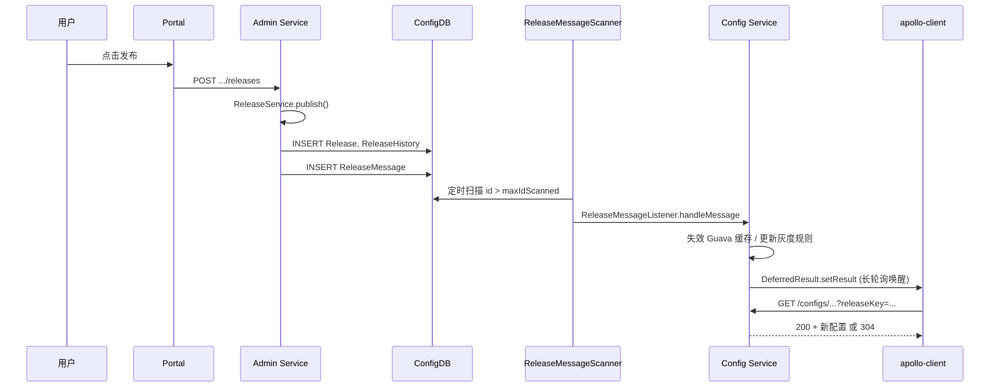

**Portal 发布入口：**

```57:66:apollo-portal/src/main/java/com/ctrip/framework/apollo/portal/service/ReleaseService.java
  public ReleaseDTO publish(NamespaceReleaseModel model) {
    ReleaseDTO releaseDTO = releaseAPI.createRelease(appId, env, clusterName, namespaceName,
        model.getReleaseTitle(), model.getReleaseComment(), releaseBy, isEmergencyPublish);
    return releaseDTO;
  }
```

**Admin Service 发布与发消息：**

```115:141:apollo-adminservice/src/main/java/com/ctrip/framework/apollo/adminservice/controller/ReleaseController.java
  @PostMapping("/apps/{appId}/clusters/{clusterName}/namespaces/{namespaceName}/releases")
  public ReleaseDTO publish(...) {
    Release release = releaseService.publish(namespace, releaseName, releaseComment, operator,
        isEmergencyPublish);
    // 灰度分支发布时，消息 cluster 用父 namespace 的 cluster
    messageSender.sendMessage(
        ReleaseMessageKeyGenerator.generate(appId, messageCluster, namespaceName),
        Topics.APOLLO_RELEASE_TOPIC);
    return BeanUtils.transform(ReleaseDTO.class, release);
  }
```

### 3.3 客户端获取配置

1. **启动**：通过 Meta Server（`/services/config`）获取 Config Service 实例列表，客户端负载均衡。
2. **长轮询**：`GET /notifications/v2?appId&cluster&notifications=...`，挂起最多 60s。
3. **拉配置**：`GET /configs/{appId}/{cluster}/{namespace}`，带 `releaseKey`、`ip`、`label`、`messages`。
4. **兜底**：定时轮询（默认 5 分钟，`apollo.refreshInterval` 可覆盖），多数情况 304。

### 3.4 回滚

`ReleaseController.rollback` → `ReleaseService.rollback` / `rollbackTo`：将当前 Release 标记 `abandoned=true`，并写 `ReleaseHistory`。若有灰度子 Namespace，会触发 `MATER_ROLLBACK_MERGE_TO_GRAY` 自动合并逻辑。最后同样 `sendMessage` 通知 Config Service。

---

## 4. 配置中心底层原理（源码级）

### 4.1 发布：`ReleaseService.publish`

发布核心逻辑在 `apollo-biz` 的 `ReleaseService`：

1. **Namespace 锁校验**（非紧急发布时，发布者不能是持锁人自己）
2. **`getNamespaceItems`**：按顺序读取 Namespace 下全部 `Item` 组成 `LinkedHashMap`
3. **分支判断**：
   - 有父 Namespace → 灰度分支发布 `publishBranchNamespace`
   - 有子 Namespace → Master 发布后自动 `mergeFromMasterAndPublishBranch`
4. **`createRelease`**：生成 `releaseKey`、JSON 序列化配置、落库、解锁、审计

```429:448:apollo-biz/src/main/java/com/ctrip/framework/apollo/biz/service/ReleaseService.java
  private Release createRelease(Namespace namespace, String name, String comment,
      Map<String, String> configurations, String operator) {
    Release release = new Release();
    release.setReleaseKey(ReleaseKeyGenerator.generateReleaseKey(namespace));
    release.setConfigurations(GSON.toJson(configurations));
    release = releaseRepository.save(release);
    namespaceLockService.unlock(namespace.getId());
    auditService.audit(Release.class.getSimpleName(), release.getId(), Audit.OP.INSERT, ...);
    return release;
  }
```

`ReleaseKeyGenerator` 生成带时间戳与命名空间信息的唯一 key，供客户端做 304 比对与增量同步。

### 4.2 基于 DB 的“消息队列”

Apollo **刻意不引入 Kafka/RabbitMQ**，用 `ReleaseMessage` 表实现 Admin → Config 的解耦广播。

#### 4.2.1 生产端：`DatabaseMessageSender`

```60:84:apollo-biz/src/main/java/com/ctrip/framework/apollo/biz/message/DatabaseMessageSender.java
  @Transactional
  public void sendMessage(String message, String channel) {
    ReleaseMessage newMessage = releaseMessageRepository.save(new ReleaseMessage(message));
    toClean.offer(newMessage.getId());  // 异步清理同 key 历史消息
  }
```

消息体格式：`appId + 分隔符 + cluster + 分隔符 + namespace`（`ReleaseMessageKeyGenerator.generate`）。

后台线程会删除同 message 更早的 id 记录，避免表无限膨胀。

#### 4.2.2 消费端：`ReleaseMessageScanner`

- 启动时 `maxIdScanned = MAX(id)`，只消费**新插入**消息
- 固定间隔（`BizConfig.releaseMessageScanIntervalInMilli()`，默认可配）扫描
- 每批最多 500 条；若 id 不连续，维护 `missingReleaseMessages` 重试（应对事务未提交或回滚）

```114:129:apollo-biz/src/main/java/com/ctrip/framework/apollo/biz/message/ReleaseMessageScanner.java
  private boolean scanAndSendMessages() {
    List<ReleaseMessage> releaseMessages =
        releaseMessageRepository.findFirst500ByIdGreaterThanOrderByIdAsc(maxIdScanned);
    ...
    fireMessageScanned(releaseMessages);
    maxIdScanned = releaseMessages.get(messageScanned - 1).getId();
    return messageScanned == 500;
  }
```

#### 4.2.3 监听器注册顺序

`ConfigServiceAutoConfiguration` 将多个 `ReleaseMessageListener` 注册到 Scanner：

| 顺序 | 监听器 | 作用 |
|------|--------|------|
| 0 | `ReleaseMessageServiceWithCache` | 刷新 ReleaseMessage 查询缓存 |
| 1 | `GrayReleaseRulesHolder` | 刷新灰度规则内存索引 |
| 2 | `ConfigService`（WithCache） | 失效配置 Guava 缓存并预热 |
| 2 | `ConfigFileController` | 失效文件格式配置本地缓存 |
| 3 | `NotificationControllerV2` | 唤醒长轮询客户端 |
| 3 | `NotificationController` | v1 兼容 |

### 4.3 Config Service 读路径与缓存

#### 4.3.1 集群降级策略

`AbstractConfigService.loadConfig`：

1. 先查请求 cluster（非 default）
2. 再查 `dataCenter` 作为 cluster 名
3. 最后 fallback 到 `default` cluster

```39:65:apollo-configservice/src/main/java/com/ctrip/framework/apollo/configservice/service/config/AbstractConfigService.java
  public Release loadConfig(...) {
    if (!Objects.equals(ConfigConsts.CLUSTER_NAME_DEFAULT, configClusterName)) {
      Release clusterRelease = findRelease(..., configClusterName, ...);
      if (Objects.nonNull(clusterRelease)) return clusterRelease;
    }
    if (!Strings.isNullOrEmpty(dataCenter) && !Objects.equals(dataCenter, configClusterName)) {
      Release dataCenterRelease = findRelease(..., dataCenter, ...);
      if (Objects.nonNull(dataCenterRelease)) return dataCenterRelease;
    }
    return findRelease(..., ConfigConsts.CLUSTER_NAME_DEFAULT, ...);
  }
```

#### 4.3.2 灰度命中

`findRelease` 先查 `GrayReleaseRulesHolder`（按 clientAppId、IP、label 匹配），命中则 `findActiveOne(grayReleaseId)`，否则取最新 active Release。

`GrayReleaseRulesHolder` 维护：

- 正向：`configAppId+cluster+namespace` → 规则列表
- 反向：`clientAppId+namespace+ip/label` → ruleId
- 定时全量扫描 DB + 收到 ReleaseMessage 时增量 merge

#### 4.3.3 三层 Guava 缓存（`ConfigServiceWithCache`）

| 缓存 | Key | Value | 失效时机 |
|------|-----|-------|----------|
| `configCache` | `appId+cluster+namespace` | notificationId + Release | ReleaseMessage 监听器 invalidate + 可选按 client messages 比对 |
| `configIdCache` | releaseId | Release | 同上 |
| `releaseKeyCache` | releaseKey | releaseId | 同上 |

`expireAfterAccess` 默认 60 分钟；收到消息后 **主动 invalidate 并 getUnchecked 预热**，避免客户端突发打穿 DB。

客户端可在请求中带 `messages` JSON（各 watch key 的 notificationId），若服务端缓存 notificationId 落后于客户端，会强制 invalidate 再加载——解决多 Config Service 实例缓存不一致问题。

#### 4.3.4 HTTP 304 与增量同步

`ConfigController.queryConfig`：

- 合并多个 Release 的 `releaseKey` 与客户端 `releaseKey` 比较，相同则 **304 Not Modified**
- 若开启 `config-service.incremental.change.enabled`，计算 key 级 diff（`DefaultIncrementalSyncService`），返回 `configurationChanges` 而非全量 map，降低大包体传输

### 4.4 长轮询推送：`NotificationControllerV2`

#### 4.4.1 Watch Keys 展开

`WatchKeysUtil` 为每个 namespace 注册多个监听 key：

- 指定 cluster
- dataCenter（若与 cluster 不同）
- **始终包含 default cluster**
- 公共 namespace 额外监听公共 AppId 下的 key

保证客户端在 cluster 降级、公共配置变更时都能收到通知。

#### 4.4.2 请求处理时序（避免竞态）

```147:193:apollo-configservice/src/main/java/com/ctrip/framework/apollo/configservice/controller/NotificationControllerV2.java
    // 1. 先注册 DeferredResult，再检查版本（防止 handleMessage 与 check 之间的 lost wakeup）
    for (String key : watchedKeys) {
      this.deferredResults.put(key, deferredResultWrapper);
    }
    // 2. 查询最新 ReleaseMessage
    entityManagerUtil.closeEntityManager();  // 异步请求不能长期占用 DB 连接
    if (!CollectionUtils.isEmpty(newNotifications)) {
      deferredResultWrapper.setResult(newNotifications);
    }
```

**关键点：** 长轮询前手动 `closeEntityManager()`，否则 JPA 会话会持有连接长达 60s，耗尽连接池。

#### 4.4.3 推送风暴保护

`handleMessage` 中若同一 key 挂起客户端超过阈值（`releaseMessageNotificationBatch`），则单线程批量 `setResult`，并按间隔 sleep，避免瞬间唤醒数万连接导致 CPU 尖刺。

#### 4.4.4 超时

`DeferredResultWrapper` 使用 `BizConfig.longPollingTimeoutInMilli()`（典型 60s），超时返回 **304**，客户端立即发起下一次长轮询。

### 4.5 配置读取 API 小结

| 接口 | 路径 | 用途 |
|------|------|------|
| 配置 JSON | `GET /configs/{appId}/{cluster}/{namespace}` | 主配置拉取 |
| 配置文件 | `GET /configfiles/{appId}/{cluster}/{namespace}` | properties/yml/json 等原始格式 |
| 通知 v2 | `GET /notifications/v2` | 多端 namespace 批量长轮询 |
| 通知 v1 | `GET /notifications` | 单 namespace 兼容 |

`ClientAuthenticationFilter` 对 `/configs/*`、`/configfiles/*`、`/notifications/v2/*` 做 AccessKey 鉴权（可配置关闭）。

---

## 5. 服务发现与 Meta Server

### 5.1 Meta Server 职责

`ServiceController` 对外暴露：

- `GET /services/config` → Config Service 实例列表
- `GET /services/admin` → Admin Service 实例列表

```47:57:apollo-configservice/src/main/java/com/ctrip/framework/apollo/metaservice/controller/ServiceController.java
  @RequestMapping("/config")
  public List<ServiceDTO> getConfigService(...) {
    return discoveryService.getServiceInstances(ServiceNameConsts.APOLLO_CONFIGSERVICE);
  }
```

Portal 与 Client **只认 Meta 的 HTTP 接口**，底层可以是 Eureka、数据库注册表、K8s、Nacos 等。

### 5.2 可插拔 `DiscoveryService`

`apollo-configservice/.../metaservice/service/` 下多种实现：

- `DefaultDiscoveryService` / `SpringCloudInnerDiscoveryService`（Eureka）
- `DatabaseDiscoveryService`（读 `ServiceRegistry` 表）
- `KubernetesDiscoveryService`、`NacosDiscoveryService` 等

`apollo-biz` 中 `DatabaseServiceRegistryImpl` 允许 Admin/Config 实例向 DB 注册 URI，适合**去 Eureka 化**部署。

### 5.3 Portal 多环境路由

Portal 在 DB 中维护各 `Env` 对应的 Meta Server 地址；调用 Admin API 时由 `RestTemplate` + 负载均衡选择目标实例，并在失败时重试其他实例——与 Client 访问 Config Service 的模式对称。

---

## 6. apollo-java 客户端深度解析（v2.5.0）

> 仓库：[apolloconfig/apollo-java](https://github.com/apolloconfig/apollo-java)（tag `v2.5.0`）  
> 与服务端通过 **HTTP 契约** 对接：`/services/config`、`/notifications/v2`、`/configs/...`  
> 共享 DTO 在 `apollo-core`（如 `ApolloConfig`、`ApolloConfigNotification`），服务端 v3 依赖的 `apollo-core` 即来自此仓库。

### 6.1 apollo-java 模块结构

| 模块 | 职责 |
|------|------|
| **apollo-core** | 常量（`ConfigConsts`）、DTO、签名（`Signature`）、Env/Meta 域名、SPI 接口 |
| **apollo-client** | 应用 SDK：配置拉取、长轮询、本地缓存、Spring 集成 |
| **apollo-openapi** | OpenAPI 规范与生成代码（供 Portal/第三方调用管理 API） |
| **apollo-client-config-data** | Spring Boot `spring.config.import` 等 Config Data 集成（可选） |

客户端入口类：`com.ctrip.framework.apollo.ConfigService`（单例门面，委托 `ConfigManager`）。

### 6.2 整体架构：Repository 链 + 门面

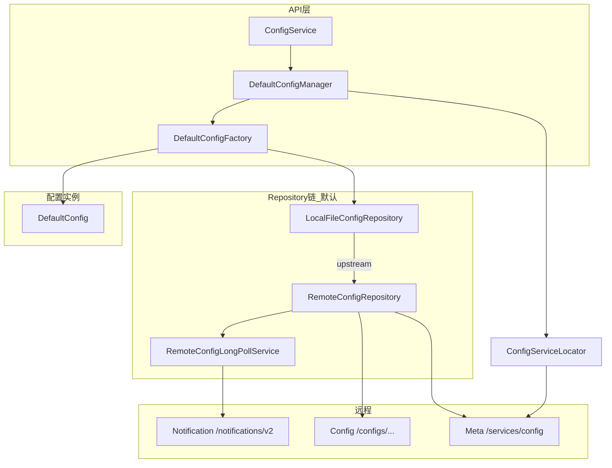

**默认装配（`DefaultConfigFactory.createConfigRepository`）：**

```
LocalFileConfigRepository(appId, namespace, RemoteConfigRepository)
```

- **Remote**：网络拉取 + 长轮询感知变更  
- **LocalFile**：将 upstream 的配置持久化到磁盘，upstream 不可用时 `sync()` 回退读文件  

可选模式：

- `apollo-inLocalMode` / `Env.LOCAL`：仅 `LocalFileConfigRepository`，不连远端  
- `apollo.kubernetes.cache.enabled`：`K8sConfigMapConfigRepository` → Local → Remote  
- 关闭 `apollo.cache-file.enable`：仅 `RemoteConfigRepository`（无本地文件兜底）

### 6.3 初始化与 Namespace 懒加载

`DefaultConfigManager.getConfig(appId, namespace)` 使用 **双重检查锁** 按 `(appId, namespace)` 单例化 `Config`：

1. 查 `Table<appId, namespace, Config>` 缓存  
2. 未命中则 `ConfigFactoryManager.getFactory` → `factory.create(appId, namespace)`  
3. `DefaultConfig` 构造时 `configRepository.initialize()` → 触发首次 `sync()`

**长轮询注册时机：** `RemoteConfigRepository` 构造末尾调用 `remoteConfigLongPollService.submit(appId, namespace, this)`。  
同一 `appId` 下多个 namespace 共享 **一条** 长轮询线程（`m_longPollStarted` 按 appId 去重）。

### 6.4 Meta 发现：`ConfigServiceLocator`

客户端不直接连 Eureka，而是：

```
GET {apollo.meta}/services/config?appId=...&ip=...
```

实现要点（`ConfigServiceLocator`）：

| 优先级 | 配置来源 | 行为 |
|--------|----------|------|
| 1 | `apollo.config-service`（系统属性 / 环境变量 / server.properties） | **跳过** Meta 定时刷新，直接使用固定 URL 列表 |
| 2 | Meta Server | 启动时 `tryUpdateConfigServices()`，之后按 `refreshInterval`（默认 5 分钟）刷新 |
| 3 | 列表为空 | `trySubmitUpdateTask()` 异步重试，并 `ApolloConfigException` 快速失败 |

`assembleMetaServiceUrl()` 使用 `ConfigUtil.getMetaServerDomainName()` → `MetaDomainConsts.getDomain(env)`，与 `META-INF/apollo-env.properties` 中环境映射一致。

**负载均衡：** `RemoteConfigRepository.loadApolloConfig` 对实例列表 `shuffle`，且将 **刚通知自己的那个** `ServiceDTO` 插入列表头部优先访问；长轮询侧通过 `ConfigServiceLoadBalancerClient`（SPI）选实例。

### 6.5 配置拉取：`RemoteConfigRepository`

#### 6.5.1 请求 URL

```
GET {configServiceHome}/configs/{appId}/{cluster}/{namespace}
    ?releaseKey=...
    &dataCenter=...
    &ip=...
    &label=...
    &messages=...   // ApolloNotificationMessages JSON
```

与服务端 `ConfigController` 参数一一对应。

#### 6.5.2 304 与内存更新

- 响应 **304**：`loadApolloConfig` 返回 `m_configCache.get()`（当前内存快照），`sync()` 中 `previous == current` 不触发 `fireRepositoryChange`  
- 响应 **200**：解析 `ApolloConfig`；若 `configSyncType == INCREMENTAL_SYNC`，在客户端用 `configurationChanges` 合并到上一份全量 map（与服务端 `DefaultIncrementalSyncService` 对称）

#### 6.5.3 定时兜底

`schedulePeriodicRefresh()`：`scheduleAtFixedRate`，间隔 `apollo.refreshInterval`（默认 **5 分钟**）。  
即使长轮询完全失效，最多延迟一个刷新周期仍可发现变更（多数情况仍 304）。

#### 6.5.4 失败重试

- `ExponentialSchedulePolicy`：长轮询失败指数退避（1s～120s）  
- 拉配置失败：shuffle 多实例重试；`m_configNeedForceRefresh` 时长轮询唤醒后 `maxRetries=2`  
- **404**：停止重试并抛出明确异常（namespace 未发布）

#### 6.5.5 AccessKey

若配置了密钥，`Signature.buildHttpHeaders(url, appId, secret)` 与 Config Service `ClientAuthenticationFilter` 校验对齐。

### 6.6 长轮询：`RemoteConfigLongPollService`

#### 6.6.1 与服务端契约对齐

| 客户端 | 服务端 |
|--------|--------|
| `GET .../notifications/v2?notifications=[{namespaceName, notificationId}, ...]` | `NotificationControllerV2.pollNotification` |
| `readTimeout = 90s` | `longPollingTimeoutInMilli` 典型 60s（客户端故意更长，避免误杀连接） |
| 304 → 立即下一轮 | `DeferredResult` 超时 304 |
| 200 + body → 更新 notificationId 并 `notify` | `setResult` 唤醒 |

#### 6.6.2 状态表

- `m_notifications`：`Table<appId, namespace, notificationId>`，初始 `-1`（`NOTIFICATION_ID_PLACEHOLDER`）  
- `m_remoteNotificationMessages`：`namespace → ApolloNotificationMessages`（v2 多 watch key，对应服务端 `notification.addMessage`）  
- `m_longPollNamespaces`：`appId → Multimap<namespace, RemoteConfigRepository>`

#### 6.6.3 唤醒后拉取

`notify()` → 对每个变更 namespace 调用 `remoteConfigRepository.onLongPollNotified(serviceDto, remoteMessages)`：

1. 记录「通知方」实例，下次拉配置优先连它  
2. 设置 `m_configNeedForceRefresh=true`  
3. 在线程池执行 `trySync()` → `loadApolloConfig` 带上最新 `messages` 参数（解决多 Config 节点缓存不一致）

#### 6.6.4 限流与负载均衡小技巧

- `m_longPollRateLimiter`：默认 QPS 2，避免异常时疯狂建连  
- 收到 **304** 时 `ThreadLocalRandom` 50% 概率 `lastServiceDto = null`，促使下次换实例（轻量负载均衡）

### 6.7 本地缓存：`LocalFileConfigRepository`

| 项 | 说明 |
|----|------|
| 目录 | `{apollo.cacheDir或/opt/data/{appId}}/config-cache/` |
| 文件名 | `{appId}+{cluster}+{namespace}.properties` |
| 写入时机 | upstream `onRepositoryChange` 后 `persistLocalCacheFile` |
| 读取时机 | `sync()` 时先 `trySyncFromUpstream()`，失败则 `loadFromLocalCacheFile` |

**意义：** Config Service / Meta 全不可用或进程重启时，仍可读到**上次成功**的快照（可能陈旧，但优于空配置）。

### 6.8 配置变更传播：`DefaultConfig`

`DefaultConfig` 实现 `RepositoryChangeListener`，在 Repository 变更时：

1. `calcPropertyChanges` 对比新旧 `Properties`  
2. **二次校验**：用 `getProperty()` 再算一遍 old/new（因为 `getProperty` 还有 System Property、环境变量、classpath 兜底）  
3. `fireConfigChange` → 应用注册的 `ConfigChangeListener`

**`getProperty` 优先级（高 → 低）：**

1. `-Dkey=value`  
2. Apollo Repository 缓存  
3. 操作系统环境变量  
4. `META-INF/config/{appId}+{namespace}.properties`（或仅 namespace）  

Spring 场景下还可通过 `PropertySourcesProcessor` 把 Apollo 源插到 `Environment` 最前（见 6.9）。

### 6.9 Spring / Spring Boot 集成

`PropertySourcesProcessor`（`BeanFactoryPostProcessor` + `PriorityOrdered.HIGHEST_PRECEDENCE`）：

1. 收集 `@EnableApolloConfig` 注册的 namespace（支持多 appId、order）  
2. 为每个 namespace 创建 `ConfigPropertySource` 加入 `CompositePropertySource`  
3. 插入位置：在 `ApolloBootstrapPropertySource` 之后，或 `addFirst` 到 `Environment`  
4. `initializeAutoUpdatePropertiesFeature`：监听变更并发布 `ApolloConfigChangeEvent`，配合 `@ApolloConfigChangeListener` 更新 `@Value` 字段（需 `apollo.autoUpdateInjectedSpringProperties=true`）

YAML/JSON 等：namespace 以 `.yml` / `.json` 结尾时，`DefaultConfigFactory` 走 `PropertiesCompatibleFileConfigRepository`，内部仍通过 `ConfigFile` + `/configfiles` 或等价逻辑获取内容。

### 6.10 关键配置项（`ConfigUtil` 摘要）

| 属性 / 环境变量 | 默认 | 含义 |
|-----------------|------|------|
| `app.id`（`META-INF/app.properties`） | — | 应用 AppId |
| `apollo.meta` | 按 env | Meta Server 地址 |
| `apollo.cluster` | `default` 或 dataCenter | 集群名 |
| `apollo.refreshInterval` | 5（分钟） | 定时拉取间隔 |
| `apollo.cache-dir` | `/opt/data/{appId}` 或 `C:\opt\data\{appId}` | 本地缓存根目录 |
| `apollo.config-service` | — | 直连 Config Service，跳过 Meta |
| `apollo.longPollQPS` / `apollo.loadConfigQPS` | 2 | 长轮询/拉配置限流 |
| `apollo.longPollingInitialDelayInMills` | 2000 | 启动后延迟开始长轮询 |
| `apollo.cache-file.enable` | true | 是否启用 LocalFile 链 |
| `apollo.accesskey.secret` | — | 访问密钥 |

### 6.11 端到端时序（客户端 ↔ 服务端）

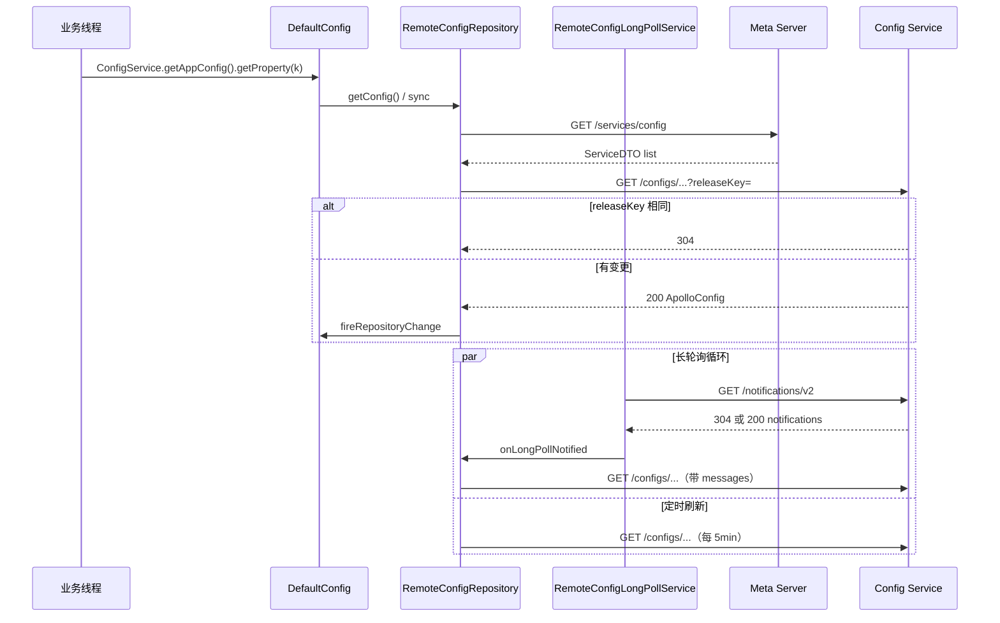

### 6.12 客户端设计亮点（相对服务端）

| 亮点 | 说明 |
|------|------|
| **Repository 分层** | Remote / Local / K8s 可组合，单一职责清晰 |
| **单 appId 单长轮询线程** | 多 namespace 合并一次 `/notifications/v2` 请求，降低连接数 |
| **通知方优先拉取** | 减少「通知到了但拉错节点读到旧缓存」的概率 |
| **messages 回传** | 与服务端 `ConfigServiceWithCache` 协同，多实例一致性 |
| **增量合并** | 大 namespace 仅传 diff，客户端本地 merge |
| **多级兜底** | 长轮询 → 定时拉取 → 本地文件 → classpath 默认配置 |
| **变更二次校验** | 避免 System Property 等覆盖导致误报变更 |
| **SPI** | `ConfigFactory`、`ConfigServiceLoadBalancerClient`、`MetaServerProvider` 可扩展 |

### 6.13 apollo-java 源码阅读顺序

1. `ConfigService` → `DefaultConfigManager` → `DefaultConfigFactory`  
2. `DefaultConfig` + `AbstractConfig`（变更计算）  
3. `RemoteConfigRepository`（拉取 + 定时）  
4. `RemoteConfigLongPollService`（推送感知）  
5. `LocalFileConfigRepository`（持久化）  
6. `ConfigServiceLocator`（Meta）  
7. `ConfigUtil`（所有开关）  
8. `spring/config/PropertySourcesProcessor`（Spring 集成）  
9. `apollo-core`：`ConfigConsts`、`ApolloConfig`、`Signature`

### 6.14 延伸阅读（扩展模块）

以下主题在第 10–11 章展开：

- 服务端：Item/Commit 草稿、灰度分支、Portal 权限、OpenAPI 契约、审计 → [第 10 节](#10-服务端专题补充)
- 客户端：`apollo-core` 签名、`spring.config.import`、Bootstrap 早期加载、OpenAPI 管理客户端 → [第 11 节](#11-apollo-java-扩展模块与生态)

---

## 7. 设计亮点

### 7.1 发布与推送解耦，且无外部 MQ

- Admin 只写 DB，Config 各实例通过 Scanner **拉模式** 消费，天然支持多 Config 节点
- 消息幂等键为 `appId+cluster+namespace`，重复消息由缓存失效 + notificationId 比对消化
- 历史消息清理控制表大小

### 7.2 有状态“逻辑”与无状态进程分离

- 进程本身无状态，**状态在 ConfigDB + 客户端本地缓存**
- 水平扩展 Config/Admin 只需注册发现组件

### 7.3 长轮询 + 304 双通道节省资源

- 推送：秒级感知变更（DeferredResult）
- 拉取：releaseKey 比对避免重复传输
- 定时拉取：推送链路故障时的最终一致性保障

### 7.4 灰度发布模型完整

- **分支 Namespace**（子 cluster）存灰度配置
- **GrayReleaseRule** 按 IP/Label 绑定规则
- Master 发布可自动 merge 到 gray 分支；灰度合并、删除、回滚均有对应 `ReleaseOperation` 与 `ReleaseHistory` 上下文

### 7.5 公共配置与关联 Namespace

- 框架 jar 读公共 namespace，业务 App 通过关联 namespace 覆盖少量 key
- Config Service 自动合并多 Release，客户端无感

### 7.6 多环境统一 Portal

- 一套 Portal 管理 DEV/FAT/UAT/PRO
- 环境仅影响“连哪个 Meta/Admin”，代码路径一致

### 7.7 OpenAPI 契约优先（Portal 3.x）

- 管理 API 由 `apollo-openapi` spec 生成接口
- 实现类在 `com.ctrip.framework.apollo.openapi`，避免 Portal 手写 DTO 漂移

### 7.8 审计与合规

- `apollo-audit`：`@ApolloAuditLog` 注解 + JPA 存储操作影响面
- `InstanceConfig` 记录哪些实例在使用哪次发布

### 7.9 部署灵活性

- `apollo-assembly` 一键演示
- 生产可拆分 + Docker 镜像（各 service `src/main/docker`）
- SQL 脚本与 `apollo-build-sql-converter` 支持 schema 演进

---

## 8. 技术亮点

| 技术点 | 实现要点 |
|--------|----------|
| **Spring DeferredResult** | Servlet 3 异步，单实例万级长连接（文档实测 4C8G ~1 万连接） |
| **Guava LoadingCache** | Config 热点读、Micrometer 指标可选 |
| **JPA 连接管理** | 长轮询前主动关闭 EntityManager，避免连接池耗尽 |
| **CaseInsensitiveMultimap** | namespace / watch key 大小写不敏感 |
| **增量配置同步** | 服务端 diff + 本地 Guava 缓存 diff 结果 |
| **ReleaseMessage 缺口扫描** | 处理并发发布时 id 空洞 |
| **批量通知限流** | 大规模客户端变更时的 sleep 分批唤醒 |
| **多发现实现** | 降低 Eureka 依赖，适配 K8s 原生部署 |
| **AccessKey 鉴权** | Config 读接口可开启密钥校验 |
| **Tracer 埋点** | `Tracer.logEvent` 贯穿 Cache/LongPoll/Release |

---

## 9. 可用性与运维考量

（摘自 `docs/en/design/apollo-design.md` 并结合实现）

| 故障 | 对客户端 | 对 Portal | 机制 |
|------|----------|-----------|------|
| 单 Config 节点宕机 | 无影响 | — | 客户端重选实例 |
| 全部 Config 宕机 | 无法更新；重启可读本地缓存 | — | 文件缓存 |
| 单 Admin 宕机 | — | 无影响 | Portal 重试 |
| 全部 Admin 宕机 | 无影响 | 无法发布 | 已发布配置仍可读 |
| ConfigDB 不可用 | 读/写均失败 | 发布失败 | 强依赖 DB |
| Eureka 不可用 | 若用 DB/K8s 发现则影响小 | 同左 | 可切换 Discovery 实现 |

**配置热更新延迟：** 正常为「DB 扫描间隔（约 1s 级）+ 长轮询即时唤醒 + 一次 HTTP 拉取」，端到端通常在秒级。

---

## 10. 服务端专题补充

本节补充前文未展开的服务端链路：**配置草稿编辑**、**灰度分支**、**Portal 权限与多环境**、**OpenAPI 契约**、**审计模块**。

### 10.1 配置草稿编辑：Item 尚未发布

用户在 Portal 修改的是 **Item 表**，发布前客户端不可见。批量变更是 `ItemChangeSets`（create/update/delete 列表）。

`ItemSetService.updateSet` 核心流程：

1. 校验 namespace 存在、可选 **Item 数量上限**（`BizConfig.itemNumLimit`）
2. 分别执行 `doCreateItems` / `doUpdateItems` / `doDeleteItems`
3. 用 `ConfigChangeContentBuilder` 生成变更 JSON
4. 若有内容则 `CommitService.createCommit` 写入 **Commit** 表（供 Portal 对比历史）
5. 各步记录 `AuditService.audit`

```104:107:apollo-biz/src/main/java/com/ctrip/framework/apollo/biz/service/ItemSetService.java
    if (configChangeContentBuilder.hasContent()) {
      commitService.createCommit(appId, clusterName, namespaceName,
          configChangeContentBuilder.build(), changeSet.getDataChangeLastModifiedBy());
    }
```

**Namespace 编辑锁：** `NamespaceLockService` 防止两人同时改；发布时 `ReleaseService.checkLock` 要求发布者不能是持锁人（紧急发布可跳过）。

### 10.2 灰度分支：`NamespaceBranchService`

灰度在数据模型上是 **子 Cluster + 子 Namespace**（branch cluster 名如 `gray-xxx`）：

| 步骤 | 操作 |
|------|------|
| 创建分支 | `createBranch` → 新建 child `Cluster` + child `Namespace` |
| 配置规则 | `updateBranchGrayRules` → `GrayReleaseRule` 表（IP/Label → releaseId） |
| 灰度发布 | `ReleaseService.publishBranchNamespace`：合并 master 配置 + 分支 Item，写 branch Release |
| 全量发布 | `mergeBranchChangeSetsAndRelease`：分支 Item 合并回 master 并发布 |

`GrayReleaseRulesHolder`（Config Service）与 Portal/Admin 侧规则表保持最终一致；规则变更也会走 `ReleaseMessage` 触发缓存刷新。

客户端侧通过请求参数 **`ip`**、**`label`**（`ConfigUtil.getApolloLabel()`）参与灰度命中，与服务端 `AbstractConfigService.findRelease` 对齐。

### 10.3 Portal：多环境、权限、通知

#### 10.3.1 多环境路由

Portal **不直接连 ConfigDB 做发布**，而是：

```
Portal Controller → AdminServiceAPI.* → RestTemplate(env) → Meta → Admin Service → ConfigDB
```

`RestTemplate` 根据 `Env` 从 PortalDB 读取对应 Meta 地址，再发现 Admin Service 列表，客户端侧负载均衡与失败重试由 Portal 封装。

#### 10.3.2 权限模型

Controller 使用 `@PreAuthorize("@unifiedPermissionValidator....")`。

`UnifiedPermissionValidator` 按登录类型分发：

- **用户**：`UserPermissionValidator` → `RolePermissionService`（PortalDB：User/Role/Permission）
- **OpenAPI Consumer**：`ConsumerPermissionValidator`（第三方 token）

权限粒度示例（`AbstractPermissionValidator`）：

- `MODIFY_NAMESPACE`：编辑 Item
- `RELEASE_NAMESPACE`：发布
- 支持 **全局**、**按 Env**、**按 Cluster** 三种 targetId（`RoleUtils.buildNamespaceTargetId`）

`shouldHideConfigToCurrentUser`：部分环境开启「仅成员可见」时，非成员看不到配置内容（公共 namespace 除外）。

#### 10.3.3 发布后通知

`ReleaseController` 发布成功后发布 Spring 事件 `ConfigPublishEvent`，`ConfigPublishListener` 异步：

- Webhook（`portalConfig.webHookUrls()`）
- 邮件
- 站内消息

与 Config Service 推客户端是 **两条独立链路**。

### 10.4 Portal OpenAPI：契约优先（v3）

服务端 Portal 在构建期从独立 spec 生成代码：

- Spec URL：`apollo-openapi.yaml`（`apolloconfig/apollo-openapi` 仓库，portal `pom.xml` 中 `apollo.openapi.spec.url`）
- 插件：`openapi-generator-maven-plugin` → `interfaceOnly` 的 `*Api` 接口
- 实现：`com.ctrip.framework.apollo.openapi.v1.controller.*` 委托 `Server*OpenApiService`

**好处：** HTTP 路径、模型、权限与文档单源真相；PR 需同时改 spec 与实现。

### 10.5 apollo-audit 审计框架

模块：`apollo-audit-annotation` / `api` / `impl` / `spring-boot-starter`。

- 开关：`apollo.audit.log.enabled=true`
- 注解：`@ApolloAuditLog`、`@ApolloAuditLogDataInfluence` 记录操作与数据影响面
- Portal 等模块引入 starter 后，关键写操作可追踪 **Who/When/What**

与 ConfigDB 的 `Audit` 表（实体级 INSERT/UPDATE）是不同层次：前者面向合规审计，后者偏数据变更记录。

---

## 11. apollo-java 扩展模块与生态

### 11.1 apollo-core：共享契约层

服务端 v3 通过 Maven 依赖 `apollo-core`（与客户端同源），保证 DTO 一致：

| 类型 | 代表类 | 用途 |
|------|--------|------|
| 常量 | `ConfigConsts` | `NOTIFICATION_ID_PLACEHOLDER=-1`、`CLUSTER_NAMESPACE_SEPARATOR=+` |
| 传输对象 | `ApolloConfig`、`ApolloConfigNotification` | Config API 响应体 |
| 签名 | `Signature` | HMAC-SHA1，`Authorization: Apollo {appId}:{sign}` + `Timestamp` 头 |
| 环境 | `Env`、`MetaDomainConsts` | Meta 域名映射 |
| SPI | `MetaServerProvider`、`ConfigServiceLoadBalancerClient` | 自定义 Meta/负载均衡 |

签名串：`timestamp + "\n" + pathWithQuery`，与服务端 `AccessKeyUtil` 校验逻辑配对。

### 11.2 Spring Boot Bootstrap（`apollo-client`）

除 `@EnableApolloConfig` + `PropertySourcesProcessor` 外，**Bootstrap 阶段**注入由 `ApolloApplicationContextInitializer` 完成：

| 配置项 | 作用 |
|--------|------|
| `apollo.bootstrap.enabled=true` | 在 ApplicationContext 初始化早期加载 Apollo |
| `apollo.bootstrap.namespaces` | 逗号分隔 namespace，默认 `application` |
| `apollo.bootstrap.eagerLoad.enabled=true` | 作为 `EnvironmentPostProcessor`，在**日志系统初始化之前**加载（适合 logback-spring.xml 用 Apollo 配置） |

流程：

1. `postProcessEnvironment`：把 `app.id`、`apollo.meta` 等写入 `System.setProperty`
2. `eagerLoad` 时 `DeferredLogger.enable()`，解决早期日志丢失
3. `initialize(environment)`：为每个 namespace 创建 `ConfigPropertySource` 并 `addFirst` 到 `Environment`

与 `PropertySourcesProcessor` 的区别：Bootstrap 源名为 `ApolloBootstrapPropertySource`，且触发时机更早。

### 11.3 apollo-client-config-data：`spring.config.import`

Spring Boot 2.4+ 推荐用 **Config Data API** 替代部分 Bootstrap 配置：

```properties
spring.config.import=apollo://application,apollo://application.yml
```

实现类：

| 类 | 职责 |
|----|------|
| `ApolloConfigDataLocationResolver` | 解析 `apollo://{namespace}` 前缀 |
| `ApolloConfigDataLoader` | 调用 `ConfigService.getConfig(namespace)` 加载为 `PropertySource` |
| `ApolloConfigDataLoaderInitializer` | 在 BootstrapRegistry 中初始化 Apollo 客户端扩展 |
| `BootstrapRegistryHelper` | 与 Spring Boot 启动注册表协作，保证单例初始化顺序 |

`ApolloConfigDataLoader.load` 顺序：

1. 通过 `ApolloConfigDataLoaderInitializer.initApolloClient()` 初始化客户端（含扩展点）
2. `ConfigPropertySourceFactory.getConfigPropertySource(namespace, config)`
3. 返回 `ConfigData` 供 Spring Boot 合并进 Environment

**扩展（可选）：**

- `ApolloClientLongPollingExtensionInitializer` + `ApolloWebClientHttpClient`：用 WebClient 替代默认 HttpClient 做长轮询
- `ApolloClientWebsocketExtensionInitializer`：WebSocket 推送实验路径（与 HTTP 长轮询并存选型）
- `PureApolloConfig` / `PureApolloConfigFactory`：更轻量的 Config 实现，减少 Spring 依赖

自动配置入口：`ApolloClientConfigDataAutoConfiguration`（`META-INF/spring/org.springframework.boot.autoconfigure.AutoConfiguration.imports`）。

### 11.4 apollo-openapi：管理 API 客户端

供 **CI/CD、运维脚本、第三方系统** 调用 Portal Open API（非应用运行时拉配置）：

```java
ApolloOpenApiClient client = ApolloOpenApiClient.newBuilder()
    .withPortalUrl("http://portal:8070")
    .withToken("xxx")
    .build();
client.createOrUpdateItem(appId, env, cluster, namespace, itemDTO);
client.publishNamespace(appId, env, cluster, namespace, releaseDTO);
```

内部分模块服务：`AppOpenApiService`、`ItemOpenApiService`、`ReleaseOpenApiService` 等，统一 `Authorization: {token}` HTTP 头，路径前缀 `OPEN_API_V1_PREFIX`。

与 `apollo-client` 对比：

| 维度 | apollo-client | apollo-openapi |
|------|---------------|----------------|
| 连接目标 | Config Service + Meta | Portal |
| 典型用途 | 应用读配置、热更新 | 自动化改配置、发布 |
| 鉴权 | AccessKey（Config 读） | Portal Consumer Token |
| 是否长轮询 | 是 | 否 |

Portal 侧 Consumer 对应 PortalDB 的 `Consumer` / `ConsumerToken`，由 `ConsumerPermissionValidator` 鉴权。

### 11.5 其他 apollo-java 模块（简表）

| 模块 | 用途 |
|------|------|
| **apollo-mockserver** | 单元测试/本地模拟 Config、Meta 接口 |
| **apollo-compat-tests** | 版本兼容回归 |
| **apollo-plugin** | 构建/开发插件（如 IDE 或 Maven 辅助） |

### 11.6 三种 Spring 集成方式选型

| 方式 | 依赖 | 适用场景 |
|------|------|----------|
| `@EnableApolloConfig` | `apollo-client` | 传统 Spring / Spring Boot，成熟稳定 |
| `apollo.bootstrap.*` | `apollo-client` + spring-boot | 日志等需极早加载的配置 |
| `spring.config.import=apollo://...` | `apollo-client-config-data` | Spring Boot 2.4+ 原生配置导入、云原生风格 |

三种方式底层均会走到 `ConfigService.getConfig` → `RemoteConfigRepository` 链路。

---

## 12. 深度专题：Portal 认证与安全体系

Portal 的认证采用 **Spring Profile 切换 + SPI 接口** 模式，同一套 Controller 代码在不同部署下绑定不同的 `UserService` / `UserInfoHolder` 实现。

### 12.1 Profile 与认证模式对照

| Profile | 场景 | 核心 Bean | 用户存储 |
|---------|------|-----------|----------|
| **auth**（默认） | 内置账号 | `JdbcUserDetailsManager` + `SpringSecurityUserService` | PortalDB `Users` 表 |
| **ldap** | 企业 LDAP/AD | `ApolloLdapAuthenticationProvider` + `LdapUserService` | LDAP 目录 |
| **oidc** | OAuth2/OIDC SSO | `OidcUserInfoHolder` + `OidcLocalUserService` | IdP + Portal 本地用户映射 |
| **无 auth** | 开发演示 | `DefaultUserInfoHolder` | 固定模拟用户 |

启动参数示例：`-Dapollo_profile=github,auth` 或 `ldap`、`oidc`（见 `apollo-development-guide`）。

`AuthConfiguration` 为各 Profile 声明独立的 `SecurityFilterChain`，并统一放行静态资源与健康检查：

```83:85:apollo-portal/src/main/java/com/ctrip/framework/apollo/portal/spi/configuration/AuthConfiguration.java
  private static final String[] BY_PASS_URLS =
      {"/prometheus/**", "/metrics/**", "/openapi/**", "/vendor/**", "/styles/**", "/scripts/**",
          "/views/**", "/img/**", "/i18n/**", "/prefix-path", "/health", "/signin", "/login.html"};
```

注意：`/openapi/**` 在 Spring Security 层放行，但 OpenAPI 仍有 **独立鉴权链**（见 12.4）。

### 12.2 SPI 核心接口

| 接口 | 职责 |
|------|------|
| `UserInfoHolder` | 当前登录用户 ID（`getUser().getUserId()`），供 Controller 取 operator |
| `UserService` | 用户搜索、创建（LDAP/OIDC 下可能同步到 PortalDB） |
| `LogoutHandler` | 登出跳转 |
| `SsoHeartbeatHandler` | SSO 会话心跳（防前端会话过期无感知） |

`@ConditionalOnMissingBean` 允许企业通过自定义 Bean **覆盖** 默认实现。

### 12.3 LDAP 认证细节

`ApolloLdapAuthenticationProvider` 继承 `LdapAuthenticationProvider`，关键差异：**登录成功后使用 LDAP 属性中的 loginId，而非用户输入框里的 username**。

```86:90:apollo-portal/src/main/java/com/ctrip/framework/apollo/portal/spi/ldap/ApolloLdapAuthenticationProvider.java
    DirContextOperations userData = this.doAuthentication(userToken);
    String loginId = userData.getStringAttribute(properties.getMapping().getLoginId());
    UserDetails user = this.userDetailsContextMapper.mapUserFromContext(userData, loginId,
        this.loadUserAuthorities(userData, loginId, ...));
```

支持按 **LDAP 组** 过滤用户（`FilterLdapByGroupUserSearch`），避免全目录搜索。

配置见 `application-ldap-openldap-sample.yml`：`searchFilter`、`groupSearch`、`mapping.loginId` 等。

### 12.4 OpenAPI 双通道鉴权

访问 `/openapi/v1/...` 时过滤器链大致为：

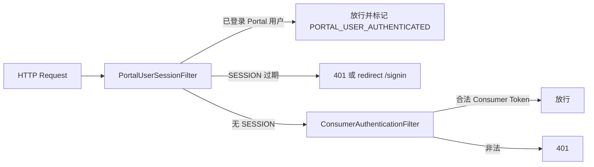

`PortalUserSessionFilter` 逻辑要点：

- 已认证 Portal 用户（`SecurityContextHolder`）可直接调 OpenAPI，便于 UI 与 API 共用登录态
- 有 `SESSION` Cookie 但未认证 → 视为过期：OIDC 返回 **401**，auth/ldap 可 **redirect** 到 `/signin`
- 否则交给 **Consumer Token** 校验（自动化场景）

这与「Spring Security 放行 `/openapi/**`」并不矛盾：放行的是 Security 拦截器，业务 Filter 仍做细粒度控制。

### 12.5 Consumer Token 与权限

OpenAPI / 第三方集成使用 PortalDB：

- `Consumer`：第三方应用标识
- `ConsumerToken`：Bearer Token
- `ConsumerRole` → `Role` → `Permission`：与人工用户共用一套 Permission 模型

`ConsumerPermissionValidator` 与 `UserPermissionValidator` 在 `UnifiedPermissionValidator` 中按 `UserIdentityContextHolder.getAuthType()` 分流。

### 12.6 Portal → Admin 调用鉴权

`RetryableRestTemplate` 除 Meta 发现 Admin 地址外，还可附加 **Admin Service Access Token**（PortalDB `ServerConfig` 中 JSON 配置，按 Env 映射）：

```210:216:apollo-portal/src/main/java/com/ctrip/framework/apollo/portal/component/RetryableRestTemplate.java
  private HttpHeaders assembleExtraHeaders(Env env) {
    String adminServiceAccessToken = getAdminServiceAccessToken(env);
    if (!Strings.isNullOrEmpty(adminServiceAccessToken)) {
      HttpHeaders headers = new HttpHeaders();
      headers.add(HttpHeaders.AUTHORIZATION, adminServiceAccessToken);
      return headers;
    }
```

Admin Service 侧可配置 HTTP Basic 保护管理 API，防止内网被越权调用。

**重试策略：**

- `GET`：连接超时、连接拒绝可换下一 Admin 实例重试
- `POST/PUT/DELETE`：仅连接拒绝重试，**超时不再重试**（避免重复写）

---

## 13. 深度专题：运行时配置与 AccessKey

Apollo 服务端大量行为并非写死在代码里，而是由 **ConfigDB/PortalDB 的 ServerConfig 表** 驱动，经 `RefreshableConfig` 每 60 秒刷新到内存。

### 13.1 配置加载链路

```
ServerConfig 表 (key-value)
    ↓ refresh()
BizDBPropertySource (RefreshablePropertySource)
    ↓ addLast 到 Spring Environment
BizConfig extends RefreshableConfig
    ↓ getIntProperty / getBooleanProperty
各业务 Bean（ReleaseMessageScanner、NotificationControllerV2…）
```

```79:86:apollo-common/src/main/java/com/ctrip/framework/apollo/common/config/RefreshableConfig.java
    executorService.scheduleWithFixedDelay(() -> {
      propertySources.forEach(RefreshablePropertySource::refresh);
    }, CONFIG_REFRESH_INTERVAL, CONFIG_REFRESH_INTERVAL, TimeUnit.SECONDS);
```

**意义：** 长跑进程可在不重启的情况下调整长轮询超时、扫描间隔、缓存开关等（取决于 key 是否被 `BizConfig` 暴露）。

### 13.2 BizConfig 关键项（与推送/性能强相关）

| ServerConfig Key | 默认值 | 影响 |
|------------------|--------|------|
| `long.polling.timeout` | 60（秒，上限 90） | `NotificationControllerV2` DeferredResult 超时 |
| `apollo.release-message-scan.interval` | 1000ms | `ReleaseMessageScanner` 扫描周期 |
| `release.message.notification.batch` | 100 | 长轮询批量唤醒阈值 |
| `release.message.notification.batch.interval.millis` | 100ms | 批量唤醒间隔 |
| `config-service.cache.enabled` | true | 是否用 `ConfigServiceWithCache` |
| `config-service.incremental.change.enabled` | — | 增量同步开关 |
| `item.key.length.limit` / `item.value.length.limit` | 128 / 20000 | Item 校验 |
| `namespace.num.limit.enabled` | false | Namespace 数量上限 |
| `accesskey.auth.timeDiffTolerance` | 60s | 签名时间窗 |
| `instance.config.audit.max.size` | 10000 | 实例审计队列长度 |

完整列表见 `BizConfig.java` 与各 `getXxx()` 方法。

### 13.3 AccessKey：客户端读配置鉴权

当某 AppId 在 ConfigDB 配置了 `AccessKey` 时，`ClientAuthenticationFilter` 拦截：

- `/configs/*`
- `/configfiles/*`
- `/notifications/v2/*`

**校验步骤：**

1. 从 URL 路径解析 `appId`（`AccessKeyUtil.extractAppIdFromRequest`）
2. 查可用 secret 列表；若无密钥则放行（可选 **observable** 密钥仅打日志不拦截，用于灰度上线）
3. 校验 `Timestamp` 头：与服务器时间差 < `accessKeyAuthTimeDiffTolerance`
4. 校验 `Authorization: Apollo {appId}:{signature}`，`signature = HMAC-SHA1(timestamp + "\n" + path?query, secret)`

客户端对称实现见 `apollo-core` 的 `Signature.buildHttpHeaders`。

**设计要点：** 签名覆盖 **path+query**，防止参数篡改；时间窗防重放。

---

## 14. 深度专题：实例上报与 ConfigFile API

### 14.1 实例配置审计：异步、去重、可观测

每次 `ConfigController` 成功返回配置（非 304 且无 clientIp 为空），会对每个合并进来的 `Release` 调用 `InstanceConfigAuditUtil.audit`：

```274:283:apollo-configservice/src/main/java/com/ctrip/framework/apollo/configservice/controller/ConfigController.java
  private void auditReleases(...) {
    for (Release release : releases) {
      instanceConfigAuditUtil.audit(appId, cluster, dataCenter, clientIp, release.getAppId(),
          release.getClusterName(), release.getNamespaceName(), release.getReleaseKey());
    }
  }
```

**异步模型：**

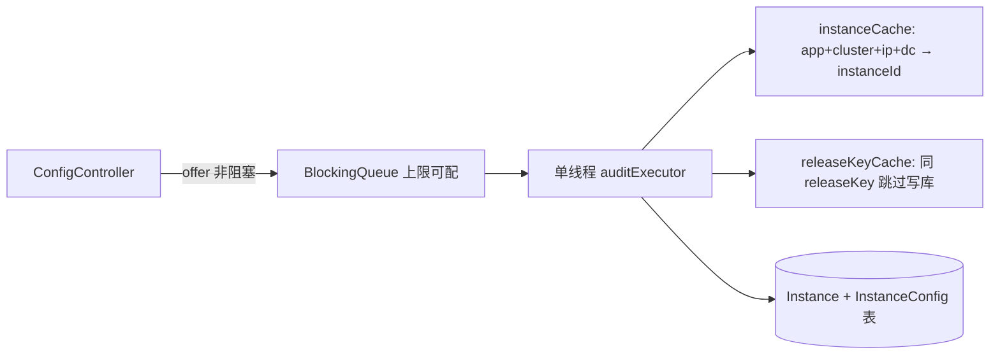

`doAudit` 优化策略：

1. **instanceCache**（1h access expire）：减少 `Instance` 表查询
2. **instanceConfigReleaseKeyCache**（1d expire）：同一 instance+namespace 的 releaseKey 未变则 **跳过 DB 写**
3. releaseKey 相同但距上次修改超过阈值（默认 10 分钟）仍 `update` **lastModifiedTime**——Portal「实例列表」依赖该字段展示「最近拉取时间」
4. 并发插入 `Instance` / `InstanceConfig` 捕获 `DataIntegrityViolationException` 安全忽略

Portal/Admin 通过 `InstanceConfigController` 按 `releaseKey` 分页查询「哪些实例在使用该次发布」，用于发布影响面评估。

### 14.2 ConfigFile API：面向文件型 Namespace

除 JSON 化的 `/configs` 外，提供 **原始文件形态** 的 HTTP API（`ConfigFileController`）：

| 路径 | 输出 |
|------|------|
| `/configfiles/{appId}/{cluster}/{namespace}` | properties 文本（key=value 拼接） |
| `/configfiles/json/...` | JSON 对象字符串 |
| `/configfiles/raw/...` | yml/xml/json 的 **原始 content** |

**实现策略：** 内部委托 `ConfigController.queryConfig`，再按格式转换：

- **PROPERTIES**：`PropertiesUtil.toString`
- **JSON**：`GSON.toJson(configurations)`
- **RAW**：非 properties 格式从 map 的 **`content` 单 key** 取全文（Portal 存 yml/xml 时整文件在 `content` 字段）

```286:294:apollo-configservice/src/main/java/com/ctrip/framework/apollo/configservice/controller/ConfigFileController.java
  private String getRawConfigContent(ApolloConfig apolloConfig) {
    ConfigFileFormat format = determineNamespaceFormat(apolloConfig.getNamespaceName());
    if (format == ConfigFileFormat.Properties) {
      return PropertiesUtil.toString(...);
    }
    return apolloConfig.getConfigurations().get("content");
  }
```

### 14.3 ConfigFile 独立缓存（与 ConfigServiceWithCache 不同）

`ConfigFileController` 维护 **按输出格式 + appId + cluster + namespace** 的字符串缓存：

- `maximumWeight = 50MB`（按字符串长度计权）
- `expireAfterWrite = 30` 分钟
- 双向索引 `watchedKey ↔ cacheKey`，`ReleaseMessageListener` 按 key 批量 `invalidate`

**灰度特殊处理：**

1. 若 `hasGrayReleaseRule(ip, label, namespace)` → **不走缓存**，每次 `loadConfig`（因灰度与实例相关）
2. 非灰度：先读缓存；miss 时加载后 **double-check** 灰度，防止「加载期间规则生效」导致缓存污染

```230:236:apollo-configservice/src/main/java/com/ctrip/framework/apollo/configservice/controller/ConfigFileController.java
      if (grayReleaseRulesHolder.hasGrayReleaseRule(appId, clientIp, clientLabel, namespace)) {
        Tracer.logEvent("ConfigFile.Cache.GrayReleaseConflict", cacheKey);
        return loadConfig(...);
      }
```

客户端 `YamlConfigFile` / `JsonConfigFile` 等通过 `ConfigFile` API 或 properties-compatible 仓库读取，与 `DefaultConfig.getProperty` 路径不同。

---

## 15. 深度专题：灰度规则引擎

### 15.1 数据模型回顾

| 实体 | 含义 |
|------|------|
| 父 Cluster | 如 `default`，承载 master Release |
| 子 Cluster（branch） | 如 `gray-20240329`，承载灰度 Release |
| `GrayReleaseRule` | 绑定 branch、规则 JSON（IP/Label 列表）、`releaseId`、`branchStatus` |

### 15.2 规则内存结构（Config Service）

`GrayReleaseRulesHolder` 维护三类索引：

| 结构 | Key | Value | 用途 |
|------|-----|-------|------|
| `grayReleaseRuleCache` | `appId+cluster+namespace` | `GrayReleaseRuleCache` 列表 | 正向：某配置下所有分支规则 |
| `reversedGrayReleaseRuleCache` | `clientAppId+namespace+ip` | ruleId | 快速判断是否有 IP 灰度 |
| `reversedGrayReleaseRuleLabelCache` | `clientAppId+namespace+label` | ruleId | 快速判断是否有 Label 灰度 |

规则来源：

- 启动全量扫描（每 60s 一批 500 条）
- `ReleaseMessage` 触发按 namespace 增量 `mergeGrayReleaseRules`

### 15.3 匹配与加载

读配置时（`AbstractConfigService.findRelease`）：

```java
Long grayReleaseId = grayReleaseRulesHolder.findReleaseIdFromGrayReleaseRule(
    clientAppId, clientIp, clientLabel, configAppId, configClusterName, configNamespaceName);
if (grayReleaseId != null) {
  release = findActiveOne(grayReleaseId, clientMessages);
}
if (release == null) {
  release = findLatestActiveRelease(configAppId, configClusterName, configNamespaceName, ...);
}
```

`findReleaseIdFromGrayReleaseRule` 遍历规则，要求 `branchStatus == ACTIVE` 且 `GrayReleaseRuleCache.matches(appId, ip, label)`。

`hasGrayReleaseRule` 仅检查 **是否存在** 可能命中的规则（用于 ConfigFile 是否走缓存），**不保证** 一定读到灰度 Release（还与 cluster 维度有关）。

### 15.4 发布侧的灰度合并逻辑（Admin）

- **灰度发布**：子 namespace Item 覆盖到「父 master 配置快照」上生成 branch Release
- **Master 发布**：可自动 merge 到子分支（`mergeFromMasterAndPublishBranch`），仅同步「分支曾修改过的 key」（`branchReleaseKeys` 优化后不再全量 diff master）
- **回滚**：`rollbackChildNamespace` 用 abandoned 与 target 两份 master 配置推算子分支应保留的 diff

详见 `ReleaseService` 中 `calculateChildNamespaceToPublishConfiguration` / `calculateBranchModifiedItemsAccordingToRelease`。

---

## 16. 深度专题：客户端 DI、监听与类型化读取

### 16.1 ApolloInjector 与 SPI

客户端不使用 Spring 管理核心 Bean，而用 **ServiceBootstrap（JDK ServiceLoader）** 加载 `Injector` 实现：

```java
s_injector = ServiceBootstrap.loadPrimary(Injector.class);
ApolloInjector.getInstance(ConfigUtil.class);
```

可替换实现以注入自定义 `HttpClient`、`MetaServerProvider` 等。`apollo-client-config-data` 通过 `ApolloConfigDataInjectorCustomizer` 在 Spring Boot 启动早期注册替代实现。

### 16.2 ConfigChangeListener 分发模型

`AbstractConfig` 在 Repository 变更后：

1. `calcPropertyChanges` 对比新旧 Properties
2. `updateAndCalcConfigChanges`（`DefaultConfig`）按 **实际 getProperty 优先级** 再算一遍，过滤误报
3. `fireConfigChange` → 按 **interestedKeys / interestedKeyPrefixes** 过滤监听器
4. `m_executorService`（CachedThreadPool）**异步**回调，避免阻塞拉配置线程

支持：

```java
config.addChangeListener(listener);  // 全部 key
config.addChangeListener(listener, Sets.newHashSet("db.url"));  // 指定 key
config.addChangeListener(listener, null, Sets.newHashSet("spring."));  // 前缀
```

Spring 集成：`PropertySourcesProcessor` 将监听器桥接为 `ApolloConfigChangeEvent`。

### 16.3 类型化读取与解析缓存

`getIntProperty` / `getBooleanProperty` 等对 **解析结果** 做 Guava 缓存（默认 500 条，1 分钟 access expire），与 `m_configVersion` 联动：配置变更时 `clearConfigCache()` 递增 version，避免旧解析结果残留。

数组类型按 **分隔符** 分桶缓存（不同 delimiter 不同 Cache）。

---

## 17. 源码阅读路线图

> 主题分类目录见文首 [目录](#目录)（八大部分 + 附录）。

建议按下列顺序阅读，由外到内、由发布到消费：

1. **总览**：`docs/en/design/apollo-design.md`
2. **启动**：`apollo-assembly/.../ApolloApplication.java`
3. **发布写路径**：`ReleaseController` → `ReleaseService` → `DatabaseMessageSender`
4. **消息消费**：`ReleaseMessageScanner` → `ConfigServiceAutoConfiguration`
5. **读与缓存**：`ConfigController` → `AbstractConfigService` → `ConfigServiceWithCache`
6. **推送**：`NotificationControllerV2` + `WatchKeysUtil`
7. **灰度**：`GrayReleaseRulesHolder` + `ReleaseService` → [第 15 节](#15-深度专题灰度规则引擎)
8. **发现**：`ServiceController` + 所选 `DiscoveryService` 实现
9. **Portal 业务**：`ReleaseController` → `RetryableRestTemplate` → [第 10.3 节](#103-portal多环境权限通知)
10. **Portal 安全**：`AuthConfiguration` → `PortalUserSessionFilter` → [第 12 节](#12-深度专题portal-认证与安全体系)
11. **草稿编辑**：`ItemSetService` → `CommitService` → [第 10.1 节](#101-配置草稿编辑item-尚未发布)
12. **实例与文件 API**：`InstanceConfigAuditUtil`、`ConfigFileController` → [第 14 节](#14-深度专题实例上报与-configfile-api)
13. **运行时配置**：`BizDBPropertySource` → `BizConfig` → [第 13 节](#13-深度专题运行时配置与-accesskey)
14. **客户端核心**（apollo-java v2.5.0）：见 [第 6 节](#6-apollo-java-客户端深度解析v250)
15. **客户端扩展**：config-data / openapi → [第 11 节](#11-apollo-java-扩展模块与生态)
16. **客户端监听**：`AbstractConfig` → `DefaultConfig` → [第 16 节](#16-深度专题客户端-di监听与类型化读取)
17. **公共/关联 Namespace**：`NamespaceService.findPublicNamespaceForAssociatedNamespace` → `ConfigController.mergeReleaseConfigurations` → [第 18 节](#18-深度专题公共关联-namespace-与配置合并)
18. **去 Eureka 部署**：`application-database-discovery.properties` → `ApolloServiceRegistryHeartbeatApplicationRunner` → [第 19 节](#19-深度专题数据库注册发现database-discovery)
19. **Portal UI**：`static/scripts/app.js` + `*Service.js` → [第 20 节](#20-深度专题portal-前端与-api-映射)
20. **创建应用**：`AppService.createAppInLocal` → `CreationListener` → [第 21 节](#21-深度专题应用namespace-生命周期与权限初始化)
21. **Portal 调 Admin**：`AdminServiceAddressLocator` → `RetryableRestTemplate` → [第 22 节](#22-深度专题portal-多环境-admin-调用与容错)
22. **迁移备份**：`ConfigsExportService` / `ConfigsImportService` → [第 23 节](#23-深度专题配置导入导出)
23. **发现选型**：各 `DiscoveryService` Profile 对照 → [第 24 节](#24-深度专题meta-服务发现实现对比)
24. **推送 key**：`WatchKeysUtil` ↔ `ReleaseMessage` → [第 25 节](#25-深度专题watchkeys-与长轮询通知对齐)
25. **一体启动**：`ApolloApplication` 四上下文 → [第 26 节](#26-深度专题一体化启动apollo-assembly)
26. **编辑锁**：`NamespaceAcquireLockAspect` → `ReleaseService.checkLock` → [第 27 节](#27-深度专题namespace-编辑锁)
27. **发布通知**：`ConfigPublishListener` → [第 28 节](#28-深度专题发布后通知webhook--邮件--mq)
28. **审计**：`ApolloAuditSpanAspect` → [第 29 节](#29-深度专题apollo-audit-审计体系)
29. **OpenAPI**：codegen `*ManagementApi` → `Server*OpenApiService` → [第 30 节](#30-深度专题openapi-契约与-portal-实现映射)
30. **全局检索**：`GlobalSearchService` / `SearchController` → [第 31 节](#31-深度专题全局配置检索)
31. **Consumer**：`ConsumerAuthenticationFilter` → [第 32 节](#32-深度专题开放平台-consumer-与-token-鉴权)
32. **回滚**：`Release.isAbandoned` + `ReleaseController.rollback` → [第 33 节](#33-深度专题release-生命周期与回滚)

---

## 18. 深度专题：公共/关联 Namespace 与配置合并

本节把「Portal 编辑时读哪份公共配置」与「客户端拉取时如何叠加 application + 公共 namespace」两条链路对齐到同一套 biz 规则。

### 18.1 概念区分

| 概念 | 存储 | 谁创建 | 客户端行为 |
|------|------|--------|------------|
| **私有 Namespace** | `AppNamespace.appId` = 当前应用 | 各 App 自建 | 仅本 App 的 `Namespace` |
| **公共 Namespace** | `AppNamespace.isPublic=true`，全局唯一 `name` | 公共库 App（如 `PA`） | 任意 App 可在本 cluster 下**关联**同名 namespace |
| **关联 Namespace** | 业务 App 下 `Namespace`，`namespaceName` 指向公共名 | Portal「关联公共配置」 | `ConfigController` 在私有 release 之后追加公共 release |

`application` 永远属于本 App，不参与公共关联逻辑（`namespaceBelongsToAppId` 对 `application` 直接返回 true）。

### 18.2 Portal/Admin：关联公共配置读哪条 `Namespace`

`NamespaceService.findPublicNamespaceForAssociatedNamespace` 根据**公共 AppNamespace 的 appId** 与**当前 cluster 是否已有发布**做回落：

```122:172:apollo-biz/src/main/java/com/ctrip/framework/apollo/biz/service/NamespaceService.java
  public Namespace findPublicNamespaceForAssociatedNamespace(String clusterName,
      String namespaceName) {
    AppNamespace appNamespace = appNamespaceService.findPublicNamespaceByName(namespaceName);
    // ...
    if (Objects.equals(clusterName, ConfigConsts.CLUSTER_NAME_DEFAULT)) {
      return namespace;
    }
    if (namespace == null) {
      return findOne(appId, ConfigConsts.CLUSTER_NAME_DEFAULT, namespaceName);
    }
    Release latestActiveRelease = releaseService.findLatestActiveRelease(namespace);
    if (latestActiveRelease != null) {
      return namespace;
    }
    // 自定义 cluster 未发布 → 若 default 已发布则用 default，否则仍用自定义 cluster 记录
    // ...
  }
```

决策要点（便于排障）：

1. **default cluster**：始终用公共 App 在该 cluster 上的 `Namespace` 行。
2. **自定义 cluster 无行**：回落到公共 App 的 **default** cluster。
3. **自定义 cluster 有行但未发布**：若 default 已发布则用 default 的 Item 视图，否则仍展示自定义 cluster（空草稿）。
4. **自定义 cluster 已发布**：用本 cluster 的公共配置。

Portal 暴露：

- MVC：`GET .../associated-public-namespace` → `NamespaceController.findPublicNamespaceForAssociatedNamespace`
- OpenAPI：`ConfigService.js` → `load_public_namespace_for_associated_namespace`（同上路径的 `/openapi/v1/...`）

关联 namespace 的**删除**走 `linked-namespaces`（只删本 App 下的关联行，不删公共 App 的 `AppNamespace`）。

### 18.3 Config Service：HTTP 拉取时的双层 Release

`GET /configs/{appId}/{clusterName}/{namespace}` 核心顺序：

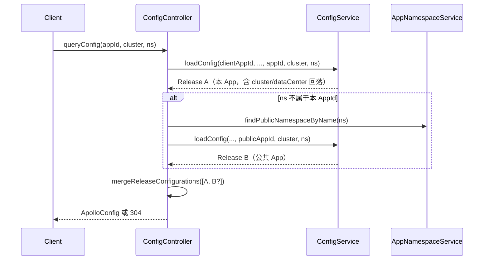

1. **本 App Release**（列表 index 0）：`configService.loadConfig`，内部经 `AbstractConfigService` 做 cluster → dataCenter → default 回落，并匹配灰度规则（见第 15 节）。
2. **公共 Release**（可选追加）：当 `namespaceBelongsToAppId` 为 false 时，`findPublicConfig` 用公共 `AppNamespace.appId` 再调一次 `loadConfig`。

```238:252:apollo-configservice/src/main/java/com/ctrip/framework/apollo/configservice/controller/ConfigController.java
  private Release findPublicConfig(String clientAppId, String clientIp, String clientLabel,
      String clusterName, String namespace, String dataCenter,
      ApolloNotificationMessages clientMessages) {
    AppNamespace appNamespace = appNamespaceService.findPublicNamespaceByName(namespace);
    if (Objects.isNull(appNamespace) || Objects.equals(clientAppId, appNamespace.getAppId())) {
      return null;
    }
    String publicConfigAppId = appNamespace.getAppId();
    return configService.loadConfig(clientAppId, clientIp, clientLabel, publicConfigAppId,
        clusterName, namespace, dataCenter, clientMessages);
  }
```

### 18.4 `mergeReleaseConfigurations` 覆盖顺序

```254:263:apollo-configservice/src/main/java/com/ctrip/framework/apollo/configservice/controller/ConfigController.java
  /**
   * Merge configurations of releases.
   * Release in lower index override those in higher index
   */
  Map<String, String> mergeReleaseConfigurations(List<Release> releases) {
    Map<String, String> result = Maps.newLinkedHashMap();
    for (Release release : Lists.reverse(releases)) {
      result.putAll(gson.fromJson(release.getConfigurations(), configurationTypeReference));
    }
    return result;
  }
```

- `releases` 顺序：**先本 App，后公共**（`LinkedList` 追加顺序）。
- `Lists.reverse` 后先 `putAll` 公共、再 `putAll` 本 App → **同名 key 以本 App 为准**（与文档「关联覆盖公共」一致）。
- `releaseKey` 为各 releaseKey 用 `+` 拼接（`CLUSTER_NAMESPACE_SEPARATOR`），客户端 304 与增量同步均依赖此合并键。

增量同步开启时，会用历史 `releaseKey` 分段查旧 Release，再对 `latestConfigurations` 与 `clientSideConfigurations` 做 diff（`IncrementalSyncService`），失败则回退全量 `configurations`。

### 18.5 子 Cluster / 灰度分支 Namespace

灰度发布在**父 cluster** 上创建**子 cluster** 的同名 `Namespace`（`NamespaceBranchService`）。`findChildNamespace` 用「子 cluster 集合」与「同 appId+namespaceName 的多条 Namespace」求交：

```230:251:apollo-biz/src/main/java/com/ctrip/framework/apollo/biz/service/NamespaceService.java
  public Namespace findChildNamespace(String appId, String parentClusterName,
      String namespaceName) {
    List<Namespace> namespaces = findByAppIdAndNamespaceName(appId, namespaceName);
    if (CollectionUtils.isEmpty(namespaces) || namespaces.size() == 1) {
      return null;
    }
    List<Cluster> childClusters = clusterService.findChildClusters(appId, parentClusterName);
    // ...
    for (Namespace namespace : namespaces) {
      if (childClusterNames.contains(namespace.getClusterName())) {
        return namespace;
      }
    }
    return null;
  }
```

`ReleaseService` 发布/合并灰度时通过 `findChildNamespace` 定位分支 namespace，与第 15 节灰度规则引擎配合。

---

## 19. 深度专题：数据库注册发现（database-discovery）

第 5 节已说明 Meta 与 `DiscoveryService` 抽象；本节聚焦**官方打包默认**的 `database-discovery` Profile 与 DB 心跳注册。

### 19.1 Profile 与 Bean 互斥

`apollo-configservice/src/main/resources/application.properties` 注释写明：官方包默认启用 `github,database-discovery`（具体以部署脚本为准）。

启用 `database-discovery` 时：

| 项 | 行为 |
|----|------|
| Eureka | `apollo.eureka.server.enabled=false`，`eureka.client.enabled=false` |
| Spring Cloud Discovery | `spring.cloud.discovery.enabled=false` |
| Meta 读实例 | `DatabaseDiscoveryService`（`@Profile("database-discovery")`） |
| 默认 Eureka 实现 | `DefaultDiscoveryService` 带 `@ConditionalOnMissingProfile({..., "database-discovery"})`，**不会**加载 |

其他互斥 Profile：`kubernetes`、`nacos-discovery`、`consul-discovery`、`zookeeper-discovery`、`custom-defined-discovery` —— 各自有独立 `*DiscoveryService` 与 `application-*.properties`。

### 19.2 实例注册：写 `ServiceRegistry` 表

`application-database-discovery.properties` 关键项：

```properties
apollo.service.registry.enabled=true
apollo.service.registry.cluster=default
apollo.service.registry.heartbeat-interval-in-second=10

apollo.service.discovery.enabled=true
apollo.service.discovery.health-check-interval-in-second=61
```

- **`apollo.service.registry.*`**：Config/Admin 进程向 ConfigDB 的 `ServiceRegistry` **注册自身 URI**（`ApolloServiceRegistryAutoConfiguration`，`@ConditionalOnProperty(..., enabled)`）。
- **`apollo.service.discovery.*`**：Meta 侧 `DatabaseDiscoveryClient` 读表并过滤 cluster、剔除超时未心跳实例。

`ApolloServiceRegistryHeartbeatApplicationRunner` 在启动时 `scheduleAtFixedRate` 调用 `DatabaseServiceRegistry.register`（与首次注册相同），间隔默认 10s；进程退出时 `ApolloServiceRegistryDeregisterApplicationListener` 注销。

```55:70:apollo-biz/src/main/java/com/ctrip/framework/apollo/biz/registry/configuration/support/ApolloServiceRegistryHeartbeatApplicationRunner.java
  public void run(ApplicationArguments args) throws Exception {
    log.info("register to database. '{}': uri '{}', cluster '{}' ",
        this.registration.getServiceName(), this.registration.getUri(),
        this.registration.getCluster());
    this.heartbeatScheduledExecutorService.scheduleAtFixedRate(this::heartbeat, 0,
        this.registration.getHeartbeatIntervalInSecond(), TimeUnit.SECONDS);
  }
```

### 19.3 Meta 查询路径

```40:44:apollo-configservice/src/main/java/com/ctrip/framework/apollo/metaservice/service/DatabaseDiscoveryService.java
  public List<ServiceDTO> getServiceInstances(String serviceId) {
    List<ServiceInstance> serviceInstanceList = this.discoveryClient.getInstances(serviceId);
    return convert(serviceInstanceList);
  }
```

`ServiceDTO.homepageUrl` 来自注册 URI；`instanceId` 也设为 homepageUrl（与 Eureka 的 instanceId 语义不同，客户端只需能 HTTP 访问）。

客户端 `ConfigServiceLocator` / Portal `RetryableRestTemplate` **不感知**底层是 Eureka 还是 DB，只消费 `GET /services/config|admin`。

### 19.4 运维对照

| 场景 | 建议检查 |
|------|----------|
| Meta 返回空列表 | `ServiceRegistry` 是否有对应 `serviceName`、cluster；心跳是否 < 61s |
| 多 Config 节点部分不可见 | 各节点 `apollo.service.registry.uri` 是否可达；防火墙 |
| 仍走 Eureka | 是否未激活 `database-discovery` Profile；`DefaultDiscoveryService` 是否被加载 |
| Portal 调 Admin 失败 | 与 Config 相同，Admin 也需注册；Portal Env Meta 地址是否正确 |

---

## 20. 深度专题：Portal 前端与 API 映射

Portal UI 为 **AngularJS 1.x** 多模块 SPA，静态资源在 `apollo-portal/src/main/resources/static/scripts/`。

### 20.1 模块划分（`app.js`）

| Angular Module | 页面/能力 |
|----------------|-----------|
| `index` | 首页 |
| `application` | 项目配置主页（namespace 面板、编辑） |
| `create_app` | 创建应用 |
| `namespace` | Namespace 管理 |
| `cluster` / `manage_cluster` | 集群 |
| `sync_item` / `diff_item` | 配置同步、比较 |
| `release_history` | 发布历史 |
| `open_manage` | 开放平台 Consumer |
| `setting` / `server_config_manage` | Portal 与 ConfigDB 运行时配置 |
| `role` | 权限 |
| `global_search_value` | 全局 key/value 检索 |

公共依赖：`app.util`（`prefixPath`、i18n）、`app.service`（`$resource` 封装）、`apollo.directive`。

`prefixPath` 来自 `localStorage.prefixPath`，用于网关子路径部署；所有请求经 `AppUtil.prefixPath()` 拼接。

### 20.2 API 分层：Portal MVC vs OpenAPI

| 类型 | 路径前缀 | 典型用途 |
|------|----------|----------|
| **Portal MVC** | `/apps/...`、`/favorites`、`/global-search/...` | 会话用户、页面聚合、权限隐藏（`hideItems`） |
| **OpenAPI v1** | `/openapi/v1/...` | 与契约一致；前端发布/改配置/锁 namespace 等**写操作**多走此路径 |
| **Server 配置** | `/server/portal-db/config`、`/server/envs/{env}/config-db/config` | 超级管理员改 DB 中 `ServerConfig` |

同一业务能力常有两条入口：例如读 namespace 详情可用 MVC `GET /apps/{appId}/envs/{env}/clusters/{cluster}/namespaces/{name}`，编辑器批量改 Item 用 OpenAPI `PUT .../items`。

### 20.3 核心 `*Service.js` 与后端对照

| 前端 Service | 关键接口 | 后端 |
|--------------|----------|------|
| `AppService.js` | `POST /apps`、`GET /openapi/v1/apps/by-self` | `AppController`、OpenAPI App |
| `NamespaceService.js` | `POST /openapi/v1/namespaces`、`DELETE linked-namespaces` | `NamespaceController`、OpenAPI Namespace |
| `ConfigService.js` | `PUT .../items`、`load_public_namespace_for_associated_namespace` | Admin `ItemController` / `ItemSetController`、Portal OpenAPI 代理 |
| `ReleaseService.js` | `POST .../releases`、`gray_release`、`rollback` | `ServerReleaseOpenApiService` → Admin `ReleaseController` |
| `CommitService.js` | `GET .../commits?page=` | Portal 转发 Admin Commit |
| `NamespaceLockService.js` | `GET .../lock` | 发布前锁 |
| `EnvService.js` | `GET /openapi/v1/envs` | 环境列表 |

`ReleaseService.js` 将 OpenAPI 的 `changeType` diff 适配为 UI 沿用的 `entity.firstEntity/secondEntity` 结构（`toLegacyReleaseChange`），减少模板层改动。

`ConfigService.js` 对 item key 做 **Base64 路径段**（`encodeBase64PathSegment`），对应 OpenAPI `encodedItems/{key}`，避免特殊字符破坏 URL。

### 20.4 配置编辑 → 发布 UI 链路（简图）

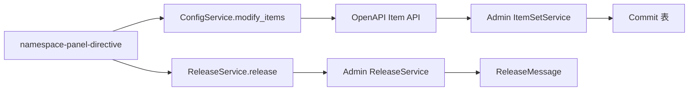

- **保存**：`ItemChangeSets` → Admin `ItemSetService.updateSet` → 写 `Item` + `Commit`（未发布）。
- **发布**：OpenAPI `POST .../releases` → Portal 校验权限 → Admin `ReleaseService.publish` → `ReleaseMessage` → Config 缓存失效（第 4 节）。

---

## 21. 深度专题：应用/Namespace 生命周期与权限初始化

### 21.1 创建应用（Portal 本地 + 多环境扇出）

`AppService.createAppInLocal` 在 **Portal DB** 事务内完成：

1. 校验 `appId` 唯一、owner 用户存在  
2. `appRepository.save`  
3. `appNamespaceService.createDefaultAppNamespace` → 默认 `application` 私有 namespace 定义  
4. `roleInitializationService.initAppRoles` + 各活跃 Env 的 `initClusterNamespaceRoles(default)`  
5. 可选 `assignRoleToUsers`（Master）

`createAppAndAddRolePermission` 在保存后 `publisher.publishEvent(new AppCreationEvent(createdApp))`。

`CreationListener` **异步扇出**到各 Env 的 Admin：

```49:61:apollo-portal/src/main/java/com/ctrip/framework/apollo/portal/listener/CreationListener.java
  public void onAppCreationEvent(AppCreationEvent event) {
    AppDTO appDTO = BeanUtils.transform(AppDTO.class, event.getApp());
    List<Env> envs = portalSettings.getActiveEnvs();
    for (Env env : envs) {
      try {
        appAPI.createApp(env, appDTO);
      } catch (Throwable e) {
        LOGGER.error("Create app failed. appId = {}, env = {})", appDTO.getAppId(), env, e);
```

`AppNamespaceCreationEvent` 同理调用 `namespaceAPI.createAppNamespace`。单 Env 失败**不阻断**其他 Env（仅打日志 + Tracer），运维需用「缺失 Env」类 OpenAPI 补齐。

### 21.2 角色与权限模板

`DefaultRoleInitializationService.initAppRoles`：

- 创建 **App Master**、**ManageAppMaster** 角色与权限  
- 将 owner 绑到 Master  
- 为 `application` namespace 创建 **Modify** / **Release** 角色并赋给 owner  

新建 namespace 时 Portal 控制器先调用：

- `initNamespaceRoles`（Modify / Release）  
- `initNamespaceEnvRoles`（按 Env 的发布权限等）  
再 `namespaceService.createNamespace` 写 Admin。

公共 `AppNamespace` 另有全局唯一名校验（`checkAppNamespaceGlobalUniqueness`）。

### 21.3 创建 Namespace（多 Env）

`NamespaceController.createNamespace` 接收 `List<NamespaceCreationModel>`，每个 model 带 `env` + `NamespaceDTO`（appId、clusterName、namespaceName）。失败 per-env 记日志，不整体回滚 Portal 侧已创建的角色（需注意半成功状态）。

OpenAPI `ServerNamespaceManagementOpenApiService.createNamespaces` 逻辑类似，但失败会聚合 `failedNamespaces` 抛 `BadRequestException`。

### 21.4 Admin Service REST 面（Portal 代理目标）

| Controller | 职责 |
|------------|------|
| `AppController` | App CRUD |
| `AppNamespaceController` | AppNamespace |
| `NamespaceController` | Namespace、关联公共查询 |
| `ItemController` / `ItemSetController` | Item、批量变更 |
| `CommitController` | 草稿历史 |
| `ReleaseController` / `ReleaseHistoryController` | 发布、回滚、历史 |
| `NamespaceBranchController` | 灰度分支 |
| `ClusterController` | 集群 |
| `InstanceConfigController` | 实例配置审计 |
| `AccessKeyController` | 密钥 |
| `NamespaceLockController` | 编辑锁 |

Portal 通过 `AdminServiceAPI.*` + `RetryableRestTemplate` 按 Env 选择 Meta → Admin 实例，Header 带 `admin-service.access.tokens` 中对应 Bearer。

### 21.5 删除与关联

- **删除关联 namespace**：`deleteLinkedNamespace` → `namespaceService.deleteNamespace`（仅本 App 环境行）。  
- **删除 AppNamespace 定义**：OpenAPI `deleteAppNamespace`，需无关联使用（`getNamespaceUsage`）。  
- Config 侧公共 namespace 列表会 `filterChildNamespace` 去掉灰度子 cluster 行，避免管理页重复展示。

---

## 22. 深度专题：Portal 多环境 Admin 调用与容错

Portal 不直连 ConfigDB 写配置，所有 Env 的 Item/Release 操作都经 **Meta 发现 Admin** 再 HTTP 调用。第 10.3 节已提到 Access Token；本节展开地址缓存、轮询重试与幂等边界。

### 22.1 地址发现：`AdminServiceAddressLocator`

后台单线程定时任务 `RefreshAdminServerAddressTask`：

1. 对每个 `PortalSettings.getAllEnvs()` 调用 `{metaDomain}/services/admin`（与客户端查 Config 对称，仅 serviceId 不同）。
2. 成功则写入 `ConcurrentHashMap<Env, List<ServiceDTO>>`；失败重试 **3 次**。
3. 全部 Env 成功 → 按 `refreshAdminServerAddressTaskNormalIntervalSecond` 调度下一轮；任一失败 → 用更短的 **offline** 间隔重试。

`getServiceList(env)` 返回前会对列表 **`Collections.shuffle`**，使 `RetryableRestTemplate` 的 for 循环具备随机起点，避免总是打同一 Admin 节点。

### 22.2 请求执行：`RetryableRestTemplate`

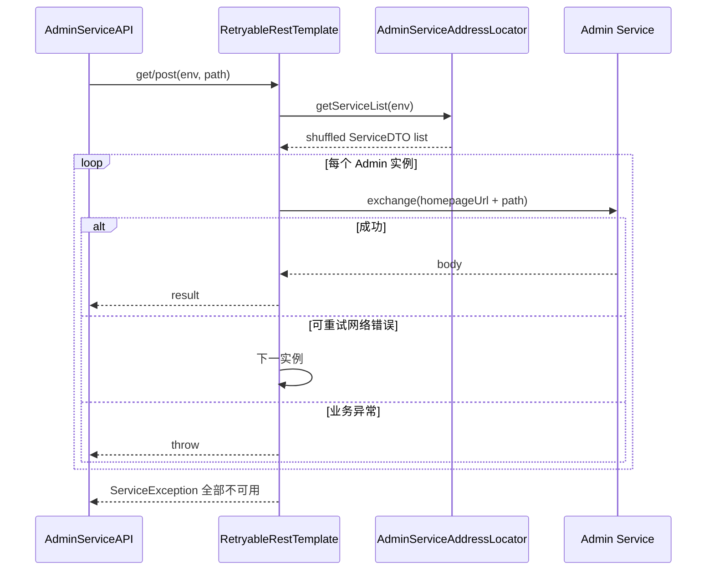

要点：

| 项 | 行为 |
|----|------|
| URL | `parseHost(service)` 保证 homepageUrl 以 `/` 结尾，再拼相对 path |
| 鉴权 | `assembleExtraHeaders` 从 PortalDB `admin-service.access.tokens` 解析 JSON，`Authorization` 按 Env 注入 |
| 追踪 | Cat `Transaction("AdminAPI", uri)`，失败 `Tracer.logError` |
| 重试 | **遍历实例列表**；非「同一请求重试 N 次」 |

### 22.3 `canRetry` 与写操作幂等

```304:314:apollo-portal/src/main/java/com/ctrip/framework/apollo/portal/component/RetryableRestTemplate.java
  // post,delete,put请求在admin server处理超时情况下不重试
  private boolean canRetry(Throwable e, HttpMethod method) {
    Throwable nestedException = e.getCause();
    if (method == HttpMethod.GET) {
      return nestedException instanceof SocketTimeoutException
          || nestedException instanceof HttpHostConnectException
          || nestedException instanceof ConnectTimeoutException;
    }
    return nestedException instanceof HttpHostConnectException
        || nestedException instanceof ConnectTimeoutException;
  }
```

| HTTP 方法 | 连接失败 | 读超时（SocketTimeout） |
|-----------|----------|-------------------------|
| GET | 换下一 Admin | 换下一 Admin |
| POST/PUT/DELETE | 换下一 Admin | **不重试**（避免 Admin 已处理但响应丢失导致双写） |

运维含义：Admin 集群中一台 **connect 失败** 时发布/改配置仍可能成功；若遇 **read timeout**，应查 Admin 日志确认是否已落库，勿盲目重试同一操作。

### 22.4 与 `AdminServiceAPI` 的关系

`AdminServiceAPI` 按资源拆类（`AppAPI`、`NamespaceAPI`、`ItemAPI`、`ReleaseAPI` 等），内部统一委托 `RetryableRestTemplate`，Portal Service 层只关心 Env + DTO，不持有 Admin 地址。OpenAPI Server 实现（如 `ServerReleaseOpenApiService`）最终也走同一套 Admin 调用链。

---

## 23. 深度专题：配置导入/导出

用于环境迁移、灾备与批量初始化，入口在 Portal：`ConfigsExportController` / `ConfigsImportController`，核心逻辑在 `ConfigsExportService` / `ConfigsImportService`。

### 23.1 全量 ZIP 结构（导出 ↔ 导入）

`ConfigsExportService.exportData` 按当前用户有权限的 App 生成 ZIP，路径约定与 `ConfigsImportService` 解析一致：

| ZIP 内路径 | 内容 |
|------------|------|
| `{owner}/{appId}/app.metadata` | App JSON |
| `{namespace}.appnamespace.metadata` | AppNamespace 元数据列表 |
| `apollo/{appId}/{env}/{cluster}.cluster.metadata` | Cluster JSON |
| `apollo/{appId}/{env}/{appId}+{cluster}+{namespace}` | Namespace 下 Item 列表 JSON（文件名即三元组） |

单 namespace **文件导入**（`POST .../items/import`）则要求上传文件名符合 `ConfigFileUtils.toFilename(appId, cluster, namespace, format)`（如 `appId+default+application.properties`）。

### 23.2 导入流水线（ZIP）

`importConfigByZip`（需 **SuperAdmin**）参数：

- `envs`：逗号分隔，只处理 ZIP 中匹配的 env 目录。
- `conflictAction`：`ignore`（目标 namespace 已有 Item 则跳过）或 `cover`（强制覆盖）。

执行顺序（`parallelStream` + `CountDownLatch`）：

1. **App** → Portal 本地 `importAppInLocal`，缺失的 Env 调 `createAppInRemote`  
2. **AppNamespace** → 本地 + 角色初始化  
3. **Cluster** → 各 Env 创建  
4. **Namespace** → `importNamespaceFromText`：无则 `createNamespace` + 角色；有 Item 且 `ignore` 则跳过  
5. **Item** → 按 key `loadItem` / `updateItem` / `createItem`；无 key 有 comment 则 `createCommentItem`

单文件 `forceImportNamespaceFromFile` 走同一套 Item 写入，不经过 ZIP 分阶段。

### 23.3 导出权限与范围

- 全量导出：仅导出 `UnifiedPermissionValidator` 判定当前用户有权限的 App。  
- 单 App 导出：`exportAppConfigByEnvAndCluster`，用于页面「导出配置」按钮（`namespace-panel-directive` 中 `items/export`）。

导出的是 **当前 Portal 能读到的草稿 Item**（经 Admin API），不是仅 Release 快照；迁移后仍需在各 Env **发布** 才会推送到客户端。

### 23.4 与 OpenAPI / 前端

| 操作 | 路径 | 权限 |
|------|------|------|
| 单 namespace 文件导入 | `POST /apps/.../items/import` | ModifyNamespace |
| ZIP 全量导入 | `POST /configs/import` | SuperAdmin |
| 导出 | `ConfigsExportController` 各 GET | 按 App 权限 |

前端 `ExportService.js` / `import-namespace-modal-directive` 对应上述 MVC 路径，与 OpenAPI Item API（在线编辑）互补。

---

## 24. 深度专题：Meta 服务发现实现对比

第 5、19 节分别介绍 Meta 职责与 database-discovery；本节汇总 **同一 `DiscoveryService` 接口** 下的实现选型（互斥 Profile，由 `DefaultDiscoveryService` 的 `@ConditionalOnMissingProfile` 保证只激活一种）。

| Profile | 实现类 | 实例来源 | 典型场景 |
|---------|--------|----------|----------|
| （默认，无上述 Profile） | `DefaultDiscoveryService` | **Eureka** `EurekaClient.getApplication(serviceId)` | 传统同机 Eureka + Config |
| `database-discovery` | `DatabaseDiscoveryService` | ConfigDB `ServiceRegistry` + 心跳 | 官方包默认、去 Eureka |
| `kubernetes` / `custom-defined-discovery` | `KubernetesDiscoveryService` | `BizConfig` 中 `apollo.config-service.url` / `apollo.admin-service.url`（逗号分隔） | K8s Service 地址写死配置 |
| `nacos-discovery` / `consul-discovery` / `zookeeper-discovery` | `SpringCloudInnerDiscoveryService` | Spring Cloud `DiscoveryClient.getInstances(serviceId)` | 接入 Nacos/Consul/ZK 注册中心 |

共同契约：

- Meta 只暴露 `GET /services/config`、`GET /services/admin`。  
- 返回 `List<ServiceDTO>`（`homepageUrl` 为客户端/Portal 实际 HTTP 根路径）。  
- Portal `AdminServiceAddressLocator` 与 apollo-java `ConfigServiceLocator` **共用** Meta，不区分发现实现。

**Kubernetes 模式** 不做动态发现，而是把 URL 列表当作静态服务列表解析为 `ServiceDTO`，适合 Ingress 或 Headless Service 固定地址。

**Spring Cloud 模式** 要求 `serviceId` 与 `ServiceNameConsts.APOLLO_CONFIGSERVICE` / `APOLLO_ADMINSERVICE` 在注册中心一致；各 `application-*-discovery.properties` 会关闭 Eureka 并打开对应 `spring.cloud.*` 客户端。

选型建议简述：

- 单机 Demo / 官方 Quick Start：**database-discovery** + 一体包。  
- 已有 Eureka 基建：默认 Profile。  
- K8s 且无 Eureka：kubernetes + 配置 URL。  
- 公司统一 Nacos/Consul：对应 Profile + Spring Cloud 注册。

---

## 25. 深度专题：WatchKeys 与长轮询通知对齐

客户端长轮询 `GET /notifications/v2` 与 Config 拉取 `GET /configs/...` 必须使用**一致的「逻辑监听范围」**，否则会出现「通知到了但拉到的仍是旧配置」或相反。`WatchKeysUtil` 负责在服务端展开这一范围。

### 25.1 ReleaseMessage Key 格式

`ReleaseMessageKeyGenerator.generate(appId, cluster, namespace)` → `appId+cluster+namespace`（`+` 为 `CLUSTER_NAMESPACE_SEPARATOR`）。

发布时 `DatabaseMessageSender` 写入的 message 与长轮询注册的 key **必须一致**，`NotificationControllerV2.handleMessage` 用 **完整 message 字符串** 查找等待中的 `DeferredResultWrapper`。

### 25.2 单 namespace 展开的 watch keys

对非 default 的 client cluster，`assembleWatchKeys` 同时监听：

1. 指定 `clusterName`  
2. `dataCenter`（若非空且与 cluster 不同）  
3. **default** cluster  

因此发布在 default 上的变更也会通知到自定义 cluster 客户端——与 `AbstractConfigService.loadConfig` 的回落读路径对称。

### 25.3 公共 namespace 额外 keys

若客户端订阅的 namespace **不属于** 本 AppId（关联公共配置），`assembleAllWatchKeys` 会对每个公共名调用 `findPublicConfigWatchKeys`，为**公共 AppId** 再展开一套 cluster/dataCenter/default keys，并挂到该 namespace 名下。

这与 `ConfigController.findPublicConfig` 双 Release 合并是同一业务模型的两侧（读合并 vs 推送订阅）。

### 25.4 `NotificationControllerV2` 注册与唤醒

长轮询处理顺序（源码注释强调顺序以防竞态）：

1. 解析 `notifications` JSON，规范化 namespace 大小写。  
2. `watchKeysUtil.assembleAllWatchKeys` → 全部 `watchedKeys`。  
3. **先** `deferredResults.put(key, wrapper)` 注册，**再** `entityManagerUtil.closeEntityManager()`（避免 JPA 连接长占）。  
4. 查 `releaseMessageService.findLatestReleaseMessagesGroupByMessages(watchedKeys)`，若已有新 message 则立即 `setResult`。  
5. 超时由 `BizConfig.longPollingTimeoutInMilli()` 控制（与客户端长轮询超时应对齐）。

`handleMessage` 收到 `ReleaseMessage` 后：

- 仅处理 channel `Topics.APOLLO_RELEASE_TOPIC`。  
- 若 `deferredResults` 无该 key，直接返回（无客户端在等待）。  
- 等待连接数 > `releaseMessageNotificationBatch` 时，**异步分批** `setResult` 并 sleep 间隔，防止一次发布唤醒上万连接打满 CPU。

客户端应在通知后携带 `messages` 参数拉配置（增量失效缓存），见第 4、6 节。

### 25.5 与客户端 notificationId

对每个 namespace，服务端取该 namespace 下**所有 watchedKeys** 对应 message 的 **最大** `ReleaseMessage.id`，若大于客户端传来的 `notificationId` 则返回新通知，并在 `ApolloConfigNotification` 中附带 `messages` 映射（key → id），供客户端下次请求携带。

---

## 26. 深度专题：一体化启动（apollo-assembly）

`apollo-assembly` 模块提供 **单 JVM 启动 Config + Admin + Portal**，适合本地开发与小型部署。

### 26.1 四个 Spring 上下文

`ApolloApplication.main` 顺序启动：

```46:75:apollo-assembly/src/main/java/com/ctrip/framework/apollo/assembly/ApolloApplication.java
    ConfigurableApplicationContext commonContext =
        new SpringApplicationBuilder(ApolloApplication.class).web(WebApplicationType.NONE)
            .run(args);
    // ...
    ConfigurableApplicationContext configContext =
        new SpringApplicationBuilder(ConfigServiceApplication.class).parent(commonContext)
            .profiles("assembly").sources(RefreshScope.class).run(args);
    // ...
    ConfigurableApplicationContext adminContext =
        new SpringApplicationBuilder(AdminServiceApplication.class).parent(commonContext)
            .profiles("assembly").sources(RefreshScope.class).run(args);
```

| 上下文 | 类型 | 作用 |
|--------|------|------|
| `commonContext` | `WebApplicationType.NONE` | 共享父上下文，排除默认 DataSource/JPA 自动配置 |
| `configContext` | Config Service Web | 配置读取、长轮询、Meta |
| `adminContext` | Admin Service Web | 配置 CRUD、发布 |
| `portalContext` | Portal Web | 管理 UI（后续代码继续启动） |

`parent(commonContext)` 使三服务共享部分 Bean 定义；各服务仍保留独立端口与数据源配置（`assembly` Profile 在各自 `application-assembly.properties`）。

### 26.2 与 Eureka / 发现的配合

`ApolloApplication` **排除** `EurekaClientAutoConfiguration`，与官方包默认 `database-discovery` 一致，避免 assembly 模式再嵌 Eureka 客户端冲突。生产多进程部署时通常拆分为独立 Config/Admin/Portal 进程，各自激活目标 Profile。

### 26.3 阅读与调试建议

本地跟踪端到端链路时：

1. 断点 `ReleaseController`（Admin）→ `ReleaseMessageScanner`（Config）→ `NotificationControllerV2.handleMessage` → `ConfigController.queryConfig`。  
2. MDC `starting_context` 区分日志来源 `[starting:config]` 等。  
3. Portal 调 Admin 仍走 HTTP（非 in-process 直调），与生产拓扑一致。

---

## 27. 深度专题：Namespace 编辑锁

Apollo 用 ConfigDB 表 `NamespaceLock` 实现「**同一 namespace 在一次发布周期内只允许一人改配置**」，防止多人并发编辑互相覆盖。锁在 **Admin Service** 侧生效；Portal 只查询锁状态展示 UI。

### 27.1 加锁：首次改 Item 时抢占

`NamespaceAcquireLockAspect` 拦截带 `@PreAcquireNamespaceLock` 的 Admin API（创建/更新/删除 Item、`ItemChangeSets` 批量更新）：

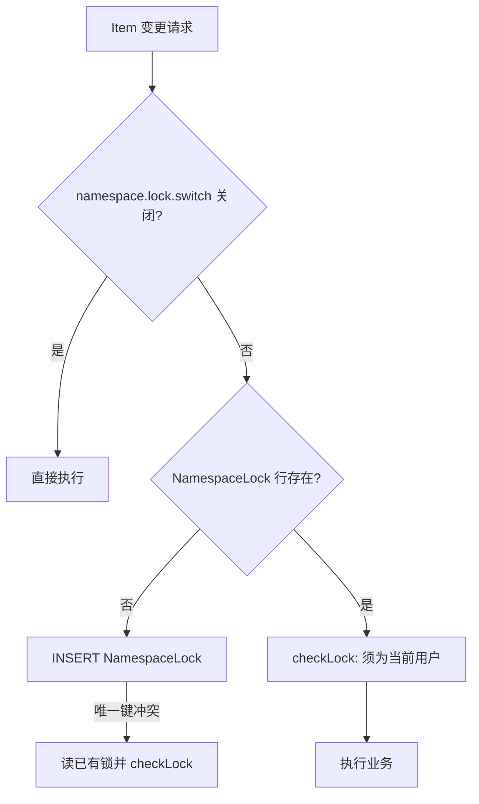

核心逻辑：

```122:166:apollo-adminservice/src/main/java/com/ctrip/framework/apollo/adminservice/aop/NamespaceAcquireLockAspect.java
  private void acquireLock(Namespace namespace, String currentUser) {
    NamespaceLock namespaceLock = namespaceLockService.findLock(namespaceId);
    if (namespaceLock == null) {
      try {
        tryLock(namespaceId, currentUser);
      } catch (DataIntegrityViolationException e) {
        namespaceLock = namespaceLockService.findLock(namespaceId);
        checkLock(namespace, namespaceLock, currentUser);
      }
    } else {
      checkLock(namespace, namespaceLock, currentUser);
    }
  }
  private void checkLock(...) {
    if (!lockOwner.equals(currentUser)) {
      throw new BadRequestException(
          "namespace:" + namespace.getNamespaceName() + " is modified by " + lockOwner);
    }
  }
```

- **并发抢锁**：`namespaceId` 上唯一约束，两人同时 INSERT 仅一人成功，另一人走 `checkLock` 失败。  
- **开关**：`BizConfig.isNamespaceLockSwitchOff()`（ServerConfig `namespace.lock.switch`），关闭后不加锁、不校验。

### 27.2 解锁：发布成功或删 namespace

`ReleaseService.createRelease` 在 `releaseRepository.save` 之后调用 `namespaceLockService.unlock(namespace.getId())`，表示本轮编辑已发布，下一位编辑者可重新抢锁。

删除 namespace 时 `NamespaceService` 也会 `unlock`。

### 27.3 发布互斥：不能自审自发

非紧急发布时 `ReleaseService.checkLock`：

```275:281:apollo-biz/src/main/java/com/ctrip/framework/apollo/biz/service/ReleaseService.java
  private void checkLock(Namespace namespace, boolean isEmergencyPublish, String operator) {
    if (!isEmergencyPublish) {
      NamespaceLock lock = namespaceLockService.findLock(namespace.getId());
      if (lock != null && lock.getDataChangeCreatedBy().equals(operator)) {
        throw new BadRequestException("Config can not be published by yourself.");
      }
    }
  }
```

含义：**最后改配置的人不能自己点发布**（需他人 Release 权限或紧急发布）。`PortalConfig.isEmergencyPublishAllowed(env)` 控制 UI 是否展示紧急发布；OpenAPI `LockInfo` 经 `NamespaceLockService.getNamespaceLockInfo` 返回 `lockOwner` 与是否允许紧急发布。

### 27.4 Portal / OpenAPI 查询

| 入口 | 说明 |
|------|------|
| Admin `GET .../lock` | `NamespaceLockController`，锁关闭时返回 null |
| Portal `NamespaceLockService` | 经 `AdminServiceAPI.NamespaceLockAPI` 转发 |
| OpenAPI | `NamespaceLockManagementApi` → `ServerNamespaceOpenApiService.getNamespaceLock` |
| 前端 | `NamespaceLockService.js` → 编辑页展示锁持有人 |

---

## 28. 深度专题：发布后通知（Webhook / 邮件 / MQ）

配置推送到客户端（ReleaseMessage）与 **Portal 侧运维通知** 解耦：后者由 Spring 事件 `ConfigPublishEvent` 驱动，在 `ConfigPublishListener` 中单线程异步处理。

### 28.1 事件来源

发布/回滚/灰度/合并等成功后，Portal MVC 或 OpenAPI 控制器调用 `ApplicationEventPublisher.publishEvent(ConfigPublishEvent.instance()...)`，例如：

- `openapi.v1.controller.ReleaseController.publishEvent(...)`  
- `NamespaceBranchController` 灰度合并  

`ConfigPublishInfo` 携带：`env`、`releaseId`、`previousReleaseId`、事件类型标志（normal / gray / rollback / merge）。

### 28.2 异步任务三步

`ConfigPublishNotifyTask.run()` 顺序：

1. **加载 ReleaseHistoryBO**（按 `ReleaseOperation` 与 releaseId / previousReleaseId 查 Admin 历史）  
2. **`sendPublishWebHook`**  
3. **`sendPublishEmail`**  
4. **`sendPublishMsg`**（`MQService` SPI，默认实现可为空）

### 28.3 Webhook 载荷与调用方式

`ConfigReleaseWebhookNotifier.notify`：

```56:71:apollo-portal/src/main/java/com/ctrip/framework/apollo/portal/component/ConfigReleaseWebhookNotifier.java
  public void notify(String[] webHookUrls, Env env, ReleaseHistoryBO releaseHistory) {
    for (String webHookUrl : webHookUrls) {
      HttpHeaders headers = new HttpHeaders();
      headers.setContentType(MediaType.APPLICATION_JSON);
      HttpEntity entity = new HttpEntity(releaseHistory, headers);
      String url = webHookUrl + "?env={env}";
      restTemplate.postForObject(url, entity, String.class, env);
    }
  }
```

| 项 | 说明 |
|----|------|
| 方法 | `POST` |
| Query | `env` = 环境名（如 `DEV`） |
| Body | **`ReleaseHistoryBO` JSON**（Jackson 序列化） |
| 主要字段 | `appId`、`clusterName`、`namespaceName`、`branchName`、`operator`、`releaseId`、`releaseTitle`、`releaseComment`、`releaseTime`、`configuration`（变更键值对列表）、`operation`、`operationContext`、`isReleaseAbandoned` |

配置项（PortalDB / `portal.properties`）：

- `config.release.webhook.service.url`：URL 数组，可多个回调  
- `webhook.supported.envs`：仅列出的 Env 才发 Webhook  

失败仅记 error 日志，**不阻断发布**。

### 28.4 邮件

`email.supported.envs` 控制范围；按 `ReleaseHistory.operation` 选择 `NormalPublishEmailBuilder` / `GrayPublishEmailBuilder` / `RollbackEmailBuilder` / `MergeEmailBuilder`，经 `EmailService` SPI 发送（企业可接 SMTP 实现）。

### 28.5 与 Config 推送的关系

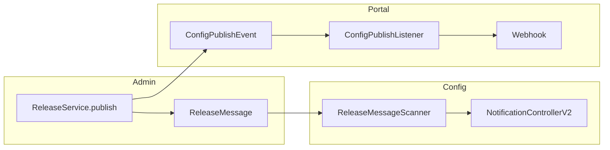

Webhook/邮件只通知**人/外部系统**；应用实例仍靠长轮询 + `/configs` 获取新配置。

---

## 29. 深度专题：apollo-audit 审计体系

仓库模块 `apollo-audit`（`apollo-audit-api`、`apollo-audit-impl`、`apollo-audit-spring-boot-starter`）为 Portal / Admin / Biz 提供**可选**的操作审计，与业务库分离（Portal 库或独立审计表）。

### 29.1 模块与开关

| 模块 | 职责 |
|------|------|
| `apollo-audit-api` | `@ApolloAuditLog`、DTO、`ApolloAuditLogApi` 接口 |
| `apollo-audit-impl` | JPA 实体、`ApolloAuditSpanAspect`、`ApolloAuditLogApiJpaImpl` |
| `apollo-audit-spring-boot-starter` | `ApolloAuditAutoConfiguration` |

启用条件：`apollo.audit.log.enabled=true`（`@ConditionalOnProperty`）。未启用时可注入 `ApolloAuditLogApiNoOpImpl` 空实现。

### 29.2 切面：`ApolloAuditSpanAspect`

```49:57:apollo-audit/apollo-audit-impl/src/main/java/com/ctrip/framework/apollo/audit/aop/ApolloAuditSpanAspect.java
  @Around(value = "setAuditSpan(auditLog)")
  public Object around(ProceedingJoinPoint pjp, ApolloAuditLog auditLog) throws Throwable {
    String opName = auditLog.name();
    try (AutoCloseable scope = api.appendAuditLog(auditLog.type(), opName, auditLog.description())) {
      Object proceed = pjp.proceed();
      auditDataInfluenceArg(pjp);
      return proceed;
    }
  }
```

- **`@ApolloAuditLog`**：标注在 Controller/Service 方法上，`type`（`OpType` CREATE/UPDATE/DELETE）、`name`（操作名，如 `App.create`）、`description`。  
- **`@ApolloAuditLogDataInfluence`** + `@ApolloAuditLogDataInfluenceTable` / `TableField`：在方法参数上标记受影响实体与字段，成功后写入 `ApolloAuditLogDataInfluence` 表，支持按实体 ID 追溯。

### 29.3 存储与查询

- 主表 `ApolloAuditLog`：traceId、操作人、操作类型、时间等。  
- `ApolloAuditController`：提供查询 API（需 `ApolloAuditLogQueryApiPreAuthorizer`，默认仅授权用户）。  
- `ApolloAuditHttpInterceptor`：可把出站 HTTP 调用记入审计（跨服务调用链）。

Biz / Portal 中常见标注：`AppService.create`、`ReleaseService` 相关 Portal 封装、`ServerConfigController` 改 DB 配置等。

### 29.4 与发布、权限审计的区别

| 机制 | 用途 |
|------|------|
| **Commit** | 未发布配置草稿 diff，给 Portal 对比页用 |
| **ReleaseHistory** | 每次发布/回滚/灰度的业务历史 |
| **apollo-audit** | 合规/运维：谁何时调了哪个管理 API、影响了哪张表 |

三者互补，不互相替代。

---

## 30. 深度专题：OpenAPI 契约与 Portal 实现映射

Portal 管理 API 与 [apolloconfig/apollo-openapi](https://github.com/apolloconfig/apollo-openapi) **契约优先**：改 API 应先改 YAML，再 codegen，再实现接口。

### 30.1 构建流水线（`apollo-portal/pom.xml`）

| 步骤 | 配置 |
|------|------|
| 契约 URL | `apollo.openapi.spec.url` → 默认 `apollo-openapi.yaml` **v0.3.3** |
| 插件 | `openapi-generator-maven-plugin`，`generate-sources` 阶段 |
| 生成器 | `spring`，`interfaceOnly=true`，`useTags=true` |
| 输出 | `target/generated-sources/openapi` |
| 包名 | `com.ctrip.framework.apollo.openapi.api`（`*ManagementApi`） |
| 模型 | `com.ctrip.framework.apollo.openapi.model`（`Open*` DTO） |
| 编译 | `build-helper-maven-plugin` 将 generated-sources 加入 classpath |

约定：**Controller 实现生成的 `*ManagementApi`，不要手写平行 DTO/路径**（AGENTS.md OpenAPI 工作流）。

### 30.2 三层结构

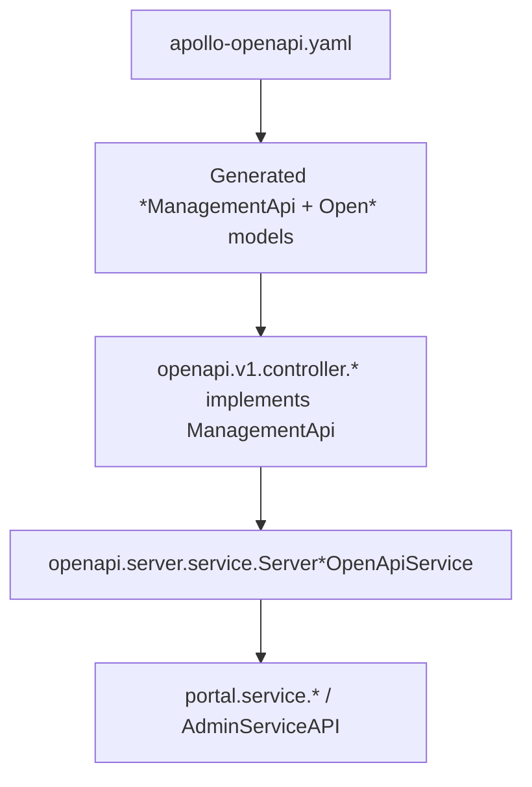

- **Controller**（`openapi/v1/controller/`）：参数校验、`@PreAuthorize`、调用 `*OpenApiService`，必要时 `publishEvent`。  
- **Server*OpenApiService**（`openapi/server/service/`）：DTO 转换（`OpenApiBeanUtils` / `OpenApiModelConverters`）、聚合 Portal 领域服务。  
- **领域服务**：`ReleaseService`、`NamespaceService`、`ItemService` 等，最终 `RetryableRestTemplate` 调 Admin。

### 30.3 Controller ↔ ManagementApi ↔ 实现类（对照表）

| 生成接口（示例） | Controller | 主要 Server 实现 |
|------------------|------------|------------------|
| `AppManagementApi` | `AppController` | `ServerAppOpenApiService` |
| `NamespaceManagementApi` / `AppNamespaceManagementApi` | `NamespaceController` | `ServerNamespaceManagementOpenApiService` / `ServerNamespaceOpenApiService` |
| `NamespaceLockManagementApi` | `NamespaceController`（部分方法） | `ServerNamespaceOpenApiService` |
| `ItemManagementApi` | `ItemController` | `ServerItemOpenApiService` |
| `ReleaseManagementApi` | `ReleaseController` | `ServerReleaseOpenApiService` |
| `NamespaceBranchManagementApi` | `NamespaceBranchController` | Portal `NamespaceBranchService` |
| `ClusterManagementApi` | `ClusterController` | `ServerClusterOpenApiService` |
| `EnvironmentManagementApi` | `EnvController` | `ServerEnvOpenApiService` |
| `InstanceManagementApi` | `InstanceController` | `ServerInstanceOpenApiService` |
| `PermissionManagementApi` | `PermissionController` | `ServerPermissionOpenApiService` |
| `AccessKeyManagementApi` | `AccessKeyController` | `ServerAccessKeyOpenApiService` |
| `OrganizationManagementApi` | `OrganizationController` | `ServerOrganizationOpenApiService` |

路径统一前缀 **`/openapi/v1`**（由 spec 定义）；与 Portal MVC `/apps/...` 并存，Angular 写操作多走 OpenAPI（见第 20 节）。

### 30.4 操作者与鉴权

- **浏览器 UI**：`UserInfoHolder` 会话用户。  
- **OpenAPI Token**：`PortalUserSessionFilter` 识别 Consumer Token；`OpenApiOperatorResolver` 解析 operator 写入审计与 Admin `DataChangeCreatedBy`。  
- **权限**：Controller 上 `@PreAuthorize("@unifiedPermissionValidator....")` 与 MVC 控制器共用同一 `UnifiedPermissionValidator`。

### 30.5 外部客户端

`apollo-java` 模块 **`apollo-openapi`** 提供 `ApolloOpenApiClient`，与上述 `/openapi/v1` 契约对齐；升级服务端时需同时检查 spec 版本与客户端 SDK 版本。仓库内 `ApolloOpenApiJavaClientCompatibilityTest` 用于防止参数绑定破坏兼容。

---

## 31. 深度专题：全局配置检索

Apollo Portal 提供两种「按配置内容找应用」能力，数据源都在 **各 Env 的 Admin ConfigDB**，经 `RetryableRestTemplate` 查询。

### 31.1 首页应用搜索（按 Item key 反查 App）

`SearchController`（`GET /app/apps/search/by-appid-or-name`）：

1. 先按 `appId` / 应用名模糊查 Portal 本地 `App` 表。  
2. 若无结果且 `searchByItem.switch=true`（默认开），则 `searchByItem`：遍历 `portalSettings.getActiveEnvs()`，在各 Env 调 `NamespaceService.findNamespaceByItem(key)`（Admin 侧按 Item key 查 namespace）。  
3. 将命中的 namespace 反查 `appId`，去重后返回 `PageDTO<App>`。

适用：**普通登录用户**在首页搜索框；权限隐含在「能看到的 App」范围内（`AppService` 过滤）。

### 31.2 全局 Value/Key 检索（SuperAdmin）

独立页面 `global_search_value.html`，API：

```43:56:apollo-portal/src/main/java/com/ctrip/framework/apollo/portal/controller/GlobalSearchController.java
  @PreAuthorize(value = "@unifiedPermissionValidator.isSuperAdmin()")
  @GetMapping("/global-search/item-info/by-key-or-value")
  public SearchResponseEntity<List<ItemInfo>> getItemInfoBySearch(
      @RequestParam(value = "key", required = false, defaultValue = "") String key,
      @RequestParam(value = "value", required = false, defaultValue = "") String value) {
```

`GlobalSearchService.getAllEnvItemInfoBySearch` 对每个 **active Env** 调用：

`Admin GET /items-search/key-and-value?key=&value=&page=&size=`

Admin `ItemService.getItemInfoBySearch`：

| 条件 | SQL 策略 |
|------|----------|
| 仅 value | `findItemsByValueLike` |
| 仅 key | `findItemsByKeyLike` |
| key + value | `findItemsByKeyAndValueLike` |

返回 `ItemInfo`（appId、env、cluster、namespace、key、value）。单 Env 结果数超过 `apollo.portal.search.perEnvMaxResults`（`PortalConfig.getPerEnvSearchMaxResults`）时，响应带提示信息要求缩小条件。

### 31.3 与已发布配置的关系

检索的是 **Item 表（草稿/未发布内容）**，不是 `Release` 快照。某 key 仅在已发布版本存在、草稿已删时，可能搜不到；运维排查「线上实际值」应结合实例配置审计或客户端拉取（第 14 节）。

---

## 32. 深度专题：开放平台 Consumer 与 Token 鉴权

第三方系统通过 **OpenAPI** 集成时，不使用 Portal 会话 Cookie，而使用 **Consumer + Token**（存 Portal DB 表 `Consumer`、`ConsumerToken`、`ConsumerRole`）。

### 32.1 认证链路

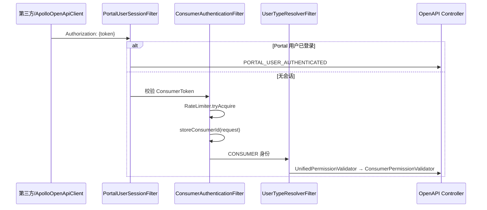

- `ConsumerAuthenticationFilter`：读 `Authorization` header，查 `ConsumerToken`；无效返回 **401**；配置 `rateLimit>0` 时用 Guava `RateLimiter`，超限 **429**。  
- 已登录 Portal 用户访问 OpenAPI 时设 `PORTAL_USER_AUTHENTICATED`，**跳过** Consumer 校验，走 `UserPermissionValidator`。  
- `UserTypeResolverFilter` 根据 request attribute 设置 `UserIdentityContextHolder` 为 `USER` 或 `CONSUMER`。

### 32.2 权限模型：复用 Portal Role/Permission

Consumer **不单独建一套权限表逻辑**，而是通过 `ConsumerRole` 关联已有 `Role` → `RolePermission` → `Permission`：

```53:78:apollo-portal/src/main/java/com/ctrip/framework/apollo/openapi/service/ConsumerRolePermissionService.java
  public boolean consumerHasPermission(long consumerId, String permissionType, String targetId) {
    Permission permission = permissionRepository.findTopByPermissionTypeAndTargetId(...);
    List<ConsumerRole> consumerRoles = consumerRoleRepository.findByConsumerId(consumerId);
    // 任一 ConsumerRole 绑定到该 Permission 即通过
  }
```

`ConsumerPermissionValidator`：

- `hasPermissions` → `permissionService.hasAnyPermission(consumerId, requiredPerms)`（与人工用户相同的 `PermissionType` + `targetId` 规则）。  
- 若 Consumer 拥有 **`CREATE_APPLICATION`** 系统权限，则对其下 namespace 的 Modify/Release **放宽**（与「能建应用就能管」的产品逻辑一致）。  
- **不支持** `isSuperAdmin`、`shouldHideConfigToCurrentUser`、`hasManageAppMaster` 等（抛 `UnsupportedOperationException` 或返回 false）。

`ConsumerService.assignNamespaceRoleToConsumer`：按 token 找到 consumerId，绑定该 App namespace 的 **Modify** + **Release** 两个 Role（可带 env 维度角色名）。

### 32.3 Consumer 生命周期（管理面）

| 步骤 | 说明 |
|------|------|
| 创建 Consumer | `ConsumerService.createConsumer`，`appId` 唯一 |
| 签发 Token | `generateAndSaveConsumerToken`，可设 `rateLimit`、`expires` |
| 授权 | 开放平台 UI（`open_manage` 模块）或 API 分配 namespace 角色 |
| 审计 | `ConsumerAuditUtil` 记录 OpenAPI 调用 |

Token 与 Portal 用户 **完全独立**；CI/CD 发布配置应使用 Consumer Token，并最小化 Role 范围。

### 32.4 与 AccessKey 的区别

| 项 | Consumer Token | AccessKey（第 13 节） |
|----|----------------|----------------------|
| 用途 | Portal **管理** OpenAPI | 应用 **拉取** Config Service |
| 校验位置 | Portal `ConsumerAuthenticationFilter` | Config `ClientAuthenticationFilter` |
| 数据表 | Portal DB | ConfigDB `AccessKey` |

---

## 33. 深度专题：Release 生命周期与回滚

`Release` 表表示某 namespace 在某一时刻的**已发布配置快照**（JSON `configurations` + `releaseKey`）。客户端只读 **最新 active** 记录；历史版本通过 `isAbandoned` 标记失效。

### 33.1 Active 与 Abandoned

| 状态 | 字段 | 客户端可见 |
|------|------|------------|
| **Active** | `isAbandoned = false` | `findLatestActiveRelease` 取 id 最大的一条 |
| **Abandoned** | `isAbandoned = true` | 不参与读取，保留审计与回滚历史 |

发布 **不会** 删除旧 Release 行，而是不断 **INSERT** 新行；回滚通过把较新的 active 行标为 abandoned，使次新行成为 latest。

### 33.2 发布类型与 `ReleaseHistory.operation`

`ReleaseOperation` 常量（节选）：

| 值 | 常量 | 含义 |
|----|------|------|
| 0 | `NORMAL_RELEASE` | 主 namespace 全量发布 |
| 1 | `ROLLBACK` | 回滚 |
| 2 | `GRAY_RELEASE` | 灰度分支发布 |
| 4 | `GRAY_RELEASE_MERGE_TO_MASTER` | 灰度合并到主 cluster |
| 5 | `MASTER_NORMAL_RELEASE_MERGE_TO_GRAY` | 主发布同步到灰度子 cluster |
| 6 | `MATER_ROLLBACK_MERGE_TO_GRAY` | 主回滚后重算灰度配置 |
| 7 | `ABANDON_GRAY_RELEASE` | 放弃灰度（删除分支等场景） |

每次发布/回滚在 `ReleaseHistory` 记录 `releaseId`、`previousReleaseId`、`operation`、`operationContext`（JSON，含紧急发布、灰度 key 列表、规则等）。

### 33.3 回滚：`rollback` vs `rollbackTo`

**回滚一步**（`PUT /releases/{releaseId}/rollback`，无 `toReleaseId`）：

```452:486:apollo-biz/src/main/java/com/ctrip/framework/apollo/biz/service/ReleaseService.java
  public Release rollback(long releaseId, String operator) {
    // 至少 2 条 active release
    List<Release> twoLatestActiveReleases = findActiveReleases(..., PageRequest.of(0, 2));
    release.setAbandoned(true);  // 废弃当前最新
    releaseHistoryService.createReleaseHistory(..., twoLatestActiveReleases.get(1).getId(), ... ROLLBACK);
    rollbackChildNamespace(...);  // 若有灰度子 namespace，可能再发 branchRelease
  }
```

- 将**当前最新** active Release 标 abandoned。  
- 生效配置变为**次新** active Release 的 `configurations`（无需新建 Release 行）。  
- 若存在灰度子 namespace 且合并结果变化，自动 `branchRelease`（`MATER_ROLLBACK_MERGE_TO_GRAY`）。

**回滚到指定版本**（`toReleaseId > -1`）：

- `findActiveReleasesBetween` 取 `(toReleaseId, releaseId]` 区间内所有 active 行。  
- 除目标外的中间版本全部 `setAbandoned(true)`。  
- `ReleaseHistory` 记录 `toReleaseId` 为生效 release。

Admin `ReleaseController.rollback` 在 biz 完成后 **同样** `messageSender.sendMessage`（与发布一致），触发 Config 长轮询与缓存失效。

### 33.4 读路径如何选 Release

`ConfigServiceWithCache` / `findLatestActiveRelease`：

```130:133:apollo-biz/src/main/java/com/ctrip/framework/apollo/biz/service/ReleaseService.java
    return releaseRepository
        .findFirstByAppIdAndClusterNameAndNamespaceNameAndIsAbandonedFalseOrderByIdDesc(...);
```

灰度命中时 `AbstractConfigService.findRelease` 可能返回**子 cluster** 的 Release，而非主 cluster 最新行（第 15 节）。

### 33.5 Portal / OpenAPI 与通知

| 操作 | Portal | OpenAPI | ReleaseMessage | Portal 事件 |
|------|--------|---------|----------------|-------------|
| 发布 | UI / MVC | `ReleaseManagementApi` | Admin Controller 发送 | `ConfigPublishEvent` |
| 回滚 | `ReleaseService.rollback` | `PUT .../rollback` | 同上 | `ConfigPublishEvent`（rollback 标志） |

回滚后客户端 `releaseKey` 变化；若带 `messages` 可增量失效。Webhook 邮件走 `ConfigPublishListener`（第 28 节），`operation=ROLLBACK` 时选用 `RollbackEmailBuilder`。

### 33.6 状态机简图

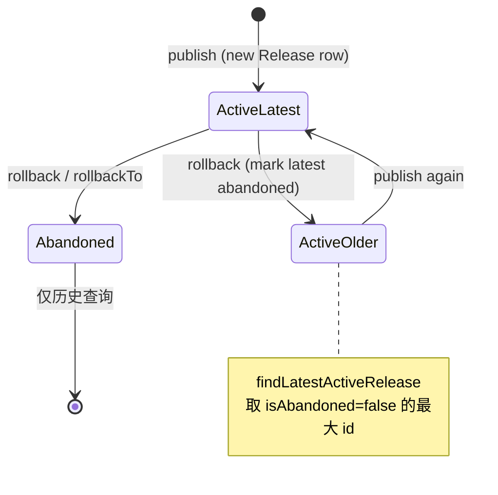

**注意**：回滚不恢复 Item 草稿；若需与线上一致，应对比 Release 与当前 Item，必要时手工改 Item 再发布。

---

## 附录 A：关键类索引

### 服务端（apollo 仓库）

| 类 | 模块 | 职责 |
|----|------|------|
| `ReleaseService` | apollo-biz | 发布/回滚/灰度合并 |
| `DatabaseMessageSender` | apollo-biz | 写 ReleaseMessage |
| `ReleaseMessageScanner` | apollo-biz | 扫描并分发消息 |
| `ConfigServiceWithCache` | apollo-configservice | 配置读缓存 |
| `ConfigController` | apollo-configservice | HTTP 配置 API |
| `NotificationControllerV2` | apollo-configservice | 长轮询 v2 |
| `GrayReleaseRulesHolder` | apollo-biz | 灰度规则内存索引 |
| `ReleaseController` | apollo-adminservice | 发布 REST |
| `ReleaseService` (portal) | apollo-portal | 调 Admin 发布 |
| `ServiceController` | apollo-configservice | Meta 服务发现 API |

### 客户端（apollo-java 仓库）

| 类 | 模块 | 职责 |
|----|------|------|
| `ConfigService` | apollo-client | 对外 API 门面 |
| `DefaultConfigManager` | apollo-client | Config/ConfigFile 单例与缓存 |
| `DefaultConfigFactory` | apollo-client | 组装 Repository 链 |
| `DefaultConfig` | apollo-client | 属性读取、变更监听、优先级合并 |
| `RemoteConfigRepository` | apollo-client | HTTP 拉配置、定时刷新 |
| `RemoteConfigLongPollService` | apollo-client | `/notifications/v2` 长轮询 |
| `LocalFileConfigRepository` | apollo-client | 本地 config-cache 持久化 |
| `ConfigServiceLocator` | apollo-client | Meta 发现 Config Service |
| `ConfigUtil` | apollo-client | 客户端全局配置 |
| `PropertySourcesProcessor` | apollo-client | Spring Environment 集成 |
| `ConfigConsts` / `ApolloConfig` | apollo-core | 常量与传输 DTO |
| `Signature` | apollo-core | AccessKey HMAC 签名 |
| `ApolloApplicationContextInitializer` | apollo-client | Bootstrap 早期注入 |
| `ApolloConfigDataLoader` | apollo-client-config-data | `spring.config.import=apollo://` |
| `ApolloOpenApiClient` | apollo-openapi | Portal 管理 API 客户端 |
| `ItemSetService` | apollo-biz | Item 批量变更 + Commit |
| `NamespaceBranchService` | apollo-biz | 灰度分支 Cluster/Namespace |
| `UnifiedPermissionValidator` | apollo-portal | Portal 权限门面 |

### 服务端（Portal / 契约）

| 类 | 模块 | 职责 |
|----|------|------|
| `*ManagementApi`（生成） | apollo-portal | OpenAPI 契约接口 |
| `ServerReleaseOpenApiService` | apollo-portal | OpenAPI 发布实现 |
| `ConfigPublishListener` | apollo-portal | 发布后 Webhook/邮件 |
| `AuthConfiguration` | apollo-portal | 多 Profile 认证装配 |
| `PortalUserSessionFilter` | apollo-portal | OpenAPI 会话与 Token 分流 |
| `ClientAuthenticationFilter` | apollo-configservice | AccessKey 鉴权 |
| `InstanceConfigAuditUtil` | apollo-configservice | 实例拉取异步审计 |
| `ConfigFileController` | apollo-configservice | 多格式配置文件 API |
| `RetryableRestTemplate` | apollo-portal | 多环境 Admin 调用与重试 |
| `BizConfig` / `BizDBPropertySource` | apollo-biz | ServerConfig 热更新 |
| `AbstractConfig` | apollo-client | 变更监听与类型缓存 |
| `ApolloInjector` | apollo-client | SPI 依赖注入入口 |
| `NamespaceService` (biz) | apollo-biz | 公共/关联 namespace 回落、子 namespace |
| `ConfigController` | apollo-configservice | 双 Release 合并、304、增量同步 |
| `AbstractConfigService` | apollo-configservice | cluster/dataCenter 回落读 Release |
| `DatabaseDiscoveryService` | apollo-configservice | DB 注册表 Meta 发现 |
| `DefaultDiscoveryService` | apollo-configservice | Eureka Meta 发现（默认 Profile） |
| `ApolloServiceRegistryHeartbeatApplicationRunner` | apollo-biz | DB 注册心跳 |
| `CreationListener` | apollo-portal | App/AppNamespace 创建扇出 Admin |
| `DefaultRoleInitializationService` | apollo-portal | 应用/Namespace 角色初始化 |
| `ItemSetService` | apollo-biz | Item 批量变更 + Commit |
| `AdminServiceAddressLocator` | apollo-portal | 定时从 Meta 刷新 Admin 地址 |
| `ConfigsImportService` / `ConfigsExportService` | apollo-portal | ZIP/文件 导入导出 |
| `WatchKeysUtil` | apollo-configservice | 长轮询监听 key 展开 |
| `ReleaseMessageKeyGenerator` | apollo-biz | `appId+cluster+namespace` |
| `SpringCloudInnerDiscoveryService` | apollo-configservice | Nacos/Consul/ZK 发现 |
| `KubernetesDiscoveryService` | apollo-configservice | 静态 URL 列表发现 |
| `ApolloApplication` | apollo-assembly | 四上下文一体启动 |
| `NamespaceAcquireLockAspect` | apollo-adminservice | Item 变更时抢 Namespace 锁 |
| `NamespaceLockService` | apollo-biz | 锁 CRUD、发布解锁 |
| `ConfigReleaseWebhookNotifier` | apollo-portal | 发布 Webhook POST |
| `ConfigPublishListener` | apollo-portal | 发布后邮件/Webhook/MQ |
| `ApolloAuditSpanAspect` | apollo-audit-impl | `@ApolloAuditLog` 切面 |
| `*ManagementApi`（生成） | apollo-portal | OpenAPI 契约接口 |
| `Server*OpenApiService` | apollo-portal | OpenAPI 业务实现层 |
| `GlobalSearchService` | apollo-portal | 多 Env Item 全局检索 |
| `ConsumerAuthenticationFilter` | apollo-portal | OpenAPI Token 与限流 |
| `ConsumerRolePermissionService` | apollo-portal | Consumer ↔ Role 权限 |
| `ReleaseService.rollback` | apollo-biz | Release 废弃与回滚 |

---

## 附录 D：关键配置项速查

### 客户端（JVM / 环境变量 / app.properties）

| 配置 | 说明 |
|------|------|
| `app.id` | 应用 ID（`META-INF/app.properties`） |
| `apollo.meta` | Meta Server 地址 |
| `apollo.cluster` | 集群，默认可用 dataCenter |
| `apollo.cache-dir` | 本地缓存目录 |
| `apollo.config-service` | 直连 Config，跳过 Meta |
| `apollo.refreshInterval` | 定时拉取间隔（分钟） |
| `apollo.accesskey.secret` | AccessKey 密钥 |
| `apollo.bootstrap.enabled` | 启动早期注入 Apollo |
| `apollo.bootstrap.eagerLoad.enabled` | 日志系统前加载 |
| `spring.config.import` | `apollo://application`（config-data 模块） |

### 服务端 ConfigDB `ServerConfig`（经 BizConfig 读取）

| Key | 说明 |
|-----|------|
| `long.polling.timeout` | 长轮询超时（秒） |
| `apollo.release-message-scan.interval` | ReleaseMessage 扫描间隔 |
| `config-service.cache.enabled` | Guava 配置缓存 |
| `config-service.incremental.change.enabled` | 增量同步 |
| `accesskey.auth.timeDiffTolerance` | 签名时间容差 |
| `item.value.length.limit` | 单 Item 值长度上限 |
| `apollo.service.registry.enabled` | Config/Admin 向 DB 注册（database-discovery） |
| `apollo.service.registry.heartbeat-interval-in-second` | 注册心跳间隔 |
| `apollo.service.discovery.health-check-interval-in-second` | Meta 剔除过期实例阈值 |

### Portal `ServerConfig` / `portal.properties`

| 配置 | 说明 |
|------|------|
| 各 Env Meta 地址 | `PortalMetaDomainService` |
| `admin-service.access.tokens` | Portal 调 Admin 的 Bearer Token（JSON 按 Env） |
| `apollo.audit.log.enabled` | 审计模块开关 |
| `webhook` 相关 | 发布后通知 |
| `config.release.webhook.service.url` | 发布 Webhook 回调地址列表 |
| `webhook.supported.envs` / `email.supported.envs` | 启用通知的环境 |
| `namespace.lock.switch` | 关闭 Namespace 编辑锁（ConfigDB ServerConfig） |
| `apollo.audit.log.enabled` | 启用 apollo-audit 模块 |
| `searchByItem.switch` | 首页是否按 Item key 反查 App |
| `apollo.portal.search.perEnvMaxResults` | 全局检索单 Env 结果上限 |

---

## 附录 E：常见问题与源码定位

| 现象 | 可能原因 | 建议查看 |
|------|----------|----------|
| 客户端启动无配置 | 未发布 / namespace 错 / 404 | `RemoteConfigRepository` 404 日志；Portal 发布记录 |
| 配置不更新 | 长轮询断开 / 仅依赖定时 | `RemoteConfigLongPollService`；网络与 90s 超时 |
| 多 Config 节点配置不一致 | 服务端缓存 | 客户端带 `messages`；`ConfigServiceWithCache` invalidate |
| 灰度不生效 | 规则未 ACTIVE / IP 不匹配 | `GrayReleaseRule`、`GrayReleaseRulesHolder` |
| Portal 发布成功应用未变 | Admin 成功但 Scanner 慢 | `ReleaseMessageScanner` 间隔；通常 <2s |
| OpenAPI 401 | Token 过期或 Consumer 权限不足 | `PortalUserSessionFilter`、`ConsumerPermissionValidator` |
| 实例列表不更新 | 审计队列满或 releaseKey 未变 | `InstanceConfigAuditUtil`、`instance.config.audit.max.size` |
| 关联公共配置显示不对 | cluster 未发布回落逻辑 | `NamespaceService.findPublicNamespaceForAssociatedNamespace` |
| 公共 key 未生效或被覆盖 | 合并顺序 / 本 App 同名 key | `ConfigController.mergeReleaseConfigurations` |
| Meta 无 Config 实例 | DB 注册未心跳或 Profile 错误 | `ServiceRegistry` 表、`database-discovery` Profile |
| 新建 App 某 Env 无数据 | `CreationListener` 单 Env 失败 | Portal 日志、`AppAPI.createApp`、OpenAPI miss-envs |
| Portal 改配置偶发失败 | Admin 列表空或全超时 | `AdminServiceAddressLocator` 缓存、Meta `/services/admin` |
| 发布超时但已生效 | POST 读超时不重试 | Admin 日志 + `RetryableRestTemplate.canRetry` |
| 有通知无新配置 | WatchKeys 与 ReleaseMessage 不一致 | `WatchKeysUtil`、`ReleaseMessageKeyGenerator` |
| 导入后客户端仍旧值 | 未发布 Release | Portal 发布；导入只写 Item/Commit |
| 改配置提示被他人占用 | NamespaceLock 非当前用户 | `NamespaceAcquireLockAspect`；等发布解锁或联系 lockOwner |
| 自己改完无法发布 | 非紧急发布禁止自发布 | `ReleaseService.checkLock`；他人发布或紧急发布 |
| Webhook 未收到 | Env 未在 supported 列表 / URL 错 | `PortalConfig.webHookUrls`；日志 `Notify webHook server failed` |
| OpenAPI 与 UI 行为不一致 | 只改了一侧 | 先改 `apollo-openapi.yaml` 再 codegen + 实现 `*ManagementApi` |
| OpenAPI 429 | Consumer `rateLimit` 过小 | `ConsumerToken.rateLimit`；`ConsumerAuthenticationFilter` |
| 回滚后客户端仍新配置 | ReleaseMessage 未发 / 缓存 | Admin `ReleaseController.rollback` + `messageSender` |
| 全局搜不到已发布 key | 搜的是 Item 草稿 | 用 Release 历史或实例审计；或先同步 Item |
| 仅一条 Release 无法回滚 | 业务校验 | `ReleaseService.rollback` 至少 2 条 active |

---

## 附录 B：与官方文档的关系

本文在官方设计文档基础上**补充了服务端与 apollo-java v2.5.0 的类名、调用顺序、缓存与并发细节**。若产品行为以官方文档为准，实现细节以源码为准；版本升级时请重点 diff：

**服务端（apollo）：**

- `NotificationController` vs `NotificationControllerV2`
- `BizConfig` 中扫描间隔、长轮询超时、批量通知阈值
- 是否启用 `ConfigServiceWithCache`、增量同步、DB 注册发现

**客户端（apollo-java）：**

- `RemoteConfigLongPollService` 与 Config Service 超时时间是否匹配
- `INCREMENTAL_SYNC` 是否双端同时开启
- `apollo.config-service` 直连与 Meta 发现模式切换

---

## 附录 C：服务端与客户端版本对应

| 组件 | 本分析版本 | 说明 |
|------|------------|------|
| apollo（服务端） | 3.0.0-SNAPSHOT | 本仓库 `pom.xml` |
| apollo-java | **2.5.0** | `pom.xml` → `apollo-java.version` |
| 协议 | HTTP REST | 客户端不绑定服务端小版本，但需 DTO 兼容 |

---

*文档说明：服务端基于本仓库源码；客户端基于 apollo-java tag v2.5.0 的 GitHub 源码静态分析（`raw.githubusercontent.com`），未运行集成测试。本地克隆 apollo-java 可参考：`git clone -b v2.5.0 https://github.com/apolloconfig/apollo-java.git`*
