# Spring MVC DeferredResult 实现原理深度分析（基于 Apollo 长轮询场景）

> 本文以 Apollo 配置中心的长轮询实现为切入点，结合 Apollo 源码与 Spring Framework 7.0.7（对应 Apollo 当前使用的 Spring Boot 4.0.5）字节码，深度剖析 `DeferredResult` 的实现原理：为什么它能"hold 住"一个 HTTP 请求，在超时窗口内任意时刻把数据响应给客户端，而又不会长时间占用容器线程。

---

## 一、Apollo 长轮询整体架构

### 1.1 背景

Apollo 客户端通过 **HTTP 长轮询（Long Polling）** 感知服务端配置变更：

- 客户端发起 `GET /notifications/v2` 请求，带上当前各 namespace 的 `notificationId`。
- 服务端 **不立即响应**：
  - 若配置已变更 → 立即返回最新 `notificationId`（HTTP 200 + 变更列表）。
  - 若配置未变更 → **hold 住请求**，直到：
    - 配置发生变更 → 立即响应变更；
    - 超时（默认 60s）→ 响应 `304 Not Modified`。
- 客户端收到响应后，再发起 `GET /configs/{appId}/{...}` 拉取最新配置，然后继续下一轮长轮询。

### 1.2 Apollo 端关键源码位置

| 组件 | 路径 |
|------|------|
| 长轮询入口 Controller | `apollo-configservice/.../controller/NotificationControllerV2.java` |
| DeferredResult 包装类 | `apollo-configservice/.../wrapper/DeferredResultWrapper.java` |
| 旧版单 namespace Controller（已废弃） | `apollo-configservice/.../controller/NotificationController.java` |
| 超时配置 | `apollo-biz/.../config/BizConfig.java` |
| 配置变更消息监听器接口 | `apollo-biz/.../message/ReleaseMessageListener.java` |

### 1.3 Apollo 长轮询时序图

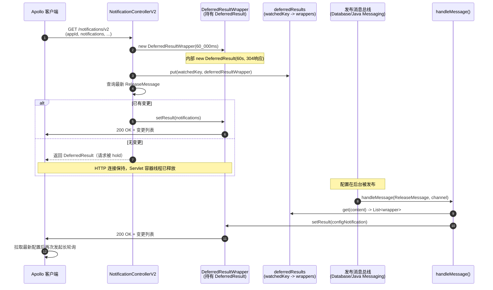

---

## 二、Apollo 端 DeferredResult 的使用方式

### 2.1 入口：`NotificationControllerV2.pollNotification`

`NotificationControllerV2.java:99-194`

```java
@GetMapping
public DeferredResult<ResponseEntity<List<ApolloConfigNotification>>> pollNotification(
    @RequestParam(value = "appId") String appId,
    @RequestParam(value = "cluster") String cluster,
    @RequestParam(value = "notifications") String notificationsAsString,
    @RequestParam(value = "dataCenter", required = false) String dataCenter,
    @RequestParam(value = "ip", required = false) String clientIp) {

  // 1. 解析客户端 notifications，组装 watchedKeys
  ...
  // 2. 创建 DeferredResultWrapper，内部封装 DeferredResult(60s, 304)
  DeferredResultWrapper deferredResultWrapper =
      new DeferredResultWrapper(bizConfig.longPollingTimeoutInMilli());
  ...
  // 3. 注册超时/完成回调（用于清理与埋点）
  deferredResultWrapper.onTimeout(() -> logWatchedKeys(watchedKeys, "Apollo.LongPoll.TimeOutKeys"));
  deferredResultWrapper.onCompletion(() -> {
    for (String key : watchedKeys) {
      deferredResults.remove(key, deferredResultWrapper);   // 注销
    }
    logWatchedKeys(watchedKeys, "Apollo.LongPoll.CompletedKeys");
  });

  // 4. 把 wrapper 注册到 watchedKey -> wrappers 的多值映射
  for (String key : watchedKeys) {
    this.deferredResults.put(key, deferredResultWrapper);
  }

  // 5. 再查一次最新 ReleaseMessage（防止在注册之前已有变更）
  List<ReleaseMessage> latestReleaseMessages =
      releaseMessageService.findLatestReleaseMessagesGroupByMessages(watchedKeys);

  // 6. 手动关闭 EntityManager，避免 DB 连接被异步请求长期占用
  entityManagerUtil.closeEntityManager();

  List<ApolloConfigNotification> newNotifications = getApolloConfigNotifications(...);
  if (!CollectionUtils.isEmpty(newNotifications)) {
    // 7. 已经有更新：立即 setResult， DeferredResult 会马上完成
    deferredResultWrapper.setResult(newNotifications);
  }

  // 8. 返回 DeferredResult —— 此时若未 setResult，请求进入"挂起"状态
  return deferredResultWrapper.getResult();
}
```

**注意注释里两段非常关键的说明**：

> `// 1、set deferredResult before the check, for avoid more waiting`
>
> 先注册再查询。如果"先查再注册"，会在 check 与 put 之间存在时间窗：`handleMessage` 在这一窗口内执行会查不到 wrapper，导致本次轮询错过通知。

> `// Manually close the entity manager.`
>
> 异步请求下，Spring 不会在请求方法返回时关闭 `EntityManager`，会一直挂到整个异步请求结束。长轮询一次挂 60s，DB 连接会被白白占用，因此必须手动关闭。

### 2.2 包装类：`DeferredResultWrapper`

`DeferredResultWrapper.java:43-87`

```java
public class DeferredResultWrapper implements Comparable<DeferredResultWrapper> {
  // 超时时的默认响应：HTTP 304 Not Modified
  private static final ResponseEntity<List<ApolloConfigNotification>> NOT_MODIFIED_RESPONSE_LIST =
      new ResponseEntity<>(HttpStatus.NOT_MODIFIED);

  private DeferredResult<ResponseEntity<List<ApolloConfigNotification>>> result;

  public DeferredResultWrapper(long timeoutInMilli) {
    // 关键：超时时间 + 超时回退结果
    result = new DeferredResult<>(timeoutInMilli, NOT_MODIFIED_RESPONSE_LIST);
  }

  public void onTimeout(Runnable timeoutCallback)   { result.onTimeout(timeoutCallback); }
  public void onCompletion(Runnable completionCallback) { result.onCompletion(completionCallback); }

  public void setResult(ApolloConfigNotification notification) {
    setResult(Lists.newArrayList(notification));
  }

  public void setResult(List<ApolloConfigNotification> notifications) {
    // 处理 namespace 名称大小写归一化的还原
    ...
    result.setResult(new ResponseEntity<>(notifications, HttpStatus.OK));
  }

  public DeferredResult<ResponseEntity<List<ApolloConfigNotification>>> getResult() {
    return result;
  }
}
```

Apollo 通过这个 wrapper 把 Spring 的 `DeferredResult` 语义化：

- **超时时间**：`bizConfig.longPollingTimeoutInMilli()`。
- **超时回退结果**：`304 Not Modified`，告诉客户端"无变更，继续下一轮"。
- **正常结果**：`200 OK + ApolloConfigNotification 列表`，告诉客户端"有变更"。

### 2.3 超时配置：`BizConfig`

`BizConfig.java:58-110`

```java
private static final int DEFAULT_LONG_POLLING_TIMEOUT = 60; // 60s
// ...
public long longPollingTimeoutInMilli() {
  int timeout = getIntProperty("long.polling.timeout", DEFAULT_LONG_POLLING_TIMEOUT);
  // java client's long polling timeout is 90 seconds, so server side long polling timeout must be less than 90
  timeout = checkInt(timeout, 1, 90, DEFAULT_LONG_POLLING_TIMEOUT);
  return TimeUnit.SECONDS.toMillis(timeout);
}
```

**约束 `1 ≤ timeout ≤ 90` 的原因**：Apollo Java 客户端的长轮询超时是 **90 秒**，服务端必须比客户端先超时，否则会出现客户端已经断连、服务端还在 hold 的无效请求。

### 2.4 配置变更触发响应：`handleMessage`

`NotificationControllerV2.java:257-312`（实现 `ReleaseMessageListener`）

```java
@Override
public void handleMessage(ReleaseMessage message, String channel) {
  String content = message.getMessage();
  ...
  if (!deferredResults.containsKey(content)) {
    return;
  }
  // 拷贝一份避免 ConcurrentModificationException
  List<DeferredResultWrapper> results = Lists.newArrayList(deferredResults.get(content));

  ApolloConfigNotification configNotification =
      new ApolloConfigNotification(changedNamespace, message.getId());
  configNotification.addMessage(content, message.getId());

  // 客户端太多时分批异步通知，避免一次性唤醒过多线程造成惊群
  if (results.size() > bizConfig.releaseMessageNotificationBatch()) {
    largeNotificationBatchExecutorService.submit(() -> {
      for (int i = 0; i < results.size(); i++) {
        if (i > 0 && i % bizConfig.releaseMessageNotificationBatch() == 0) {
          TimeUnit.MILLISECONDS.sleep(bizConfig.releaseMessageNotificationBatchIntervalInMilli());
        }
        results.get(i).setResult(configNotification);
      }
    });
    return;
  }

  // 正常情况：在当前线程（消息消费线程）同步调用 setResult
  for (DeferredResultWrapper result : results) {
    result.setResult(configNotification);
  }
}
```

这里的关键点：

1. `handleMessage` 运行在 **消息发布/消费线程**，不是 Servlet 容器线程 —— 这正是 `DeferredResult` 的核心价值：**另一个线程** 把结果"塞回"给挂起的 HTTP 请求。
2. `setResult` 是线程安全的（后文源码会看到内部用 `synchronized` + 双重检查）。
3. 大量客户端订阅同一个 key 时，Apollo 做了 **分批 + 间隔**，避免瞬时唤醒数千线程造成惊群与下游压力。

---

## 三、DeferredResult 是什么

`DeferredResult<T>` 是 Spring MVC 提供的 **异步请求处理容器**。它本身**不持有 HTTP 连接对象**，只是把"结果暂存 + 回调注册"封装起来，配合 `WebAsyncManager`、`StandardServletAsyncWebRequest` 调用 Servlet 3.0 的异步 API 来实现：

- 请求进入容器线程 → Controller 方法返回 `DeferredResult` → 容器线程**被释放**回线程池。
- 任意其他线程调用 `deferredResult.setResult(value)` → Spring 通过 Servlet 异步 `dispatch` 重新进入容器 → 把结果写回响应。

### 3.1 DeferredResult 的核心字段（来自字节码）

```java
public class DeferredResult<T> {
  private static final Object RESULT_NONE = new Object();  // 哨兵：表示"尚无结果"

  private final Long        timeoutValue;    // 超时时长（毫秒），可空
  private final Supplier<?> timeoutResult;   // 超时时要返回的结果（Supplier 懒求值）
  private Runnable                       timeoutCallback;    // onTimeout 注册的回调
  private Consumer<Throwable>            errorCallback;      // onError 注册的回调
  private Runnable                       completionCallback; // onCompletion 注册的回调
  private DeferredResultHandler         resultHandler;      // Spring 注入的"结果处理器"
  private volatile Object   result = RESULT_NONE;  // 当前结果
  private volatile boolean  expired;               // 是否已超时过期

  @FunctionalInterface
  interface DeferredResultHandler {
    void handleResult(Object result);
  }
}
```

关键字段语义：

| 字段 | 含义 |
|------|------|
| `RESULT_NONE` | 哨兵对象，区分"null 也是合法结果"与"还没设置结果" |
| `result` | 当前已设置的结果，`volatile` 保证可见性 |
| `expired` | 是否已超时；一旦为 true，任何后续 `setResult` 都会被忽略 |
| `resultHandler` | 由 `WebAsyncManager` 通过 `setResultHandler` 注入的回调，真正触发"重新 dispatch"的入口 |

### 3.2 三个回调注册方法

```java
public void onTimeout(Runnable timeoutCallback)            { this.timeoutCallback = timeoutCallback; }
public void onError(Consumer<Throwable> errorCallback)      { this.errorCallback = errorCallback; }
public void onCompletion(Runnable completionCallback)       { this.completionCallback = completionCallback; }
```

它们只是把回调存进字段 —— **执行时机由 `WebAsyncManager` 在合适的阶段触发**，不是 DeferredResult 自己触发的。

---

## 四、Servlet 3.0 异步机制基础

要理解 `DeferredResult`，必须先理解 Servlet 3.0 的异步 API，因为 Spring 只是在它之上做了封装。

### 4.1 同步 vs 异步请求处理

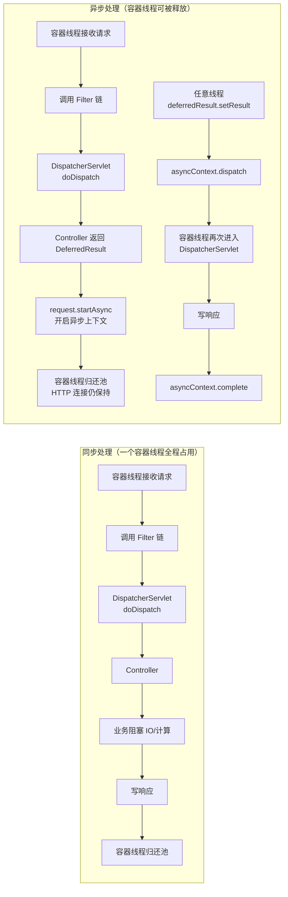

### 4.2 三个核心 API

```java
// 1. 在 ServletRequest 上开启异步
AsyncContext asyncContext = request.startAsync(request, response);
asyncContext.setTimeout(60_000);   // 设置异步超时
asyncContext.addListener(asyncListener);  // 注册监听超时/完成/错误的回调

// 2. 任意线程在任意时刻完成异步（重新派发）
asyncContext.dispatch();   // 把请求重新交回 Servlet 容器，再次走 filter + servlet

// 3. AsyncListener 回调
void onComplete(AsyncEvent event);
void onTimeout(AsyncEvent event);
void onError(AsyncEvent event);
void onStartAsync(AsyncEvent event);
```

**核心要点**：

- `startAsync` 之后，原始容器线程可以从 `service()` 方法返回，**但 HTTP 连接不会关闭**（底层 socket 仍然 open）。
- `dispatch()` 触发的是 **一次新的容器派发**，请求会重新经过 filter 链和 `DispatcherServlet`，但这次能拿到之前存的"异步结果"。
- 如果到 `setTimeout` 期限还没人调用 `dispatch()`，容器会触发 `onTimeout`，并自行做一次超时派发。

### 4.3 为什么 HTTP 连接不会断开

这是问题最核心的答案。Tomcat / Jetty 等容器的处理模型是：

1. **同步模式下**：HTTP 连接的生命周期 = 容器线程处理 `service()` 的时间。线程从 `service()` 返回即视为请求结束，连接关闭。
2. **异步模式下**：调用 `startAsync` 后，连接的生命周期由 **`AsyncContext`** 管理，与容器线程解耦。线程从 `service()` 返回时，容器检测到已开启异步上下文，**不会关闭 socket**，而是把连接状态记为"异步处理中"。

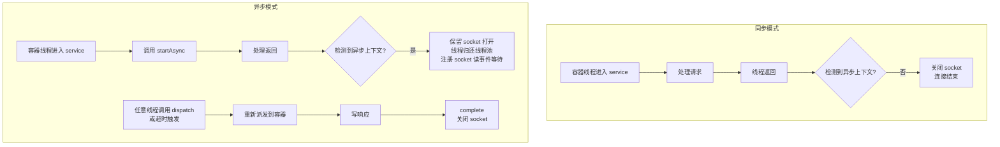

底层实现上（以 Tomcat 为例）：

- `request.startAsync()` 把当前连接标记为 `ASYNC` 状态。
- 容器线程从 `CoyoteAdapter.service()` 返回时，看到异步状态，**不调用 response finishResponse / 不关闭 socket**，而是把 `SocketWrapper` 挂起，等待 `dispatch()` 或超时。
- 客户端的 TCP 连接因此被服务端 hold 在 `ESTABLISHED` 状态，客户端 read 一直阻塞直到服务端写数据或超时。

---

## 五、Spring MVC DeferredResult 核心组件

Spring 在 Servlet 异步 API 之上做了三层封装：

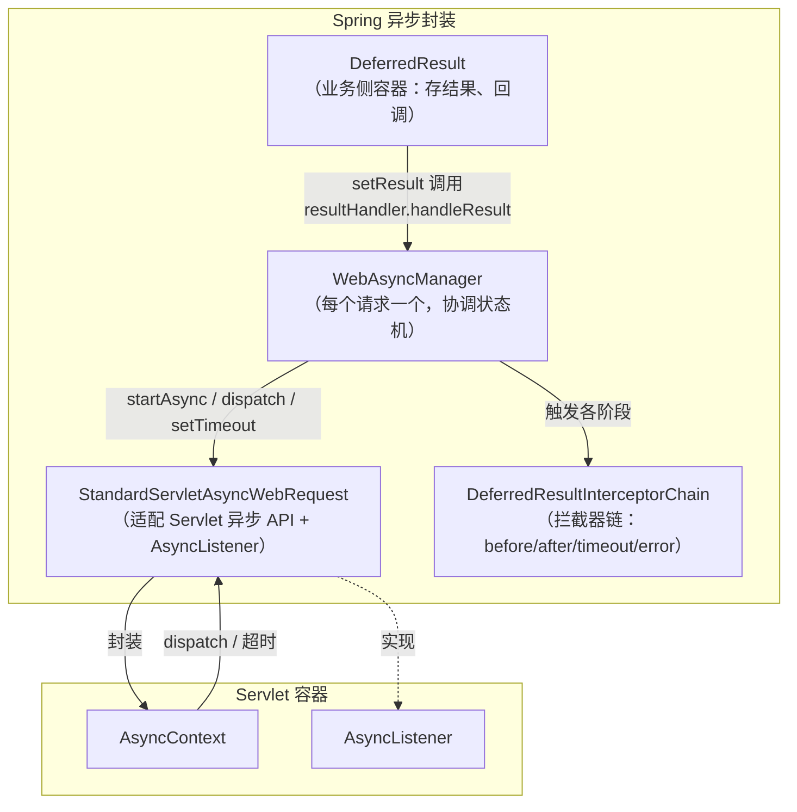

### 5.1 `WebAsyncManager` 的状态机

`WebAsyncManager` 用一个 `AtomicReference<State>` 维护异步处理状态，从字节码可见状态枚举：

```
NOT_STARTED  ->  ASYNC_PROCESSING  ->  RESULT_SET  ->  (dispatch 完成)
```

- `NOT_STARTED`：尚未开始异步。
- `ASYNC_PROCESSING`：已调用 `startAsync`，等待结果。
- `RESULT_SET`：结果已就绪，已调用 `dispatch`，等待容器重新派发。

`setConcurrentResultAndDispatch` 用 CAS `ASYNC_PROCESSING -> RESULT_SET` 保证**只 dispatch 一次**（重复 `setResult` 会被 CAS 失败挡掉）。

### 5.2 `StandardServletAsyncWebRequest`

它既实现 `AsyncWebRequest`（Spring 自己的抽象），又实现 `AsyncListener`（Servlet 规范）。所以它既是异步请求的"操作门面"，又是异步事件的"接收者"。

---

## 六、核心源码分析（基于 7.0.7 字节码还原）

### 6.1 入口：`WebAsyncManager.startDeferredResultProcessing`

`WebAsyncManager.startDeferredResultProcessing(DeferredResult, Object...)` —— 这是 Controller 返回 `DeferredResult` 后，由 `RequestMappingHandlerAdapter` 调用的总入口。字节码还原后的逻辑：

```java
public void startDeferredResultProcessing(DeferredResult<?> deferredResult, Object... processingContext) throws Exception {
    Assert.notNull(deferredResult, "DeferredResult must not be null");
    Assert.state(this.asyncWebRequest != null, "AsyncWebRequest must not be null");

    // (1) CAS: NOT_STARTED -> ASYNC_PROCESSING，保证一个请求只能启动一次异步
    if (!this.state.compareAndSet(State.NOT_STARTED, State.ASYNC_PROCESSING)) {
        throw new IllegalStateException("Async processing already started: " + this.state.get());
    }

    // (2) 设置超时时间到 AsyncWebRequest
    Long timeout = deferredResult.getTimeoutValue();
    if (timeout != null) {
        this.asyncWebRequest.setTimeout(timeout);
    }

    // (3) 构建拦截器链：LifecycleInterceptor + 注册的全局拦截器 + TimeoutDeferredResultInterceptor
    List<DeferredResultProcessingInterceptor> interceptors = new ArrayList<>();
    interceptors.add(deferredResult.getLifecycleInterceptor());   // DeferredResult 自带的"生命周期拦截器"
    interceptors.addAll(this.deferredResultInterceptors.values());
    interceptors.add(timeoutDeferredResultInterceptor);           // 兜底超时拦截器
    DeferredResultInterceptorChain interceptorChain = new DeferredResultInterceptorChain(interceptors);

    // (4) 向 AsyncWebRequest 注册 timeout / error / completion 三类回调
    //     这些回调内部都会：触发拦截器链对应阶段 -> setConcurrentResultAndDispatch(...)
    this.asyncWebRequest.addTimeoutHandler(() -> {
        // lambda$startDeferredResultProcessing$0
        interceptorChain.triggerAfterTimeout(this.asyncWebRequest, deferredResult);
        // 用 deferredResult 的 timeoutResult（Supplier 求值）作为最终结果
        Object timeoutResult = (deferredResult.timeoutResult != null)
                ? deferredResult.timeoutResult.get() : null;
        setConcurrentResultAndDispatch(timeoutResult);
    });
    this.asyncWebRequest.addErrorHandler(throwable -> {
        // lambda$startDeferredResultProcessing$1
        // 包装 IOException -> AsyncRequestNotUsableException（客户端断连）
        interceptorChain.triggerAfterError(this.asyncWebRequest, deferredResult, throwable);
    });
    this.asyncWebRequest.addCompletionHandler(() -> {
        // lambda$startDeferredResultProcessing$2
        interceptorChain.triggerAfterCompletion(this.asyncWebRequest, deferredResult);
    });

    // (5) beforeConcurrentHandling 拦截器（在容器线程上调用）
    interceptorChain.applyBeforeConcurrentHandling(this.asyncWebRequest, deferredResult);

    // (6) 真正启动异步：startAsyncProcessing 内部调用 asyncWebRequest.startAsync()
    startAsyncProcessing(processingContext);

    try {
        // (7) applyPreProcess（在容器线程上调用）
        interceptorChain.applyPreProcess(this.asyncWebRequest, deferredResult);

        // (8) 关键：把"结果处理器"注入 DeferredResult
        //     这个 handler 就是把结果回写给 WebAsyncManager 的桥梁
        deferredResult.setResultHandler((result) -> {
            // lambda$startDeferredResultProcessing$3
            // 在调用 setResult 的线程上执行
            Object postResult = interceptorChain.applyPostProcess(this.asyncWebRequest, deferredResult, result);
            setConcurrentResultAndDispatch(postResult);
        });
    } catch (Throwable ex) {
        setConcurrentResultAndDispatch(ex);  // 出错也走 dispatch，把异常当结果
    }
}
```

**步骤 (8) 是整个机制的关键**：`setResultHandler` 注入的 handler 就是"业务线程 → Spring 异步框架"的桥梁。下面看 `DeferredResult.setResult` 如何调用它。

### 6.2 `DeferredResult.setResult` 与并发控制

`DeferredResult.setResult(T)` → `setResultInternal(Object)`，字节码还原：

```java
public boolean setResult(T result) {
    return setResultInternal(result);
}

private boolean setResultInternal(Object result) {
    // (1) 第一次检查（无锁）：如果已设置或已超时，直接返回 false
    if (isSetOrExpired()) {
        return false;
    }
    // (2) 加锁，处理"setResult 与 setResultHandler 之间的竞态"
    synchronized (this) {
        // (3) 第二次检查（持锁）：防止在获取锁期间状态已变
        if (isSetOrExpired()) {
            return false;
        }
        // (4) 设置结果
        this.result = result;

        // (5) 取出 resultHandler
        DeferredResultHandler handler = this.resultHandler;
        if (handler == null) {
            // (5a) handler 还没被 WebAsyncManager 注入：只存结果，等注入时再触发
            return true;
        }
        // (5b) 清空 handler 引用，避免重复触发
        this.resultHandler = null;
    }
    // (6) 在锁外触发 handler —— 回到 WebAsyncManager 的 lambda$startDeferredResultProcessing$3
    //     -> applyPostProcess -> setConcurrentResultAndDispatch
    handler.handleResult(result);
    return true;
}

public final boolean isSetOrExpired() {
    return (this.result != RESULT_NONE) || this.expired;
}
```

#### 为什么需要锁？—— `setResult` 与 `setResultHandler` 的竞态

这是一个经典的 **初始化竞态**。两条线程并发：

- 线程 A（容器线程）：执行 `startDeferredResultProcessing`，正要调用 `deferredResult.setResultHandler(handler)`。
- 线程 B（业务线程）：执行 `deferredResult.setResult(value)`。

如果没有任何同步，会出现灾难性的"丢事件"：

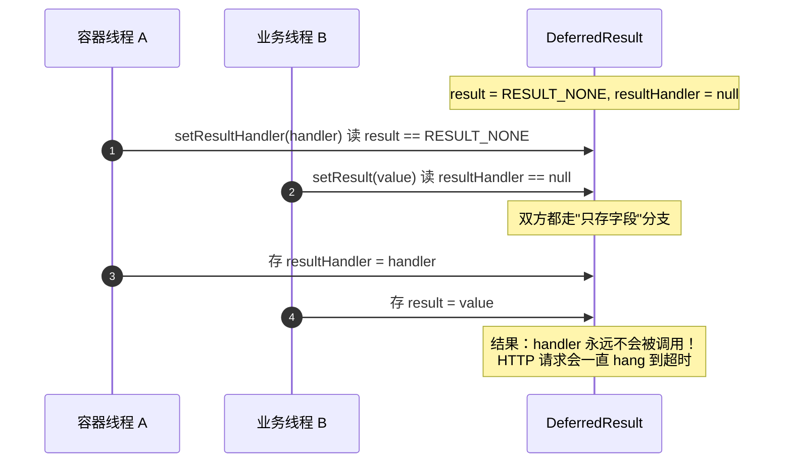

Spring 用 **`synchronized` + 双重检查** 解决：

```java
// setResultHandler（字节码还原）
public final void setResultHandler(DeferredResultHandler handler) {
    Assert.notNull(handler, "DeferredResultHandler is required");
    if (this.expired) return;          // 已超时则不处理
    synchronized (this) {
        if (this.expired) return;
        Object currentResult = this.result;
        if (currentResult == RESULT_NONE) {
            // 情况 A：业务还没 setResult —— 存 handler，等 setResult 时触发
            this.resultHandler = handler;
            return;
        }
        // 情况 B：业务已经 setResult —— 立刻触发 handler（锁内取到结果，锁外调用）
    }
    handler.handleResult(currentResult);
}
```

竞态解决矩阵：

| 顺序 | `setResultHandler` 看到的 `result` | `setResult` 看到的 `resultHandler` | 行为 |
|------|------|------|------|
| setResult 先，setResultHandler 后 | `value`（≠ NONE） | — | handler 立即调用 handleResult(value) |
| setResultHandler 先，setResult 后 | — | `handler` | setResult 内调用 handler.handleResult(value) |
| 并发（两者同时进临界区前） | 一方先持锁，另一方等待 | | 持锁者存字段；后进者二次检查发现字段已就绪，触发 handler |

**两个 `volatile` 字段**（`result`、`expired`）保证可见性，`synchronized` 保证原子性，双重检查避免重复触发。这是整个 `DeferredResult` 设计中最精妙的地方。

### 6.3 `setConcurrentResultAndDispatch`：真正触发 dispatch

```java
private void setConcurrentResultAndDispatch(Object result) {
    Assert.state(this.asyncWebRequest != null, "AsyncWebRequest must not be null");
    synchronized (this) {
        // (1) CAS: ASYNC_PROCESSING -> RESULT_SET，保证只 dispatch 一次
        if (!this.state.compareAndSet(State.ASYNC_PROCESSING, State.RESULT_SET)) {
            // 已经被别的路径（如 timeout）dispatch 了
            if (logger.isDebugEnabled()) {
                logger.debug("Could not set concurrent result: " + this.state.get());
            }
            return;
        }
        // (2) 存并发结果（dispatch 后第二次进 DispatcherServlet 时取这个）
        this.concurrentResult = result;
        this.concurrentResultContext = ...;

        // (3) 如果异步请求已完成（容器提前触发 complete），不再 dispatch
        if (this.asyncWebRequest.isAsyncComplete()) {
            if (logger.isDebugEnabled()) {
                logger.debug("Async processing already complete");
            }
            return;
        }
        // (4) 关键：触发 Servlet 容器重新派发！
        this.asyncWebRequest.dispatch();
    }
}
```

这里 `state` 的 CAS 是防止"业务 setResult" 与"容器 onTimeout" 同时发生时重复 dispatch。

### 6.4 `StandardServletAsyncWebRequest`：Servlet API 适配层

#### `startAsync()`

```java
public void startAsync() {
    Assert.state(getRequest().isAsyncSupported(),
        "Async support must be enabled on a servlet and for all filters involved...");
    if (isAsyncStarted()) return;   // 幂等

    // 状态机：NEW -> ASYNC
    if (this.state == State.NEW) {
        this.state = State.ASYNC;
    } else {
        Assert.state(this.state == State.ASYNC, "Already async " + this.state);
    }

    // ★ 调用 Servlet API：HttpServletRequest.startAsync(request, response)
    this.asyncContext = getRequest().startAsync(getRequest(), getResponse());

    // 注册自己为 AsyncListener（本类实现了 AsyncListener）
    this.asyncContext.addListener(this);

    // 设置超时
    if (this.timeout != null) {
        this.asyncContext.setTimeout(this.timeout);
    }
}
```

#### `dispatch()`

```java
public void dispatch() {
    Assert.state(this.asyncContext != null, "AsyncContext not yet initialized");
    if (!isAsyncComplete()) {
        // ★ 调用 Servlet API：AsyncContext.dispatch()
        this.asyncContext.dispatch();
    }
}
```

#### AsyncListener 回调实现

```java
// 容器检测到超时回调
@Override
public void onTimeout(AsyncEvent event) throws IOException {
    // 执行所有 addTimeoutHandler 注册的回调
    this.timeoutHandlers.forEach(Runnable::run);
}

// 客户端断连等错误
@Override
public void onError(AsyncEvent event) throws IOException {
    this.exceptionHandlers.forEach(c -> c.accept(event.getThrowable()));
}

// 异步完成（无论正常/超时/异常都会调）
@Override
public void onComplete(AsyncEvent event) throws IOException {
    this.stateLock.lock();
    try {
        this.completionHandlers.forEach(Runnable::run);
        this.asyncContext = null;            // 释放引用
        this.state = State.COMPLETED;
    } finally {
        this.stateLock.unlock();
    }
}
```

注意：这些回调里跑的 `timeoutHandlers` / `completionHandlers`，正是 `WebAsyncManager.startDeferredResultProcessing` 在步骤 (4) 注册的 lambda —— 它们最终都会调用 `setConcurrentResultAndDispatch` 把"超时结果/异常"也当作结果 dispatch 出去。

### 6.5 `DispatcherServlet.doDispatch`：两阶段处理

`DispatcherServlet` 是理解整个流程的最后一环。同一个请求会被 `doDispatch` 处理 **两次**：

```java
protected void doDispatch(HttpServletRequest request, HttpServletResponse response) throws Exception {
    HttpServletRequest processedRequest = request;
    HandlerExecutionChain mappedHandler = null;
    boolean multipartRequestParsed = false;

    WebAsyncManager asyncManager = WebAsyncUtils.getAsyncManager(request);
    ModelAndView mv = null;
    Exception dispatchException = null;

    try {
        processedRequest = checkMultipart(request);
        multipartRequestParsed = (processedRequest != request);

        mappedHandler = getHandler(processedRequest);
        ...
        HandlerAdapter ha = getHandlerAdapter(mappedHandler.getHandler());

        // ★ 第一次：调用 Controller，返回 DeferredResult 时内部触发 startAsync
        //   HandlerAdapter 检测到返回值是 DeferredResult，调用 webAsyncManager.startDeferredResultProcessing
        mv = ha.handle(processedRequest, response, mappedHandler.getHandler());

        if (asyncManager.isConcurrentHandlingStarted()) {
            // ★★★ 第一次进入：异步已启动 —— 提前 return，不渲染！
            //   容器线程在此返回并归池，HTTP 连接由 AsyncContext 保持
            mappedHandler.applyAfterConcurrentHandlingStarted(processedRequest, response);
            asyncManager.setMultipartRequestParsed(multipartRequestParsed);
            return;   // ← 关键：方法直接结束，不调用 processDispatchResult
        }

        // 同步路径：正常 applyPostHandle + render
        applyDefaultViewName(processedRequest, mv);
        mappedHandler.applyPostHandle(processedRequest, response, mv);
    } catch (...) {
        dispatchException = ...;
    }

    // ★ 第二次（dispatch 后重新进入）：hasConcurrentResult() 为 true
    //   processDispatchResult 内部会从 asyncManager 取出 concurrentResult 渲染
    processDispatchResult(processedRequest, response, mappedHandler, mv, dispatchException);

    if (asyncManager.isConcurrentHandlingStarted()) {
        // 异步已开始（第二次也是异步派发）—— 不触发 afterCompletion
        ...
        return;
    }
    ...
}
```

`processDispatchResult` 在第二次进入时，会通过 `asyncManager.getConcurrentResult()` 拿到之前 `setConcurrentResultAndDispatch` 存的结果：

- 如果结果是正常返回值 → 走 ReturnValueHandler 写响应（200 + JSON）。
- 如果结果是 `Throwable` → 走异常解析。
- 如果结果为 `null` 且是超时派发 → 走超时处理。

---

## 七、完整调用链路时序图

下图把 Apollo 场景下"从客户端请求到响应"的每一步、每条线程都串起来：

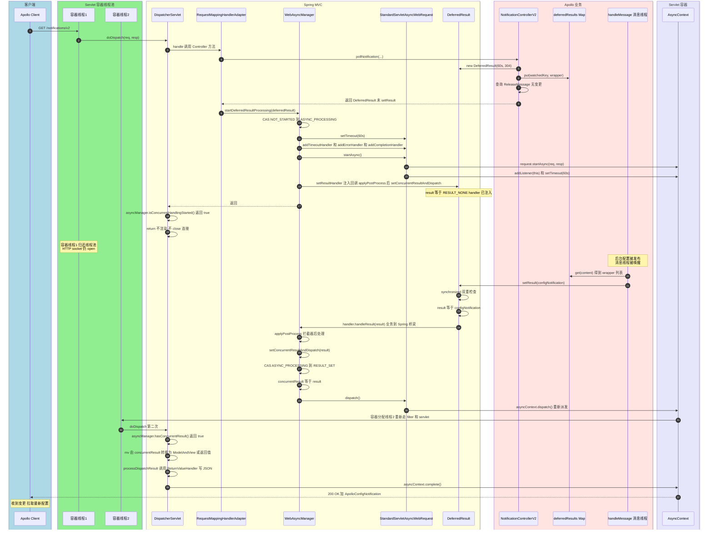

### 超时分支时序图

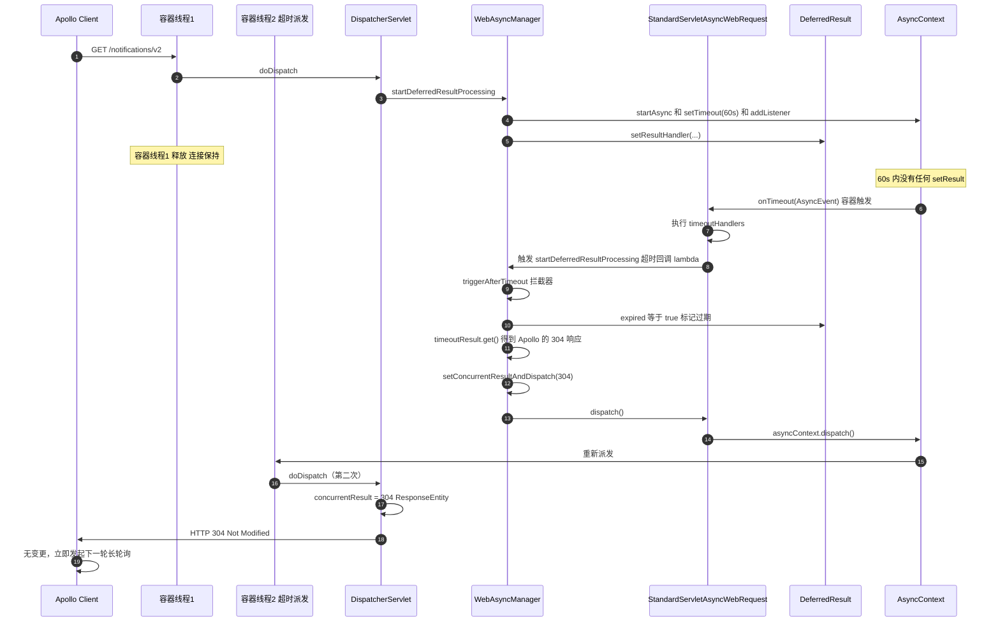

---

## 八、状态机流程图

### 8.1 `WebAsyncManager` 状态流转

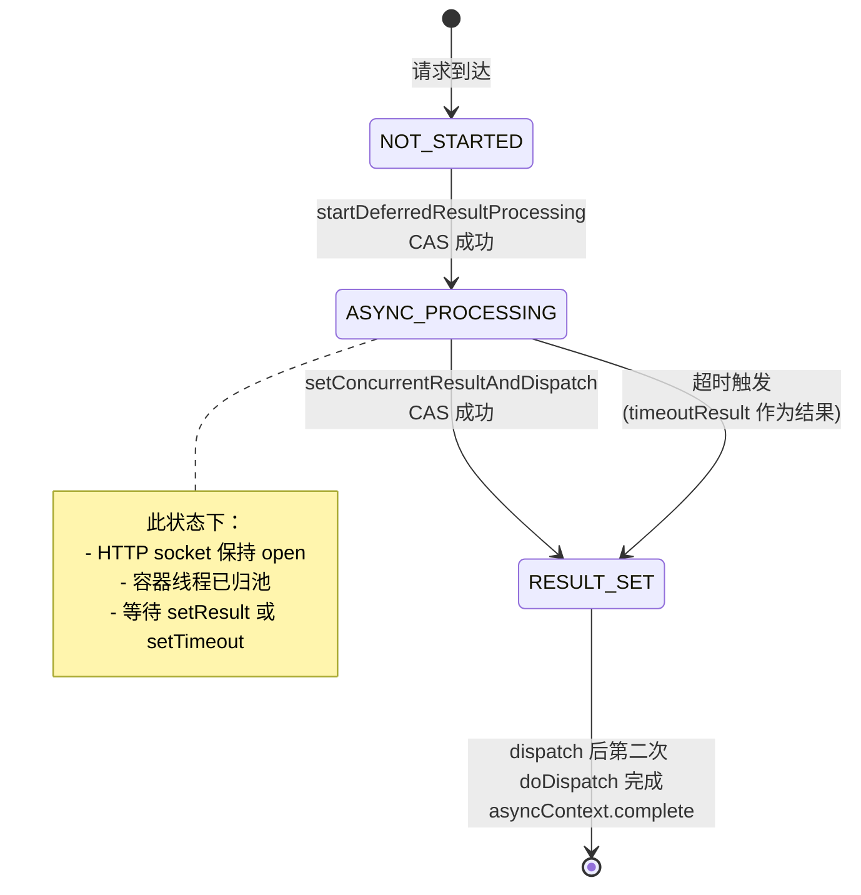

### 8.2 `DeferredResult` 内部字段流转

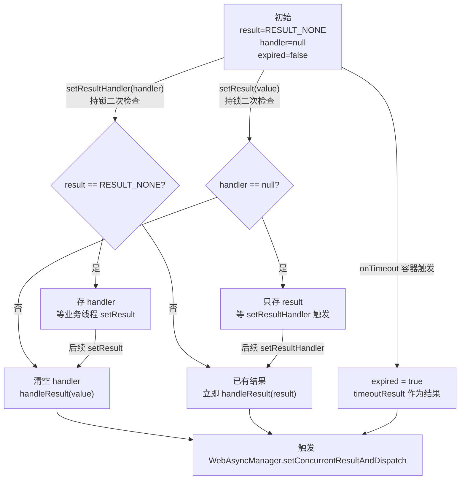

---

## 九、为什么 HTTP 连接不断开 —— 核心问题汇总

把前面分散的点收口成一句答案：

> **`request.startAsync()` 把 HTTP 连接的生命周期从"容器线程的执行时间"解耦到"`AsyncContext` 的生命周期"，容器线程返回时检测到异步上下文存在，不会关闭 socket；只要在 `setTimeout` 期限内调用 `dispatch()`（或被超时触发），容器会重新派发请求并写响应，socket 才会被 `complete()` 关闭。**

具体到 Apollo：

1. 客户端发请求 → 容器线程 #1 进 `doDispatch` → Controller 返回 `DeferredResult`。
2. `RequestMappingHandlerAdapter` 检测到返回值是 `DeferredResult` → 调用 `WebAsyncManager.startDeferredResultProcessing`。
3. `startDeferredResultProcessing` → `StandardServletAsyncWebRequest.startAsync` → `request.startAsync()`。
4. 容器线程 #1 从 `doDispatch` 返回（`isConcurrentHandlingStarted()==true`，提前 return），**线程归还线程池**，但 **socket 由 `AsyncContext` 持有保持 open**。
5. 客户端的 TCP 连接被服务端 hold 在 `ESTABLISHED`，read 一直阻塞。
6. 任意时刻（配置发布时），消息线程调用 `deferredResult.setResult(notification)`：
   - 触发注入的 `resultHandler` → `setConcurrentResultAndDispatch` → `asyncContext.dispatch()`。
7. 容器分配线程 #2 重新派发 → `doDispatch` 第二次进入 → 取 `concurrentResult` → 写 JSON 响应 → `asyncContext.complete()` → socket 关闭。
8. 若 60s 内无变更：容器 `onTimeout` 触发 → 用 `304` 作为 `timeoutResult` → 同样走 dispatch → 写 304 → 关闭连接。

### 9.1 容器线程占用时间对比

| 模式 | 容器线程占用时长 | 能支撑的并发长轮询数 |
|------|------------------|----------------------|
| 同步阻塞（`Thread.sleep(60s)`） | 60s / 请求 | ≈ 线程池大小（默认 200 → 200） |
| `DeferredResult` 异步 | < 5ms / 请求（只是 doDispatch 两次的耗时） | ≈ 文件描述符上限（数万~数十万） |

这正是 Apollo 选择 `DeferredResult` 而非同步阻塞的根本原因 —— **用极少的容器线程支撑海量长轮询连接**。

---

## 十、Apollo 中的关键设计点

### 10.1 "先注册再查询" —— 防止漏通知

`NotificationControllerV2.java:147-191`

```java
// 1、set deferredResult before the check, for avoid more waiting
//    If the check before setting deferredResult,it may receive a notification
//    the next time when method handleMessage is executed between check and set deferredResult.
deferredResultWrapper.onTimeout(...);
deferredResultWrapper.onCompletion(...);
for (String key : watchedKeys) {
    this.deferredResults.put(key, deferredResultWrapper);  // ★ 先注册
}
// 2、check new release
List<ReleaseMessage> latestReleaseMessages =
    releaseMessageService.findLatestReleaseMessagesGroupByMessages(watchedKeys);
```

如果顺序反过来（先查再注册），存在窗口：

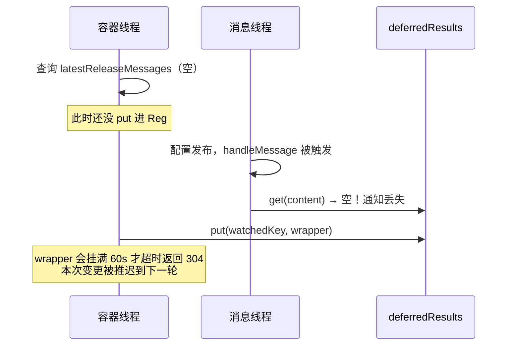

先注册再查询，即使查询后立刻有变更，`handleMessage` 也能命中已注册的 wrapper；而查询发现已有变更时直接 `setResult` 立即返回，也不会让请求挂起。

### 10.2 手动关闭 EntityManager —— 防止 DB 连接泄漏

`NotificationControllerV2.java:178-184`

```java
// Manually close the entity manager.
// Since for async request, Spring won't do so until the request is finished,
// which is unacceptable since we are doing long polling - means the db connection
// would be hold for a very long time
entityManagerUtil.closeEntityManager();
```

Spring 的 `OpenEntityManagerInViewFilter` 在**请求结束**时关闭 `EntityManager`。但异步请求的"结束"是 60s 之后，这期间 Hibernate 的 DB 连接会被白白占用。Apollo 在 Controller 内主动关闭，让 DB 连接立即归还。

### 10.3 分批通知 —— 防止惊群

`NotificationControllerV2.java:286-304`

当某 namespace 被海量客户端订阅时，一次发布会同时唤醒所有 wrapper。Apollo 配置：

```java
// BizConfig
private static final int DEFAULT_RELEASE_MESSAGE_NOTIFICATION_BATCH = 100;
private static final int DEFAULT_RELEASE_MESSAGE_NOTIFICATION_BATCH_INTERVAL_IN_MILLI = 100;
```

- 客户端数 > `batch`（默认 100）时，切到单线程异步通知。
- 每通知 `batch` 个客户端，sleep `interval`（默认 100ms）。
- 避免一次性触发数千次 `setResult` → 数千次 `dispatch` → 容器线程池瞬时打满。

### 10.4 超时回退为 304 —— 协议友好

`DeferredResultWrapper.java:36-44`

```java
private static final ResponseEntity<List<ApolloConfigNotification>> NOT_MODIFIED_RESPONSE_LIST =
    new ResponseEntity<>(HttpStatus.NOT_MODIFIED);
...
result = new DeferredResult<>(timeoutInMilli, NOT_MODIFIED_RESPONSE_LIST);
```

超时不是返回 500，而是 **304 Not Modified** —— 这正是 HTTP 缓存协商的语义。客户端看到 304 就知道"配置没变"，可以无缝进入下一轮长轮询。

### 10.5 `onCompletion` 注销 —— 防止内存泄漏

`NotificationControllerV2.java:155-161`

```java
deferredResultWrapper.onCompletion(() -> {
    for (String key : watchedKeys) {
        deferredResults.remove(key, deferredResultWrapper);
    }
});
```

无论请求是正常完成还是超时，`onCompletion` 都会被调用。在这里把 wrapper 从 `deferredResults` 移除，否则 Map 会无限增长导致 OOM。

---

## 十一、Apollo 旧版实现对照

`NotificationController.java`（`@Deprecated`）是单 namespace 版本，超时写死 30s：

```java
private static final long TIMEOUT = 30 * 1000;
private static final ResponseEntity<ApolloConfigNotification> NOT_MODIFIED_RESPONSE =
    new ResponseEntity<>(HttpStatus.NOT_MODIFIED);
...
DeferredResult<ResponseEntity<ApolloConfigNotification>> deferredResult =
    new DeferredResult<>(TIMEOUT, NOT_MODIFIED_RESPONSE);
```

与 V2 的核心差异：

| 维度 | V1 (NotificationController) | V2 (NotificationControllerV2) |
|------|------------------------------|------------------------------|
| namespace 数 | 单个 | 批量（一次请求监听多个） |
| 超时 | 写死 30s | 可配 `long.polling.timeout`（1-90s） |
| 注册结构 | `Multimaps.synchronizedSetMultimap` | `CaseInsensitiveMultimapWrapper`（大小写不敏感） |
| 结果 | 单个 `ApolloConfigNotification` | `List<ApolloConfigNotification>` |
| 分批通知 | 无 | 有（防惊群） |

两版的 `DeferredResult` 用法本质相同：注册超时/完成回调 → put 到 map → 查询是否有新变更 → 有则立即 setResult，无则返回 DeferredResult 让请求挂起。

---

## 十二、核心设计总结

### 12.1 `DeferredResult` 设计精髓

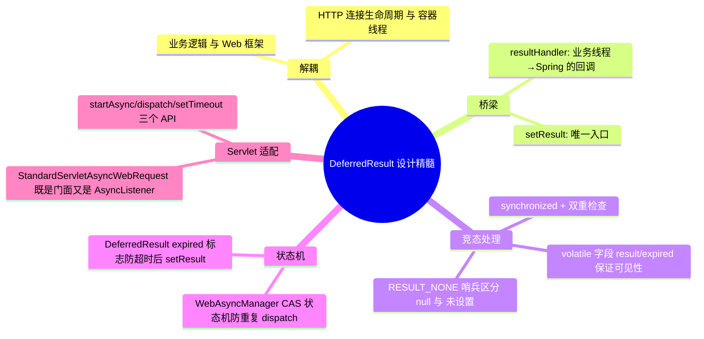

### 12.2 关键问题 Q&A

**Q1：为什么 HTTP 连接不会断开？**
A：`request.startAsync()` 把连接托管给 `AsyncContext`，容器线程返回时不关闭 socket，直到 `asyncContext.complete()` 或 `dispatch()` 后写完响应。

**Q2：容器线程在哪里被释放？**
A：`DispatcherServlet.doDispatch` 第一次进入时，检测到 `asyncManager.isConcurrentHandlingStarted()==true`，提前 `return` 不渲染，线程从 `service()` 返回归池。

**Q3：业务线程如何"通知"挂起的请求？**
A：业务线程调用 `deferredResult.setResult(value)` → 触发注入的 `resultHandler` → `setConcurrentResultAndDispatch` → `asyncContext.dispatch()` → 容器重新派发。

**Q4：重复 `setResult` 会怎样？**
A：第一次 `setResultInternal` 持锁时清空了 `resultHandler`（置 null）；第二次进入双重检查发现 `isSetOrExpired()==true`（result ≠ RESULT_NONE），直接返回 false。`WebAsyncManager` 还用 CAS `ASYNC_PROCESSING→RESULT_SET` 二次保险，确保只 dispatch 一次。

**Q5：超时如何处理？**
A：Servlet 容器在 `setTimeout` 到期时触发 `AsyncListener.onTimeout` → Spring 调用 `timeoutResult` Supplier 求值得到超时结果（Apollo 是 304）→ 同样走 dispatch → 第二次 doDispatch 写出 304。同时 `DeferredResult.expired=true`，之后任何 `setResult` 都被忽略。

**Q6：为什么 Apollo 服务端超时要小于客户端？**
A：客户端也有自己的 socket read 超时（90s）。若服务端超时 > 客户端，客户端会先断连，服务端再 `dispatch` 写响应会失败（抛 `IOException` → `AsyncRequestNotUsableException`）。所以 Apollo 强制 `1 ≤ timeout ≤ 90`。

**Q7：为什么 `onCompletion` 里要 remove？**
A：无论正常完成还是超时，`AsyncContext` 完成时都会触发 `onComplete` → Spring 执行 `completionHandlers` → Apollo 在这里把 wrapper 从 `deferredResults` 移除。不移除会导致 Map 累积，旧 wrapper 永远被新消息唤醒触发无效的 `setResult`（虽然 `isSetOrExpired` 会挡掉，但浪费内存和 CPU）。

---

## 十三、附录：关键源码索引

### Apollo 源码

| 文件 | 关键位置 |
|------|----------|
| `NotificationControllerV2.java` | `:99` `pollNotification` 返回 `DeferredResult`<br/>`:124-125` `new DeferredResultWrapper(timeout)`<br/>`:152-166` 注册超时/完成回调 + put 到 map<br/>`:189-191` 已有变更立即 `setResult`<br/>`:257-312` `handleMessage` 消息线程触发 `setResult` |
| `DeferredResultWrapper.java` | `:43-45` `new DeferredResult(timeout, 304)`<br/>`:73-83` `setResult` 包装 |
| `NotificationController.java` | `:102-103` 旧版 `new DeferredResult(30s, 304)` |
| `BizConfig.java` | `:60` `DEFAULT_LONG_POLLING_TIMEOUT=60`<br/>`:105-110` `longPollingTimeoutInMilli` 1-90s 校验<br/>`:58-59` 分批通知默认 100/100ms |

### Spring 源码（7.0.7，字节码还原）

| 类 | 关键方法 | 作用 |
|----|----------|------|
| `DeferredResult` | `setResult` / `setResultInternal` | 持锁设结果 + 触发 handler |
| `DeferredResult` | `setResultHandler` | 持锁注入 handler / 已有结果则立即触发 |
| `DeferredResult` | `LifecycleInterceptor`（内部类） | 把 onTimeout/onError/onCompletion 接到 DeferredResult 的字段回调 |
| `WebAsyncManager` | `startDeferredResultProcessing` | 总入口：CAS 状态、注册回调、startAsync、setResultHandler |
| `WebAsyncManager` | `setConcurrentResultAndDispatch` | CAS 到 RESULT_SET、存 concurrentResult、dispatch |
| `StandardServletAsyncWebRequest` | `startAsync` | 调用 `request.startAsync` + `addListener` + `setTimeout` |
| `StandardServletAsyncWebRequest` | `dispatch` | 调用 `asyncContext.dispatch()` |
| `StandardServletAsyncWebRequest` | `onTimeout/onError/onComplete` | AsyncListener 实现，触发已注册 handlers |
| `DispatcherServlet` | `doDispatch` | 两阶段：第一次检测异步提前 return；第二次渲染 concurrentResult |
| `DispatcherServlet` | `processDispatchResult` | 第二次进入时取 concurrentResult 渲染 |

---

## 十四、总结

`DeferredResult` 的本质是 **"结果占位 + Servlet 异步适配"**：

1. **结果占位**：用 `RESULT_NONE` 哨兵 + `volatile result` + `synchronized` 双重检查，安全地在"容器线程注入 handler"与"业务线程注入 result"之间建立桥梁，谁先到就先存，后到者触发执行。
2. **Servlet 异步适配**：通过 `StandardServletAsyncWebRequest` 调用 `startAsync`/`dispatch`/`setTimeout`，把"请求生命周期"从容器线程解耦到 `AsyncContext`，实现 socket 保持 open 而线程可归池。
3. **状态机编排**：`WebAsyncManager` 用 `AtomicReference<State>` 的 CAS 保证 `NOT_STARTED→ASYNC_PROCESSING→RESULT_SET` 单向流转，确保一次异步只 dispatch 一次，超时与 setResult 不会重复触发。

Apollo 在此之上做了四层工程化封装：

- **超时回退 304**：协议语义清晰，客户端无缝续轮。
- **先注册再查询**：消除 check-then-act 窗口，防止漏通知。
- **手动关 EntityManager**：避免 DB 连接随异步请求被占 60s。
- **分批通知 + onCompletion 清理**：防惊群、防内存泄漏。

这一整套设计让 Apollo config-service 能以**百级容器线程**支撑**万级长轮询连接**，是 Spring 异步 Servlet 编程的教科书级实践。